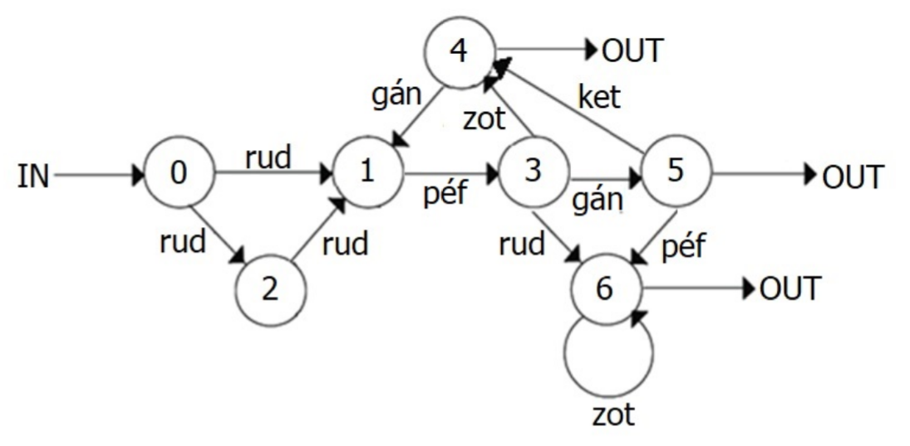
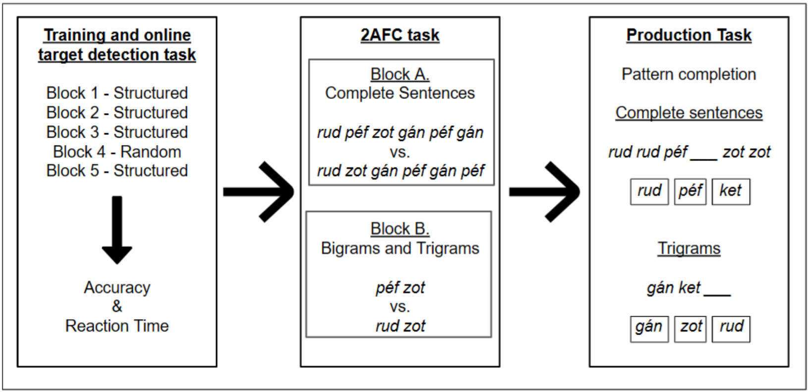
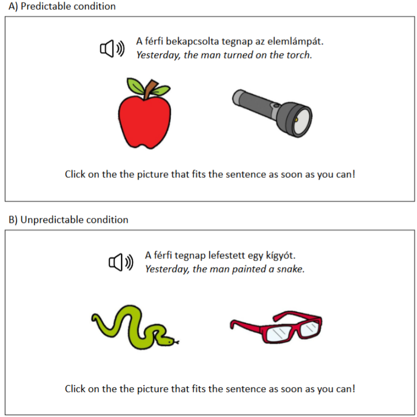

# 1. Task descriptions

## 1.1. Statistical learning tasks

### 1.1.1. Speech segmentation task

The segmentation tasks were adapted from Saffran et al.'s (1996a; 1996b;
1999) studies. As in the original paradigm, participants were presented
with a continuous stream of 12 CV syllables organized into four
trisyllabic words so that transitional probabilities across syllables
(TPs, i.e., the probability that syllable X is followed by syllable Y)
were 1 within words and 0.33 across word boundaries. Syllable stimuli
were adopted to the phonotactic rules of Hungarian (cé /tse:/, csa
/tʃɒ/, gá /ga:/, gye /ɟε/, ha /hɒ/, jü /jy/, lo /lo/, pe /pε/, ri /ri/,
sö /∫ø/, tu /tu/, vi /vi/), and combined into four 3-syllable nonsense
words (cévigá, csagyejü, lohari, söpetu). To avoid coarticulation
effects, syllables were recorded in isolation and manipulated in Praat
(Boersma and Weenink, 2021). Syllables had a pitch of 125 Hz. Their
duration was 270 ms and they were presented with an ISI of 30 ms, which
resulted in a presentation rate of 300 ms.

The task consisted of a training phase followed by an offline test
phase. During the training phase, participants were exposed to five
blocks. Four of the streams (Blocks TRN1--TRN3 and Block REC5) contained
the four words, and each of these words occurred 15 times in a
pseudorandom order with the only constraint that the same word could not
be repeated twice in a row. Block RND4 was a random stream, where the 12
syllables followed each other in a random order 15 times each, with the
only constraint that the same syllable could not be repeated twice in a
row. The streams did not provide any other cues to segmentation than the
statistical properties (TPs) of the streams. In the structured streams,
TPs within words were 1 and 0.33 at word boundaries. In Block RND4, TPs
were 0.09 between any syllable.

After a short practice, throughout the five blocks of the training
phase, participants performed a target detection task. They had to
respond to a target (one of the last syllables of words, counterbalanced
between participants) by pressing the spacebar, and to any other
syllable by pressing "A" on the keyboard. The blocks consisted of 180
target items: each item occurred 15 times in both the structured and
random streams. During this phase of the task, accuracy and RT measures
were collected. We calculated six indices from the data of the online
task: SEGM RT training (median RT~TRN1~ - median RT~TRN3~), SEGM RT
TRN3-RND4 (median RT~RND4~ - median RT~TRN3~), SEGM RT RND4-REC5 (median
RT~RND4~ - median RT~REC5~), SEGM ACC training (accuracy~TRN3~ -
accuracy~TRN1~), SEGM ACC TRN3-RND4 (accuracy~TRN3~ - accuracy~RND4~),
and SEGM ACC RND4-REC5 (accuracyREC5 - accuracyRND4). Participants who
did not have significantly more responses on targets than on other
syllables (indicating attention to the task) as tested with a
Fisher-exact test were excluded from the analyses of the training phase.

The online training phase was followed by a test phase consisting of a
2AFC and a production task. In the 2AFC task, bigram and trigram pairs
were presented and participants were instructed to choose the one more
familiar to what they heard in the training. Here, we used the four
words and bigrams from the training streams, and we also created four
part-word (syllable bigrams/trigrams spanning a word boundary in the
word streams), and four non-word (syllable bigrams/trigrams not
occurring together in the word streams) foils (Table 1). We tested three
types of contrasts in the case of both bigrams and trigrams: word vs.
part-word, word vs. non-word, and part-word vs. non-word sequences.
Trials consisting of predefined contrasts were randomized for each
participant. We quantified learning by accuracy rates for bigram and
trigram contrasts: the number of correct answers divided by the number
of all trials, yielding a number between 0 and 1 for the indices SEGM
2AFC bigram and SEGM 2AFC trigram. Participants also performed a
production task, in which incomplete trisyllabic words were presented
and their task was to complete them with one of three items in a 3AFC
task. The 12 trials varied in the location and/or identity of the
missing syllable within the sequence. Each word occurred three times in
the task. We assessed learning in this task by an accuracy rate, the
number of correct answers divided by the number of all trials, resulting
in a number between 0 and 1, the SEGM production index.

Table 1

*Stimuli of the 2AFC task*

|         | word     | part-word | non-word |
|---------|----------|-----------|----------|
| trigram | cévigá   | gácsagye  | csahatu  |
|         | csagyejü | jüloha    | peloga   |
|         | lohari   | risöpe    | rigyecé  |
|         | söpetu   | tucévi    | visöjü   |
| bigram  | cévi     | gácsa     | csaha    |
|         | csagye   | jülo      | pelo     |
|         | loha     | risö      | rigye    |
|         | söpe     | tucé      | visö     |

Participants whose response rates to target items were not significantly
higher than those to non-target items in the online task were excluded
from the calculation of task indices and further analyses.

### 1.1.2. Artificial grammar learning task

We tested AGL by using the modified version of the AGL task of Knowlton
and Squire (1996). The modifications were applied to make TPs between
items more variable than in the original task version. This means that
low, medium and high TPs varied across items, resulting in greater
variability between difficulty levels of trials in the 2AFC task. In the
target detection task, the target was a syllable that was highly
predictable based on the preceding item (*péf*). The grammar used in
this study is presented in Figure 1, and the TPs between individual
units are shown in Table 2.

**Figure 1**

*The modified version of the artificial grammar Knowlton and Squire
(1996)*



**Table 2**

*Forward transitional probabilities*

|         |         |         |         |         |         |
|---------|---------|---------|---------|---------|---------|
|         | **rud** | **péf** | **zot** | **gán** | **ket** |
| **rud** | 0.236   | 0.551   | 0.146   |         |         |
| **péf** | 0.224   |         | 0.329   | 0.388   |         |
| **zot** |         |         | 0.388   | 0.209   |         |
| **gán** |         | 0.643   |         |         | 0.250   |
| **ket** |         |         |         | 0.643   |         |

*Note.* The syllable péf was the target in the target detection task.

The words in the artificial lexicon were 1-syllable CVC nonwords
compiled from the phoneme inventory of Hungarian (péf /peːf/, rud /rud/,
gán /ɡaːn/, ket /kɛt/, zot /zot/). To avoid coarticulation effects,
words were recorded in isolation and manipulated in Praat (Boersma and
Weenink, 2021) to have a uniform pitch of 125 Hz. The duration of words
was 400 ms and they were presented with an ISI of 50 ms within sentences
and 100 ms between sentences.

34 grammatical strings were generated following the rules of the
grammar, yielding 3 three-word sentences, 6 four-word sentences, 5
five-word sentences, 7 six-word sentences and 13 seven-word sentences.
Eight sentences were selected for test strings only used in the offline
tasks, while the remaining 26 strings were included in the online
training phase.

**Figure 2**

*Testing procedure in the AGL task*



The task began with the online training phase, in which participants
completed a target detection task. They were instructed to press the
spacebar when they heard the target word (péf /peːf/) and the key 'A'
for every other words. The training consisted of five blocks: Blocks 1-3
and Block 5 contained the same training strings, while Block 4 contained
26 random strings which were generated by arranging the words of the
grammar in a random order. The strings within all blocks were presented
in a randomized order. Each training block contained the target 42
times, while the random block had 43 occurrences of it. We measured
accuracy and RTs for all targets throughout the 5 blocks. We expected to
see better prediction (reflected in increasing accuracy and decreasing
RTs) as learning proceeds, together with a decrease (poorer accuracy and
longer RTs) in the random block (Block 4), and in the recovery block
(Block 5) an increase again, compared to the random block, in which
performance was expected to reach the level of performance in Block 3.
We calculated six indices from the RT and accuracy data of the online
blocks: AGL RT training (median RT~TRN1~ - median RT~TRN3~), AGL RT
TRN3-RND4 (median RT~RND4~ - median RT~TRN3~), AGL RT RND4-REC5 (median
RT~RND4~ - median RT~REC5~), AGL ACC training (accuracy~TRN3~ -
accuracy~TRN1~), AGL ACC TRN3-RND4 (accuracy~TRN3~ - accuracy~RND4~),
and AGL ACC RND4-REC5 (accuracy~REC5~ - accuracy~RND4~). Participants
who did not have significantly more responses on targets than on other
syllables (indicating attention to the task) as tested with a
Fisher-exact test were excluded from the analyses of the training phase.

The online training phase was followed by a 2AFC task, in which
participants were instructed to choose between two strings; they were
asked to select the one that is more similar to the previously heard
language. This task consisted of two blocks: a block testing sensitivity
to TPs in complete sentences (16 trials, yielding a 2AFC sentence index)
and a block testing sensitivity to TPs in sentence fragments (bigrams
and trigrams, 22 trials, yielding a 2AFC sentence fragments index). In
the block of complete sentences, the grammatical string was a sentence
of the grammar (one of the eight previously selected test sentences,
which they have not heard during the training phase). In this block,
each grammatical sentence occurred twice, paired with different
ungrammatical sentences, which were in all cases the modified versions
of the given grammatical string. In the block of sentence fragments, six
bigrams and six trigrams were included. All of them occurred paired with
a bigram/trigram of syllables with zero TP, and ten trials (five bigrams
and five trigrams) occurred again by an also grammatical fragment with
lower frequency of occurrence in the training. We aimed to increase the
sensitivity of the task by including trials where targets and
distractors differ on varying dimensions (transitional probabilities,
frequency, grammaticality, surface features like the grammatical
beginning or ending of sequences) and sequence length (complete
sentences or sentence fragments). The order of the blocks and the order
of each trial within each block was randomized. 2AFC accuracy rates were
calculated by dividing the number of correct responses by the number of
all trials for the two blocks separately, resulting in the AGL 2AFC
phrase and AGL 2AFC sentence indices.

The second offline task was a production task, in which participants saw
incomplete sentences on the computer screen, and they were instructed to
complete them with one of three words provided below the incomplete
sentence. The 24 test trials contained eight grammatical trigrams and
the eight test sentences. Each test sentence occurred in two trials,
while the trigrams were presented only once. Trials varied in the
location and the identity of the missing item within the sequence.
Performance in this task was quantified by dividing the number of
correct responses by the number of all trials, resulting in the AGL
production index. Participants whose response rates to target items were
not significantly higher than those to non-target items in the online
task were excluded from the calculation of task indices and further
analyses.

## 1.2. Language tasks

### 1.2.1. Grammatical sensitivity task

The grammatical sensitivity task (based on Carroll & Sapon, 1959 and
Ottó & Nikolov, 2003) was conducted to assess participants' sensitivity
to grammatical structure without the recruitment of metalinguistic
processes. In each trial of the task, participants were presented with
two sentences. In the first sentence (sample), a part of the sentence
was highlighted from the text. In the second sentence (test), three
parts were highlighted, and one of the highlighted parts was analogous
to the target in the first sentence along a given structural or
functional aspect.

**Figure 3**

*A trial from the grammatical sensitivity task*

SAMPLE

Laura [fogmosással]{.underline} kezdi a hétfő reggelt.

Laura fog-mos-ás-sal kezdi a hétfő reggel-t

Laura toothbrushing-INST start-DEF.3SG the Monday morning-ACC

'Laura starts Monday morning with toothbrushing.'

TEST

[Addigra]{.underline} már abbahagytam [a dicsekvést]{.underline} [a
számtalan kalandommal]{.underline}.

Addigra már abba-hagy-t-am a dicsekvés-t a számtalan kaland-om-mal

by.then already stop-PFV-PAST-DEF.1SG the boast-ACC the countless
adventure-POSS.1SG-INST

'By then, I had already stopped boasting about my countless adventures.'

(1) Addigra (2) a dicsekvést [(3) a számtalan kalandommal]{.underline}

Participants' task was to choose which highlighted part from the second
sentence was the most similar to that of the first sentence. This task
yielded one accuracy index calculated as the ratio of correct responses
to trials, *grammatical sensitivity*. Participants whose accuracy was
lower than 0.5 were excluded from further analyses.

### 1.2.2. Pragmatic comprehension task

We used the pragmatic comprehension task (KOBAK, Lukács & Kas, 2024) to
assess participants' ability to process the pragmatic level of sentences
in a four-alternative forced-choice picture selection task. In each
trial, participants heard a sentence with conflicting semantic and
pragmatic meanings. The four pictures depicted four situations, and
participants had to choose the one best matching the meaning of the
sentence. The trials tested metaphor comprehension, conversational
implicatures and irony. Participants were informed that multiple
solutions might seem acceptable, but they should choose the one which
seems the best match. The task yielded one index calculated from the
accuracies of trials, *pragmatic comprehension*. Participants whose
accuracy was lower than 0.4 were excluded from further analyses.

### 1.2.3. Self-paced reading task

Participants' online sentence processing abilities were assessed in a
self-paced reading task. This task required participants to read
sentences at their preferred pace by pressing a key to progress through
the text. The task included three types of sentences, each type with a
different type of difficulty in processing. Participants were presented
with 1) two types of garden path sentences, where the sentence
interpretation had to be rebuilt at a point when the typical original
interpretation proved to be wrong (garden path sentences and past
participle garden path sentences), 2) sentences that included some kind
of semantic or grammatical violation, and 3) sentences including an
object relative clause. These test sentences inducing processing
difficulties were matched with control sentence pairs without these
factors taxing sentence processing: 1) sentences without local
ambiguities, 2) sentences without violations and 3) sentences with
subject relative clauses. Example sentences for the processing
difficulty types are given in Figure 5.

**Figure 5**

*Example sentences for the different sentence types of the self-paced
reading task*

*GARDEN PATH SENTENCES*

TEST:

Míg Zsuzsi írt egy levelet [hozott]{.underline} [a postás]{.underline}.

Míg Zsuzsi ír-t, egy level-et hoz-ott a postás

while Zsuzsi write-PAST, INDEF letter-ACC bring-PAST DEF postman

'While Zsuzsi was writing, the postman brought a letter.'

CONTROL:

Míg Zsuzsi írt egy üzenetet egy levelet [hozott]{.underline} [a
postás]{.underline}.

Míg Zsuzsi ír-t egy üzenet-et, egy levél-et hoz-ott a postás

while Zsuzsi write-PAST.INDEF a message-ACC, a letter-ACC bring-PAST.DEF
the postman

'While Zsuzsi was writing a message, the postman brought a letter.'

*PAST PARTICIPLE GARDEN PATH SENTENCES*

TEST:

Péter gyakran fordított [irányban]{.underline} [írta le]{.underline} a
nevét.

Péter gyakran fordított irány-ban ír-ta le a nev-é-t

Péter often reversed direction-INE write-PAST.3SG.DEF down the
name-POSS.3SG-ACC

'Péter often wrote his name down in reverse.'

CONTROL:

Péter gyakran a fordított [irányban]{.underline} [írta le]{.underline} a
nevét.

Péter gyakran a fordított irány-ban ír-ta le a nev-é-t

Péter often the reversed direction-INE write-PAST.3SG.DEF down the
name-POSS.3SG-ACC

'Péter often wrote his name down in the reverse direction.'

*SEMANTIC VIOLATION*

TEST:

Sötét volt így felkapcsoltam a [tigrist]{.underline} [a
konyhában]{.underline}.

Sötét volt, így fel-kapcsol-t-am a tigris-t a konyhá-ban

dark be.PAST.3SG so up-switch-PAST-1SG.DEF the tiger-ACC the kitchen-INE

'It was dark, so I switched on the tiger in the kitchen.'

CONTROL:

Sötét volt így felkapcsoltam [a villanyt]{.underline} [a
konyhában]{.underline}.

Sötét volt, így fel-kapcsol-t-am a villany-t a konyhá-ban

dark be.PAST.3SG so up-switch-PAST-1SG.DEF the light-ACC the kitchen-INE

'It was dark, so I switched on the light in the kitchen.'

*SYNTACTIC VIOLATION*

TEST:

A szobalány végigsöpörte [egy seprűkkel]{.underline} [a
padlót]{.underline}.

A szobalány végig-söpör-te egy seprű-k-kel a padló-t

DEF maid through-sweep-PAST.3SG.DEF a broom-PL.INST the floor-ACC

'The maid swept the floor with a brooms.'

CONTROL:

A szobalány végigsöpörte [egy seprűvel]{.underline} [a
padlót]{.underline}.

A szobalány végig-söpör-te egy seprű-vel a padló-t

DEF maid through-sweep-PAST-3SG.DEF a broom-INST the floor-ACC

Glossed Translation: 'The maid swept the floor with a brooms.'

*OBJECT RELATIVE CLAUSES*

TEST:

Az ügyvéd akit az újságíró felhívott [főzött]{.underline} [egy
bablevest]{.underline}.

Az ügyvéd, akit az újságíró fel-hív-ott, főz-ött egy bableves-t

The lawyer, REL.OBJ the journalist up-call-PAST.INDEF cook-PAST.INDEF a
bean-soup-ACC

'The lawyer, whom the journalist called, cooked a bean soup.'

CONTROL:

Az ügyvéd aki az újságírót felhívta [főzött]{.underline} [egy
bablevest]{.underline}.

Az ügyvéd aki az újságíró-t fel-hív-ta, főz-ött egy bableves-t

The lawyer REL.NOM the journalist-ACC up-call-PAST.DEF, cook-PAST.INDEF
a bean-soup-ACC

'The lawyer, who called the journalist, cooked a bean soup.'

*Note.* Target and target plus one sentence parts are underlined.

After the self-paced presentation of each sentence, participants were
required to answer a question about its content to ensure careful
processing of the materials. Indices were calculated from the reaction
time differences between the targets and the sentence parts after the
targets (target plus one) in test and control sentence pairs. We tested
both targets and sentence parts immediately after the targets because of
the potential overflow effects and we wanted to look at which comparison
results in a larger and more reliable effect in the case of each
sentence type. This resulted in eight indices altogether, garden path
sentence processing - target, garden path sentence processing - plus
one, past participle garden path sentence processing - target, past
participle garden path sentence processing - plus one, sentence
violation processing - target, sentence violation processing - plus one,
object relative clause processing - target and object relative clause
processing - plus one. Participants whose accuracy was lower than 0.7 on
the comprehension questions were excluded from further analyses. We
hypothesized that smaller reaction time differences between test and
control sentences would be associated with more efficient sentence
processing. For this reason, we changed the sign of scores of the
indices so that larger values were associated with more efficient
sentence processing abilities.

While we interpret smaller reaction time differences between test and
control sentences as indicating more efficient sentence processing, we
acknowledge that the interpretation of this type of interference-based
index is not without caveats. In theory, minimal differences may also
reflect reduced sensitivity to sentence-level structure or a lack of
engagement. In the present task, the majority of test sentences were
semantically plausible but less predictable than their matched controls,
requiring greater integration effort. A subset of test items also
included semantic violations, which are known to elicit increased
processing costs (Kutas & Hillyard, 1980; Kuperberg, 2007). Therefore,
we interpret RT differences primarily as reflecting semantic integration
difficulty rather than anomaly detection. On this basis, smaller RT
differences suggest more efficient updating or resolution. This
interpretation is further supported by weak but consistent positive
correlations between this index and measures of language ability,
statistical learning, and cognitive control.

### 1.2.4. Predictive sentence processing task

Semantic prediction abilities of participants were also assessed more
directly by a predictive sentence processing task (Hintz et al., 2020,
2024). In each trial, participants heard a sentence and at the same
time, they were presented with two pictures on the screen. Their task
was to click on the key corresponding to the image that is presented in
the sentence as quickly as they could. In half of the trials, the verb
in the sentence was semantically restrictive, so the object (presented
at the end of the sentence) was predictable based on the verb and the
visual context provided by the two options. In the other half of the
trials, the object was not predictable. An example for predictable and
unpredictable sentences are illustrated on Figure 5.

**Figure 5**

*Predictable and unpredictable trials from the sentence repetition task*



Sentence processing efficiency relying on the linguistic and visual
context was quantified by contrasting accuracies and reaction times
between responses in the case of predictable and unpredictable
sentences, yielding the predictive sentence processing accuracy and
predictive sentence processing RT indices. For each participant,
reaction time outliers were identified and excluded based on Tukey's
fences criterion. Participants with an accuracy below 0.6 were excluded
from further analyses.

In contrast with the self-paced reading task, where higher reaction time
differences reflect processing cost, in the predictive sentence
processing task, higher reaction time differences reflect a greater
benefit from predictability---that is, faster or more accurate responses
to predictable versus unpredictable sentences, indicating more effective
use of contextual cues.

### 1.2.5. One-minute reading task

To assess participants' reading fluency, we measured the amount of text
(in number of syllables) they can process in a self-paced reading task
where they could advance at their own pace. The text consisted of 1036
syllables altogether. They were informed that after reading the text,
they would have to respond to comprehension questions on the contents.
Participants below .5 accuracy rates on these comprehension questions
were excluded from the analyses. Reading efficiency was quantified by
the number of syllables read, yielding the one-minute reading index.

## 1.3. General cognitive tasks

### 1.3.1. Stroop task

The Stroop task also served to assess inhibitory control abilities. The
task required participants to respond to words describing colors
('blue', 'green', 'red', 'yellow') written in fonts of one of the four
different colors (blue, green, red, yellow). Word forms and font colors
were either congruent (e.g. the word 'yellow' written in yellow font) or
incongruent (e.g. the word 'yellow' written in blue font). Participants
were asked to respond to the color of the font. There was an additional
baseline condition where a neutral string was presented ('xxxx'), and
participants had to respond to the font color (blue, green, red,
yellow). Responses from this condition were solely used for assessing
participants' task engagement and were not used for task index
calculation. The stimuli were presented until a response. There was an
ISI of 500 ms between trials. The efficiency of inhibitory control was
estimated by calculating the differences in accuracies and reaction
times between the incongruent and congruent trials, yielding the stroop
accuracy (accuracy~congruent~ - accuracy~incongruent~) and stroop RT
(median RT~incongruent~ - median RT~congruent~) indices. For each
participant, reaction time outliers were identified and excluded based
on Tukey's fences criterion. Participants with an accuracy below 0.5 in
the baseline condition were excluded from further analyses. Larger
differences between incongruent and congruent trials were assumed to be
associated with lower inhibitory control efficiency. To align scoring
with this assumption, we changed the sign of the task scores, such that
larger values were associated with more efficient inhibitory control.

### 1.3.2. Simon task

To assess executive functions, more narrowly, interference control, we
used the Simon task (based on Craft & Simon, 1970 and Tse & Altarriba,
2014). In this task, participants were presented with an arrow in each
trial, and they were instructed to ignore the location and focus on the
direction of the arrow and press button 'L' for right-pointing and
button 'S' for left-pointing arrows. Arrows could appear in three
locations: on the left, on the right or on the middle of the screen.

After a practice block, participants completed two blocks of the task,
with a short break between them. The experimental blocks consisted of
60-60 trials in each of three conditions: 1) in the congruent condition,
the left-pointing arrow was presented on the left, and the
right-pointing arrow was presented on the right of the screen, 2) in the
incongruent condition, the left-pointing arrow was presented on the
right, while the right-pointing arrow was presented on the left of the
screen, and 3) in the neutral condition both the left- and
right-pointing arrows occurred in the center of the screen. Both blocks
contained 20 congruent, 20 incongruent and 20 neutral trials in a
randomized order. Each trial started with a fixation cross presented in
the middle of the screen for 500 ms, which was followed by the
presentation of the target arrow. The arrow was presented until a
response, or for a maximum of 4000 ms. There was an ISI of 750 ms
between trials. We calculated two indices from accuracies and RTs, simon
accuracy (accuracy~congruent~ - accuracy~incongruent~) and simon RT
(median RT~incongruent~ - median RT~congruent~). For each participant,
reaction time outliers were identified and excluded based on Tukey's
fences criterion. Participants with an accuracy below 0.5 in the neutral
condition were excluded from further analyses. We hypothesized that
smaller RT differences between congruent and incongruent trials would be
associated with more efficient interference control. For this reason, we
changed the sign of scores of the indices so that larger values were
associated with more efficient interference control.

### 1.3.3. N-back task

To assess executive functions, more narrowly, updating capacity, we used
an n-back task. In this task, letters (B, C, F, H, K, L, M, Q, R, X)
were presented individually in the middle of the screen, and
participants were instructed to press the spacebar for every item that
was identical to the one presented two steps earlier, and otherwise
press key 'A'. After a short practice block, the task consisted of four
blocks altogether, a 1-back, two 2-back, and one 3-back block. Each
block consisted of 60 trials: 10 targets, 10 lures and 40 foils. Blocks
started with the presentation of a fixation cross for 1000ms, which was
followed by the presentation of the individual trials for 500ms, with an
ISI of 1500ms. We calculated a d-prime score for each difficulty level,
1-back d-prime, 2-back d-prime, and 3-back d-prime ((hits / 10) - (false
alarms / 50) \* 100).

### 1.3.4. Digit span

We assessed short term memory and working memory with a digit span task.
Here, sequences of spoken digits were presented, and participants were
instructed to reproduce them by typing back in the same (forward digit
span for assessing short term memory) or in the reversed order (backward
digit span for assessing working memory). Tasks started with the
presentation of three digits sequences with an ISI of 200ms between
individual digits, and the length of sequences increased as the task
proceeded. The maximum length of sequences was ten digits. Participants
were presented with four trials within each sequence length, and the
task was terminated after three incorrect responses within the same
length. The last sequence length with at least two correct responses
were considered as forward digit span and backward digit span.

### 1.3.5. Perceptual speed

To test perceptual speed, we used a reaction time task that measured
processing stimuli in the acoustic and visual modalities in three
subtasks. In the first visual block, participants were instructed to
look at a blank screen, and focus on the appearance of a picture of a
ball in the middle of the screen and press the spacebar as fast as they
could each time when the ball appeared. The visual block was followed by
an acoustic block, in which participants had to focus on a tone
presented via headphones. For both modalities, 32 trials were presented.
ISIs varied randomly between 1223 and 4988 ms for the visual modality,
and 1041 and 4883 ms for the auditory modality. These two subtasks
yielded two indices calculated as the median of RTs, visual reaction
time and auditory reaction time.

In a third block, participants had to complete a speeded visual decision
making task. In this task, two Gabor patches were presented on the
screen, and the task was to decide if the two patches had the same
orientation or not. Participants were instructed to complete as many
trials as they could within 60 seconds. Participants below .75 accuracy
were excluded from the analysis of this subtask. The subtask yielded two
indices, visual decision time (the median of RTs of trials) and visual
decision score (1 - (median RT \* (1 - accuracy))).

# 2. Data analysis

## 2.1. Preparation

R packages:

```{r message = FALSE, warning = FALSE}
library(tidyverse)
library(broom)
library(psych)
library(EFAtools)
library(lavaan)
library(ClustOfVar)
library(semTools)
library(semPlot)
library(tidySEM)
```

Data:

```{r include = FALSE, warning = FALSE}
library(readr)
df = read_csv("data/df.csv")
```

```{r message = FALSE, warning = FALSE}
df = df %>% 
  mutate(
    perceptual_speed_visual_RT = -(perceptual_speed_visual_RT),
    perceptual_speed_visual_decision = -(perceptual_speed_visual_decision),
    perceptual_speed_auditory_RT = -(perceptual_speed_auditory_RT),
    simon_RT = -(simon_RT),
    simon_accuracy = -(simon_accuracy),
    stroop_RT = -(stroop_RT),
    stroop_accuracy = -(stroop_accuracy),
    selfpaced_gardenpath_target = -(selfpaced_gardenpath_target),
    selfpaced_violation_processing_target = -(selfpaced_violation_processing_target)
  )
```

## 2.2. Selecting reliable indices

Our initial data set comprised 12 tasks with 45 indices (Table 1). Each
index has a minimum overlap of 100 cases with each other indices. For
each index, two criteria were considered: (i) **unidimensionality** and
(ii) **internal consistency**, indicative of its reliability. Indices
failing to meet either criterion were dropped. Indices that could not be
evaluated were retained under the assumption that they might contain
valuable information for the overall model.

Unidimensionality was assessed using Exploratory Factor Analyses (EFA)
on individual items within the task index. We applied the following
criterion: an index was considered to be unidimensional if one salient
factor was possible to extract and its eigenvalue was above 1. As for
most of our indices (all non-linguistic cognitive indices and
statistical learning indices) unidimensionality tests were not
applicable, we only tested the outcome (language) variables. Internal
consistency was evaluated using the split-half method or omega
coefficient where applicable, with a minimum reliability level set at
0.5 as the inclusion criterion.

For *grammatical sensitivity* and *pragmatic comprehension* indices, the
item composition was modified to meet the criteria. Since these two
indices consist of qualitatively different items, to prevent
overfitting, we divided the sample into two halves. One half was used to
select well-fitting items in the modified index, and the other half was
employed to evaluate the new structure.

Consequently, 13 indices were dropped, leaving 32 indices introduced to
the EFA models.

**Table 1**

*Reliability of indices of the original dataset*

| group | task                           | index                                        | reliability type | reliability value | unidimensionality | suitable |
|-----------|-----------|-----------|-----------|-----------|-----------|-----------|
| COG   | perceptual speed               | visual reaction time                         | split-half\*     | 0.957             | n.a.              | yes      |
| COG   | perceptual speed               | auditory reaction time                       | split-half\*     | 0.956             | n.a.              | yes      |
| COG   | perceptual speed               | visual decision score                        | split-half\*     | 0.179             | n.a.              | no       |
| COG   | perceptual speed               | visual decision time                         | split-half\*     | 0.952             | n.a.              | yes      |
| COG   | simon                          | simon RT                                     | split-half\*     | 0.643             | n.a.              | yes      |
| COG   | simon                          | simon accuracy                               | split-half\*     | 0.546             | n.a.              | yes      |
| COG   | stroop                         | stroop RT                                    | split-half\*     | 0.768             | n.a.              | yes      |
| COG   | stroop                         | stroop accuracy                              | split-half\*     | 0.876             | n.a.              | yes      |
| COG   | digit span                     | forward digit span                           | n.a.             | n.a.              | n.a.              | yes      |
| COG   | digit span                     | backward digit span                          | n.a.             | n.a.              | n.a.              | yes      |
| COG   | n-back                         | 1-back d-prime                               | split-half\*     | 0.807             | n.a.              | yes      |
| COG   | n-back                         | 2-back d-prime                               | split-half\*     | 0.763             | n.a.              | yes      |
| COG   | n-back                         | 3-back d-prime                               | split-half\*     | 0.691             | n.a.              | yes      |
| SL    | speech segmentation            | SEGM RT training                             | split-half\*     | 0.646             | n.a.              | yes      |
| SL    | speech segmentation            | SEGM RT TRN3-RND4                            | split-half\*     | 0.768             | n.a.              | yes      |
| SL    | speech segmentation            | SEGM RT RND4-REC5                            | split-half\*     | 0.778             | n.a.              | yes      |
| SL    | speech segmentation            | SEGM ACC training                            | split-half\*     | 0.855             | n.a.              | yes      |
| SL    | speech segmentation            | SEGM ACC TRN3-RND4                           | split-half\*     | 0.850             | n.a.              | yes      |
| SL    | speech segmentation            | SEGM ACC RND4-REC5                           | split-half\*     | 0.761             | n.a.              | yes      |
| SL    | speech segmentation            | SEGM 2AFC bigram                             | n.a.             | n.a.              | n.a.              | yes      |
| SL    | speech segmentation            | SEGM 2AFC trigram                            | n.a.             | n.a.              | n.a.              | yes      |
| SL    | speech segmentation            | SEGM production                              | n.a.             | n.a.              | n.a.              | yes      |
| SL    | artificial grammar learning    | AGL RT training                              | split-half\*     | 0.222             | n.a.              | no       |
| SL    | artificial grammar learning    | AGL RT TRN3-RND4                             | split-half\*     | 0.270             | n.a.              | no       |
| SL    | artificial grammar learning    | AGL RT RND4-REC5                             | split-half\*     | 0.247             | n.a.              | no       |
| SL    | artificial grammar learning    | AGL ACC training                             | split-half\*     | 0.634             | n.a.              | yes      |
| SL    | artificial grammar learning    | AGL ACC TRN3-RND4                            | split-half\*     | 0.380             | n.a.              | no       |
| SL    | artificial grammar learning    | AGL ACC RND4-REC5                            | split-half\*     | 0.390             | n.a.              | no       |
| SL    | artificial grammar learning    | AGL 2AFC sentence                            | n.a.             | n.a.              | n.a.              | yes      |
| SL    | artificial grammar learning    | AGL 2AFC phrase                              | n.a.             | n.a.              | n.a.              | yes      |
| SL    | artificial grammar learning    | AGL production                               | n.a.             | n.a.              | n.a.              | yes      |
| LANG  | predictive sentence processing | predictive sentence processing RT            | split-half\*     | 0.853             | n.a.              | yes      |
| LANG  | predictive sentence processing | predictive sentence processing accuracy      | split-half\*     | 0.585             | n.a.              | yes      |
| LANG  | KOBAK                          | pragmatic comprehension                      | omega            | 0.630             | 1                 | yes      |
| LANG  | grammatical sensitivity        | grammatical sensitivity                      | omega            | 0.676             | 1                 | yes      |
| LANG  | self-paced reading             | garden path - target                         | omega            | 0.506             | 1                 | yes      |
| LANG  | self-paced reading             | garden path - plus one                       | omega            | -0.060            | 0                 | no       |
| LANG  | self-paced reading             | past participle garden path - target         | omega            | 0.270             | 0                 | no       |
| LANG  | self-paced reading             | past participle garden path - plus one       | omega            | 0.140             | 0                 | no       |
| LANG  | self-paced reading             | object relative clause processing - target   | omega            | -0.030            | 1                 | no       |
| LANG  | self-paced reading             | object relative clause processing - plus one | omega            | 0.576             | 0                 | no       |
| LANG  | self-paced reading             | sentence violation processing - target       | omega            | 0.681             | 1                 | yes      |
| LANG  | self-paced reading             | sentence violation processing - plus one     | omega            | 0.391             | 0                 | no       |
| LANG  | one-minute reading             | one-minute reading                           | n.a.             | n.a.              | n.a.              | yes      |

*Note.* \*: Reported split-half reliabilities are the mean of 100
iterations, Spearman-Brown corrected at each iteration. Regarding the
unidimensionality tests, numeral 1 signals that an index passed the test
and numeral 0 signals that an index failed the test.

## 2.3. Latent factor identification

### 2.3.1. Summary for the process of latent factor identification

(See details below)

To identify latent factors, we initially categorised the measurement
indices into three designated domains: the *statistical learning* (SL)
domain, the *core cognitive* (COG) domain, and the *language* (LANG)
domain (see Table 1).

As a next step, exploratory factor analyses (EFAs) were conducted within
each domain, following these procedures:

1.  **KMO test**: Using the Kaiser-Meyer-Olkin test, we assessed the
    measures of sampling adequacy (MSA) for the indices. Subsequently,
    indices with unsatisfactory fit for EFA (MSA \< 0.6) were excluded.

2.  **Bartlett's test**: Secondly, Bartlett's test of sphericity was
    employed, with the significance level indicating a suitable fit for
    EFA.

3.  **Parallel analysis**: To determine the number of factors in each
    domain, Horn's parallel analysis was used. This method compares
    eigenvalues derived from the data matrix to those from a Monte Carlo
    simulated matrix generated from random data of the same size.

4.  **Exploratory factor analysis**: After determining the number of
    factors, exploratory factor analysis was conducted using maximum
    likelihood as the factoring method and promax (oblique) rotation.
    Missing values were imputed using the mean. Based on factor loadings
    and uniqueness observed in each index, we refined our model.

5.  **Hierarchical cluster analysis**: To validate EFA results,
    hierarchical cluster analyses were performed. The stability of
    partitions from a hierarchy of variables was evaluated using a
    bootstrapping method (n=100). Based on the mean adjusted Rand
    criterion, we examined local maximums regarding the potential number
    of clusters and selected the one supported by our theoretical
    considerations if necessary. We then proceeded with k-means
    clustering of variables, resulting in the identification of latent
    variables.

6.  **Confirmatory factor analysis**: In the final step, we validated
    the structure through confirmatory factor analysis. Analyses were
    conducted using the Robust Maximum Likelihood method, with missing
    values imputed by the Maximum Likelihood method. Final models were
    refined if necessary.

During these steps, seven indices were removed from the initial 32
indices for not meeting the KMO test criterion, and two additional
indices were dropped due to model refinement. Thus, the final data set
included 23 indices from 12 different tasks (Table 2).

### 2.3.2. Latent factors in statistical learning domain

**Kaiser-Meyer-Olkin test**:

```{r echo = FALSE, warning = FALSE}
df %>% 
  select(
    SEGM_RT_training,
    SEGM_RT_TRN3_RND4,
    SEGM_RT_RND4_REC5,
    SEGM_ACC_training,
    SEGM_ACC_TRN3_RND4,
    SEGM_ACC_RND4_REC5,
    SEGM_2AFC_bigram,
    SEGM_2AFC_trigram,
    SEGM_production,
    AGL_ACC_training,
    AGL_2AFC_phrase,
    AGL_2AFC_sentence,
    AGL_production
  ) %>% 
KMO()
```

Indices with unsatisfactory fit for EFA (MSA \< 0.5) were excluded: -
SEGM_ACC_training [speech segmentation - SEGM ACC training] -
SEGM_ACC_TRN3_RND4 [speech segmentation - SEGM ACC TRN3-RND4] -
SEGM_ACC_RND4_REC5 [speech segmentation - SEGM ACC RND4-REC5] -
AGL_ACC_training [artificial grammar learning - AGL ACC training]

Then, KMO test was repeated.

```{r echo = FALSE, warning = FALSE}
df %>% 
  select(
    SEGM_RT_training,
    SEGM_RT_TRN3_RND4,
    SEGM_RT_RND4_REC5,
    SEGM_2AFC_bigram,
    SEGM_2AFC_trigram,
    SEGM_production,
    AGL_2AFC_phrase,
    AGL_2AFC_sentence,
    AGL_production
  ) %>% 
KMO()
```

The reaction time based indices showed poor fit (\< 0.6), however, we
did not omit them for their possible exploratory power. Instead, we
performed two separate analysis with only the reaction time based
variables and the remaining ones.

#### 2.3.2.1. RT variables

**Bartlett's test**:

```{r echo = FALSE, warning = FALSE}
df %>% 
  select(
    SEGM_RT_training,
    SEGM_RT_TRN3_RND4,
    SEGM_RT_RND4_REC5
  ) %>% 
BARTLETT()
```

**Parallel analysis**:

```{r echo = FALSE, warning = FALSE}
df %>% 
  select(
    SEGM_RT_training,
    SEGM_RT_TRN3_RND4,
    SEGM_RT_RND4_REC5
  ) %>% 
    fa.parallel(fm = "ml", fa = "fa")
```

Parallel analysis indicates a single factor.

**Exploratory factor analysis**:

```{r echo = FALSE, warning = FALSE}
SL_RT = df %>% 
  select(
    SEGM_RT_training,
    SEGM_RT_TRN3_RND4,
    SEGM_RT_RND4_REC5
  ) %>% 
  # maximum likelihood
  fa(
    nfactors = 1,
    fm = "ml",
    rotate = "Promax",
    use = "pairwise",
    cor = "cor",
    scores = "regression",
    missing = TRUE,
    impute = "mean"
    )
```

```{r echo = FALSE, warning = FALSE}
summary(SL_RT)
```

```{r echo = FALSE, warning = FALSE}
SL_RT$loadings
tidy(SL_RT$uniquenesses)
```

#### 2.3.2.2. Offline SL indices (non-RT indices)

**Bartlett's test**:

```{r echo = FALSE, warning = FALSE}
df %>% 
  select(
    SEGM_2AFC_bigram,
    SEGM_2AFC_trigram,
    SEGM_production,
    AGL_2AFC_phrase,
    AGL_2AFC_sentence,
    AGL_production
  ) %>% 
BARTLETT()
```

**Parallel analysis**:

```{r echo = FALSE, warning = FALSE}
df %>% 
  select(
    SEGM_2AFC_bigram,
    SEGM_2AFC_trigram,
    SEGM_production,
    AGL_2AFC_phrase,
    AGL_2AFC_sentence,
    AGL_production
  ) %>% 
    fa.parallel(fm = "ml", fa = "fa")
```

Parallel analysis indicates 2 factors.

**Exploratory factor analysis**:

```{r echo = FALSE, warning = FALSE}
SL_OFF = df %>% 
  select(
    SEGM_2AFC_bigram,
    SEGM_2AFC_trigram,
    SEGM_production,
    AGL_2AFC_phrase,
    AGL_2AFC_sentence,
    AGL_production
  ) %>% 
  # maximum likelihood
  fa(
    nfactors = 2,
    fm = "ml",
    rotate = "Promax",
    use = "pairwise",
    cor = "cor",
    scores = "regression",
    missing = TRUE,
    impute = "mean"
    )
```

```{r echo = FALSE, warning = FALSE}
summary(SL_OFF)
```

```{r echo = FALSE, warning = FALSE}
SL_OFF$loadings
tidy(SL_OFF$uniquenesses)
```

#### 2.3.2.3. Final model for statistical learning variables

Since the 2-factor model showed a complex structure, we proceeded with
hierarchical cluster analysis to reveal potential single-variable
factors.

**Hierarchical cluster analysis**:

```{r echo = FALSE, warning = FALSE}
tree_01 = data.frame(df %>% 
  select(
    SEGM_RT_training,
    SEGM_RT_TRN3_RND4,
    SEGM_RT_RND4_REC5,
    SEGM_2AFC_bigram,
    SEGM_2AFC_trigram,
    SEGM_production,
    AGL_2AFC_phrase,
    AGL_2AFC_sentence,
    AGL_production
  )) %>% 
hclustvar()
```

```{r echo = FALSE, warning = FALSE}
plot(tree_01)
```

```{r echo = FALSE, warning = FALSE}
stab = stability(tree_01, B = 100)
```

Since the Rand criterion shows that there is two local maxima (at 3 and
5) regarding the number of clusters, we selected the greater number to
get a more detailed analysis.

**K-means cluster analysis**:

```{r echo = FALSE, warning = FALSE}
km = data.frame(df %>% 
  select(
    SEGM_RT_training,
    SEGM_RT_TRN3_RND4,
    SEGM_RT_RND4_REC5,
    SEGM_2AFC_bigram,
    SEGM_2AFC_trigram,
    SEGM_production,
    AGL_2AFC_phrase,
    AGL_2AFC_sentence,
    AGL_production
  )) %>% 
kmeansvar(init = 5, nstart = 1000)
```

```{r echo = FALSE, warning = FALSE}
summary(km)
```

In conclusion, we used these 5 clusters of statistical learning
variables to identify latent factors which later serve as predictors in
the SEM models. We tested the robustness of the results with
confirmatory factor analysis.

**Confirmatory factor analysis**:

```{r echo = FALSE, warning = FALSE}
model_SL =
"
  SL_RT =~ SEGM_RT_training + SEGM_RT_TRN3_RND4 + SEGM_RT_RND4_REC5
  SL_tribi =~ SEGM_2AFC_bigram + SEGM_2AFC_trigram
  SL_SEGM_prod =~ SEGM_production
  SL_AGL =~ AGL_2AFC_sentence + AGL_production
  SL_phr =~ AGL_2AFC_phrase
"
```

**Model fits for CFA**:

```{r echo = FALSE, warning = FALSE}
model_SL_fit = cfa(model_SL, df, missing = "ML", estimator = "MLR")
summary(model_SL_fit, standardized = TRUE, fit.measures = TRUE)
```

In one case (*SEGM_2AFC_bigram [speech segmentation - SEGM 2AFC
bigram]*), the unexplained variance was high (\>0.65), however we kept
it to assign convergent validity to the SL_trigram variable. We further
excluded the *SEGM_AL_midRT_train [speech segmentation - SEGM RT
training]* index to solve the Heywood case present in this factor.

------------------------------------------------------------------------

The final grouping of the variables is:

1.  **SEGM RT**:

-   SEGM_RT_TRN3_RND4 [speech segmentation - SEGM RT TRN3-RND4]
-   SEGM_RT_RND4_REC5 [speech segmentation - SEGM RT RND4-REC5]

2.  **SEGM 2AFC**:

-   SEGM_2AFC_trigram [speech segmentation - SEGM 2AFC trigram]
-   SEGM_2AFC_bigram [speech segmentation - SEGM 2AFC bigram]

3.  **SEGM production**:

-   SEGM_production [speech segmentation - SEGM production]

4.  **AGL**:

-   AGL_2AFC_sentence [artificial grammar learning - AGL 2AFC sentence ]
-   AGL_production [artificial grammar learning - AGL production]

5.  **AGL phrase**:

-   AGL_2AFC_phrase [artificial grammar learning - AGL 2AFC phrase]

### 2.3.3. Latent factors in core cognitive domain

**Kaiser-Meyer-Olkin test**:

```{r echo = FALSE, warning = FALSE}
df %>% 
  select(
    perceptual_speed_visual_RT,
    perceptual_speed_auditory_RT,
    perceptual_speed_visual_decision,
    digit_span_forward,
    digit_span_backward,
    nback_1_back_dprime,
    nback_2_back_dprime,
    nback_3_back_dprime,
    stroop_RT,
    stroop_accuracy,
    simon_RT,
    simon_accuracy
  ) %>% 
KMO()
```

Indices with unsatisfactory fit for EFA (MSA \< 0.6) were excluded: \*
simon_accuracy [simon - accuracy] \* stroop_accuracy [stroop - accuracy]

Then, KMO test was repeated.

```{r echo = FALSE, warning = FALSE}
df %>% 
  select(
    perceptual_speed_visual_RT,
    perceptual_speed_auditory_RT,
    perceptual_speed_visual_decision,
    digit_span_forward,
    digit_span_backward,
    nback_1_back_dprime,
    nback_2_back_dprime,
    nback_3_back_dprime,
    stroop_RT,
    simon_RT,
  ) %>% 
KMO()
```

**Bartlett's test**:

```{r echo = FALSE, warning = FALSE}
df %>% 
  select(
    perceptual_speed_visual_RT,
    perceptual_speed_auditory_RT,
    perceptual_speed_visual_decision,
    digit_span_forward,
    digit_span_backward,
    nback_1_back_dprime,
    nback_2_back_dprime,
    nback_3_back_dprime,
    stroop_RT,
    simon_RT,
  ) %>% 
BARTLETT()
```

**Parallel analysis**:

```{r echo = FALSE, warning = FALSE}
df %>% 
  select(
    perceptual_speed_visual_RT,
    perceptual_speed_auditory_RT,
    perceptual_speed_visual_decision,
    digit_span_forward,
    digit_span_backward,
    nback_1_back_dprime,
    nback_2_back_dprime,
    nback_3_back_dprime,
    stroop_RT,
    simon_RT,
  ) %>% 
    fa.parallel(fm = "ml", fa = "fa")
```

**Exploratory factor analysis**:

```{r echo = FALSE, warning = FALSE}
COG_EFA = df %>% 
  select(
    perceptual_speed_visual_RT,
    perceptual_speed_auditory_RT,
    perceptual_speed_visual_decision,
    digit_span_forward,
    digit_span_backward,
    nback_1_back_dprime,
    nback_2_back_dprime,
    nback_3_back_dprime,
    stroop_RT,
    simon_RT,
  ) %>% 
  # maximum likelihood
  fa(
    nfactors = 4,
    fm = "ml",
    rotate = "Promax",
    use = "pairwise",
    cor = "cor",
    scores = "regression",
    missing = TRUE,
    impute = "mean"
    )
```

```{r echo = FALSE, warning = FALSE}
summary(COG_EFA)
```

```{r echo = FALSE, warning = FALSE}
COG_EFA$loadings
tidy(COG_EFA$uniquenesses)
```

------------------------------------------------------------------------

For further analysis, we performed hierarchical variable clustering on
the core cognitive variables as well.

**Hierarchical cluster analysis**:

```{r echo = FALSE, warning = FALSE}
tree_01 = data.frame(df %>% 
  select(
    perceptual_speed_visual_RT,
    perceptual_speed_auditory_RT,
    perceptual_speed_visual_decision,
    digit_span_forward,
    digit_span_backward,
    nback_1_back_dprime,
    nback_2_back_dprime,
    nback_3_back_dprime,
    stroop_RT,
    simon_RT,
  )) %>% 
hclustvar()
```

```{r echo = FALSE, warning = FALSE}
plot(tree_01)
```

```{r echo = FALSE, warning = FALSE}
stab = stability(tree_01, B=100)
```

Since the Rand criterion shows that there is two local maxima (at 2 and
4) regarding the number of clusters, we chose the bigger number for more
detailed analysis.

**K-means cluster analysis**:

```{r echo = FALSE, warning = FALSE}
km = data.frame(df %>% 
  select(
    perceptual_speed_visual_RT,
    perceptual_speed_auditory_RT,
    perceptual_speed_visual_decision,
    digit_span_forward,
    digit_span_backward,
    nback_1_back_dprime,
    nback_2_back_dprime,
    nback_3_back_dprime,
    stroop_RT,
    simon_RT,
  )) %>% 
kmeansvar(init = 4, nstart = 1000)
```

```{r echo = FALSE, warning = FALSE}
summary(km)
```

------------------------------------------------------------------------

In conclusion, we have 4 clusters of cognitive variables:

1.  **perceptual speed**:

-   perceptual_speed_visual_RT [perceptual speed - visual reaction time]
-   perceptual_speed_auditory_RT [perceptual speed - auditory reaction
    time]
-   perceptual_speed_visual_decision [perceptual speed - visual decision
    time]

2.  **digit span**:

-   digit_span_forward [digit span - forward digit span]
-   digit_span_backward [digit span - backward digit span]

3.  **nback test**:

-   nback_1_back_dprime [n-back - 1-back d-prime]
-   nback_2_back_dprime [n-back - 2-back d-prime]
-   nback_3_back_dprime [n-back - 3-back d-prime]

4.  **cognitive control**:

-   stroop_RT [stroop - RT]
-   simon_RT [simon - RT]

As the following step, we tested whether these factors shows an
appropriate fit using CFA.

**Confirmatory factor analysis**:

```{r echo = FALSE, warning = FALSE}
model_COG =
"
  COG_PS =~ perceptual_speed_visual_RT + perceptual_speed_visual_decision + perceptual_speed_auditory_RT
  COG_DS =~ digit_span_forward + digit_span_backward
  COG_nback =~ nback_1_back_dprime + nback_2_back_dprime + nback_3_back_dprime
  COG_RT =~ stroop_RT + simon_RT
"
```

**Model fits for CFA**:

```{r echo = FALSE, warning = FALSE}
model_COG_fit = cfa(model_COG, df, missing = "ML", estimator = "MLR")
summary(model_COG_fit, standardized = TRUE, fit.measures = TRUE)
```

In three cases the unexplained variance is very high (\>0.65). 1. First,
we excluded the *nback_1_dprime* variable, since it does not carry more
information compared to *nback_2_dprime* and *nback_3_dprime* variables
both theoretically and measurement-wise. 2. Secondly, we split the
*COG_RT factor* into two, since the *stroop* and *simon* tasks have
potentially additional exploratory power in the model. 3. Thirdly, we
split the *COG_PS factor* into two. (For detail see next section.)

------------------------------------------------------------------------

To split the COG_PS into two factor, we performed two CFA analyses with
nested models (*model_PS_01* and *model_PS_02*).

**First model / Model_PS_01**:

```{r echo = FALSE, warning = FALSE}
model_PS_01 =
"
  PS_01 =~ perceptual_speed_visual_RT + perceptual_speed_visual_decision
  PS_02 =~ perceptual_speed_auditory_RT
  COG_DS =~ digit_span_forward + digit_span_backward
  COG_nback =~ nback_2_back_dprime + nback_3_back_dprime
  COG_stroop =~ stroop_RT 
  COG_simon =~ simon_RT
"
```

```{r echo = FALSE, warning = FALSE}
model_PS_01_fit = cfa(model_PS_01, df, missing = "ML", estimator = "MLR")
summary(model_PS_01_fit, standardized = TRUE, fit.measures = TRUE)
```

**Second model / Model_PS_02**:

```{r echo = FALSE, warning = FALSE}
model_PS_02 =
"
  PS_01 =~ perceptual_speed_visual_RT + perceptual_speed_auditory_RT
  PS_02 =~ perceptual_speed_visual_decision
  COG_DS =~ digit_span_forward + digit_span_backward
  COG_nback =~ nback_2_back_dprime + nback_3_back_dprime
  COG_stroop =~ stroop_RT 
  COG_simon =~ simon_RT
"
```

```{r echo = FALSE, warning = FALSE}
model_PS_02_fit = cfa(model_PS_02, df, missing = "ML", estimator = "MLR")
summary(model_PS_02_fit, standardized = TRUE, fit.measures = TRUE)
```

Based on the two models, we concluded that *model_PS_02* indicates a
better model considering four fit indices (TLI, CFI, SRMR, RMSEA) and
the BIC. So for further analyses, we used the
*perceptual_speed_visual_decision [perceptual speed - visual decision
time]* index as a single-variable latent factor retaining the other two
variables as the *PS factor*.

------------------------------------------------------------------------

The final grouping of the variables is the following structure:

1.  **perceptual speed**:

-   perceptual_speed_visual_RT [perceptual speed - visual reaction time]
-   perceptual_speed_auditory_RT [perceptual speed - auditory reaction
    time]

2.  **visual decision speed**:\

-   perceptual_speed_visual_decision [perceptual speed - visual decision
    time]

3.  **digit span**:

-   digit_span_forward [digit span - forward digit span]
-   digit_span_backward [digit span - backward digit span]

4.  **nback test**:

-   nback_2_back_dprime [n-back - 2-back d-prime]
-   nback_3_back_dprime [n-back - 3-back d-prime]

5.  **Stroop task**:

-   stroop_RT [stroop - RT]

6.  **Simon task**:

-   simon_RT [simon - RT]

### 2.3.4. Latent factors in language domain

**Kaiser-Meyer-Olkin test**:

```{r echo = FALSE, warning = FALSE}
df %>% 
  select(
    grammatical_sensitivity,
    one_minute_reading,
    predictive_sent_proc_RT,
    predictive_sent_proc_accuracy,
    selfpaced_gardenpath_target,
    selfpaced_violation_processing_target,
    pragmatic_comprehension
  ) %>% 
KMO()
```

We excluded the *predictive_sent_proc_accuracy [predictive sentence
processing - accuracy]* index which showed unacceptable KMO values (\<
0.5).

```{r echo = FALSE, warning = FALSE}
df %>% 
  select(
    grammatical_sensitivity,
    one_minute_reading,
    predictive_sent_proc_RT,
    selfpaced_gardenpath_target,
    selfpaced_violation_processing_target,
    pragmatic_comprehension
  ) %>% 
KMO()
```

All indices are now in the acceptable range (\> 0.6), and the
*predictive_sent_proc_RT [predictive sentence processing - RT]* is also
near the boundary.

**Parallel analysis**:

```{r echo = FALSE, warning = FALSE}
df %>% 
  select(
    grammatical_sensitivity,
    one_minute_reading,
    predictive_sent_proc_RT,
    selfpaced_gardenpath_target,
    selfpaced_violation_processing_target,
    pragmatic_comprehension
  ) %>% 
    fa.parallel(fm = "ml", fa = "fa")
```

Parallel analysis indicates 2 factors emerging.

**Exploratory factor analysis**:

```{r echo = FALSE, warning = FALSE}
LANG_EFA = df %>% 
  select(
    grammatical_sensitivity,
    one_minute_reading,
    predictive_sent_proc_RT,
    selfpaced_gardenpath_target,
    selfpaced_violation_processing_target,
    pragmatic_comprehension
  ) %>% 
  # maximum likelihood
  fa(
    nfactors = 2,
    fm = "ml",
    rotate = "Promax",
    use = "pairwise",
    cor = "cor",
    scores = "regression",
    missing = TRUE,
    impute = "mean"
    )
```

```{r echo = FALSE, warning = FALSE}
summary(LANG_EFA)
```

```{r echo = FALSE, warning = FALSE}
LANG_EFA$loadings
tidy(LANG_EFA$uniquenesses)
```

Since the 2-factor model showed a complex structure, we proceeded with
hierarchical cluster analysis to reveal potential single-variable
factors.

**Hierarchical cluster analysis**:

```{r echo = FALSE, warning = FALSE}
tree_01 = data.frame(df %>% 
  select(
    grammatical_sensitivity,
    one_minute_reading,
    predictive_sent_proc_RT,
    selfpaced_gardenpath_target,
    selfpaced_violation_processing_target,
    pragmatic_comprehension
  )) %>% 
hclustvar()
```

```{r echo = FALSE, warning = FALSE}
plot(tree_01)
```

```{r echo = FALSE, warning = FALSE}
stab = stability(tree_01, B=100)
```

**K-means cluster analysis**:

```{r echo = FALSE, warning = FALSE}
km = data.frame(df %>% 
  select(
    grammatical_sensitivity,
    one_minute_reading,
    predictive_sent_proc_RT,
    selfpaced_gardenpath_target,
    selfpaced_violation_processing_target,
    pragmatic_comprehension
  )) %>% 
kmeansvar(init = 5, nstart = 1000)
```

```{r echo = FALSE, warning = FALSE}
summary(km)
```

As a next step, we tested whether these factors show appropriate fit
using CFA.

**Confirmatory factor analysis**:

```{r echo = FALSE, warning = FALSE}
model_LANG =
"
  LANG_MENYET =~ grammatical_sensitivity
  LANG_OMR =~ one_minute_reading
  LANG_pred =~ predictive_sent_proc_RT
  LANG_space =~ selfpaced_gardenpath_target + selfpaced_violation_processing_target
  LANG_TROG =~ pragmatic_comprehension
"
```

**Fit indices for CFA**:

```{r echo = FALSE, warning = FALSE}
model_LANG_fit = cfa(model_LANG, df, missing = "ML", estimator = "MLR")
summary(model_LANG_fit, standardized = TRUE, fit.measures = TRUE)
```

In conclusion, we used 5 clusters of language related variables to
identify latent factors which serve as outcome in the SEM models.

The final structure is:

1.  **grammatical sensitivity**

-   grammatical_sensitivity [grammatical sensitivity]

2.  **reading fluency**

-   one_minute_reading [one-minute reading]

3.  **semantic prediction**

-   predictive_sent_proc_RT [predictive sentence processing - RT]

4.  **violation processing**

-   selfpaced_gardenpath_target [self-paced reading - garden path
    sentence processing]
-   selfpaced_violation_processing_target [self-paced reading - sentence
    violation processing]

5.  **pragmatic comprehension**

-   pragmatic_comprehension [KOBAK - pragmatic comprehension]

### 2.3.5. Summary of the latent factors

**Table 2**

*Latent factors and constituent indices*

| domain | latent factor           | index                             | mean  | SD   | reference value | t     | p      | realiability value |
|--------|--------|--------|--------|--------|--------|--------|--------|--------|
| SL     | SEGM RT                 | SEGM RT TRN3-RND4                 | 0.17  | 0.15 | 0               | 19.14 | \<.001 | 0.77               |
| SL     | SEGM RT                 | SEGM RT RND4-REC5                 | 0.14  | 0.16 | 0               | 14.24 | \<.001 | 0.78               |
| SL     | SEGM 2AFC               | SEGM 2AFC bigram                  | 0.55  | 0.13 | 0.5             | 6.85  | \<.001 | n.a.               |
| SL     | SEGM 2AFC               | SEGM 2AFC trigram                 | 0.58  | 0.15 | 0.5             | 9.11  | \<.001 | n.a.               |
| SL     | SEGM production         | SEGM production                   | 0.67  | 0.20 | 0.33            | 27.87 | \<.001 | n.a.               |
| SL     | AGL                     | AGL 2AFC sentence                 | 0.68  | 0.16 | 0.5             | 18.02 | \<.001 | n.a.               |
| SL     | AGL                     | AGL 2AFC production               | 0.49  | 0.14 | 0.5             | 18.45 | \<.001 | n.a.               |
| SL     | AGL phrase              | AGL phrase                        | 0.56  | 0.12 | 0.5             | 7.55  | \<.001 | n.a.               |
| LANG   | grammatical sensitivity | grammatical sensitivity           | 0.76  | 0.18 | 0.33            | 48.15 | \<.001 | 0.68               |
| LANG   | pragmatic comprehension | pragmatic comprehension           | 0.76  | 0.15 | 0.25            | 74.10 | \<.001 | 0.63               |
| LANG   | violation processing    | garden path sentence processing   | -0.10 | 0.27 | 0               | 7.71  | \<.001 | 0.51               |
| LANG   | violation processing    | sentence violation processing     | -0.24 | 0.31 | 0               | 15.92 | \<.001 | 0.68               |
| LANG   | semantic prediction     | predictive sentence processing RT | 0.57  | 0.32 | 0               | 38.80 | \<.001 | 0.85               |
| LANG   | reading fluency         | one minute reading                | 300   | 90   | n.a.            | n.a.  | n.a.   | n.a.               |
| COG    | perceptual speed        | visual reaction time              | -0.31 | 0.05 | n.a.            | n.a.  | n.a.   | 0.96               |
| COG    | perceptual speed        | auditory reaction time            | -0.30 | 0.05 | n.a.            | n.a.  | n.a.   | 0.96               |
| COG    | visual decision speed   | visual decision time              | -0.98 | 0.24 | n.a.            | n.a.  | n.a.   | 0.95               |
| COG    | digit span              | forward digit span                | 6.57  | 1.79 | n.a.            | n.a.  | n.a.   | n.a.               |
| COG    | digit span              | backward digit span               | 5.43  | 1.96 | n.a.            | n.a.  | n.a.   | n.a.               |
| COG    | nback                   | 2-back d-prime                    | 0.87  | 1.59 | 0               | 11.80 | \<.001 | 0.76               |
| COG    | nback                   | 3-back d-prime                    | -0.45 | 2.30 | 0               | 4.18  | \<.001 | 0.69               |
| COG    | Stroop                  | Stroop RT                         | -0.26 | 0.19 | 0               | 29.97 | \<.001 | 0.77               |
| COG    | Simon                   | Simon RT                          | -0.06 | 0.05 | 0               | 22.91 | \<.001 | 0.64               |

*Note.* In the case of each index, group level performance means,
medians, and results of t-tests testing the learning effect are listed
where applicable. The level of no learning is included in the *reference
value* column for tested indices. Reliability values are listed where
applicable (note that these reliability values are identical to values
in Table 1).

## 2.4. Mediation models (Structural equation modelling)

After the identification of latent factors, we proceeded with assembling
the models for mediation analysis. In each model, there was one
statistical learning variable, all the core cognitive variables, and the
language variables. We specified the models with lavaan syntax. CFA
estimator was Robust Maximum Likelihood method. Missing values were
imputed using Maximum Likelihood method. An optimal model fit was
ascertained based on Comparative Fit Index (CFI) and Tucker-Lewis Index
(TLI) values ranging between 0.90--0.95, and an acceptable model fit was
indicated by a Root Mean Squared Error of Approximation (RMSEA) index
below 0.05 and Standardised Root Mean Square Residual (SRMR) index below
0.08. Inflated indices were expected due to single-item factors.

### 2.4.1. Calculating error variances from reliability indices

```{r echo = FALSE, warning = FALSE}
# Error variances
stroop_e = (1-0.829)*var(df$stroop_RT, na.rm = TRUE)
simon_e = (1-0.724)*var(df$simon_RT, na.rm = TRUE)
visdec_e = (1-0.955)*var(df$perceptual_speed_visual_decision, na.rm = TRUE)
menyet_e = (1-0.661)*var(df$grammatical_sensitivity, na.rm = TRUE)
pred_e = (1-0.866)*var(df$predictive_sent_proc_RT, na.rm = TRUE)
trog_e = (1-0.666)*var(df$pragmatic_comprehension, na.rm = TRUE)
```

### 2.4.2. SEGM RT model

```{r echo = FALSE, warning = FALSE}
model_RT = 
"
# statistical learning
SL =~ 1*SEGM_RT_TRN3_RND4 + 1*SEGM_RT_RND4_REC5

# cognitive
PS =~ perceptual_speed_visual_RT + perceptual_speed_auditory_RT
DS =~ digit_span_forward + digit_span_backward
nback =~ nback_2_back_dprime + nback_3_back_dprime
stroop =~ stroop_RT
simon =~ simon_RT
PS_visdec =~ perceptual_speed_visual_decision

# language
MENYET =~ grammatical_sensitivity
pred =~ predictive_sent_proc_RT
space =~ selfpaced_gardenpath_target + selfpaced_violation_processing_target
OMR =~ one_minute_reading
TROG =~ pragmatic_comprehension

# direct effect: c paths
MENYET ~ c11*SL
pred ~ c21*SL
space ~ c31*SL
OMR ~ c41*SL
TROG ~ c51*SL

# mediator regression: a paths (SL -> cog)
DS ~ a11*SL
simon ~ a21*SL
PS_visdec ~ a31*SL
nback ~ a41*SL
PS ~ a51*SL
stroop ~ a61*SL

# mediator regression: b paths (cog -> lang)
MENYET ~ b11*DS + b12*simon + b13*PS_visdec + b14*nback + b15*PS + b16*stroop
pred ~ b21*DS + b22*simon + b23*PS_visdec + b24*nback + b25*PS + b26*stroop
space ~ b31*DS + b32*simon + b33*PS_visdec + b34*nback + b35*PS + b36*stroop
OMR ~ b41*DS + b42*simon + b43*PS_visdec + b44*nback + b45*PS + b46*stroop
TROG ~ b51*DS + b52*simon + b53*PS_visdec + b54*nback + b55*PS + b56*stroop

# mediator residual covariance
DS ~~ simon
DS ~~ PS_visdec
simon ~~ PS_visdec
DS ~~ nback
simon ~~ nback
PS_visdec ~~ nback
DS ~~ PS
simon ~~ PS
PS_visdec ~~ PS
nback ~~ PS
DS ~~ stroop
simon ~~ stroop
PS_visdec ~~ stroop
nback ~~ stroop
PS ~~ stroop

# dependent residual covariance
MENYET ~~ pred
MENYET ~~ space
pred ~~ space
MENYET ~~ OMR
pred ~~ OMR
space ~~ OMR
TROG ~~ MENYET
TROG ~~ space
TROG ~~ pred
TROG ~~ OMR

# effect decomposition
# y1 ~ x1
ind_x1_m1_y1 := a11*b11
ind_x1_m2_y1 := a21*b12
ind_x1_m3_y1 := a31*b13
ind_x1_m4_y1 := a41*b14
ind_x1_m5_y1 := a51*b15
ind_x1_m6_y1 := a61*b16
ind_x1_y1 := ind_x1_m1_y1 + ind_x1_m2_y1 + ind_x1_m3_y1 + ind_x1_m4_y1 + ind_x1_m5_y1 + ind_x1_m6_y1
tot_x1_y1 := ind_x1_y1 + c11

# y2 ~ x1
ind_x1_m1_y2 := a11*b21
ind_x1_m2_y2 := a21*b22
ind_x1_m3_y2 := a31*b23
ind_x1_m4_y2 := a41*b24
ind_x1_m5_y2 := a51*b25
ind_x1_m6_y2 := a61*b26
ind_x1_y2 := ind_x1_m1_y2 + ind_x1_m2_y2 + ind_x1_m3_y2 + ind_x1_m4_y2 + ind_x1_m5_y2 + ind_x1_m6_y2
tot_x1_y2 := ind_x1_y2 + c21

# y3 ~ x1
ind_x1_m1_y3 := a11*b31
ind_x1_m2_y3 := a21*b32
ind_x1_m3_y3 := a31*b33
ind_x1_m4_y3 := a41*b34
ind_x1_m5_y3 := a51*b35
ind_x1_m6_y3 := a61*b36
ind_x1_y3 := ind_x1_m1_y3 + ind_x1_m2_y3 + ind_x1_m3_y3 + ind_x1_m4_y3 + ind_x1_m5_y3 + ind_x1_m6_y3
tot_x1_y3 := ind_x1_y3 + c31

# y4 ~ x1
ind_x1_m1_y4 := a11*b41
ind_x1_m2_y4 := a21*b42
ind_x1_m3_y4 := a31*b43
ind_x1_m4_y4 := a41*b44
ind_x1_m5_y4 := a51*b45
ind_x1_m6_y4 := a61*b46
ind_x1_y4 := ind_x1_m1_y4 + ind_x1_m2_y4 + ind_x1_m3_y4 + ind_x1_m4_y4 + ind_x1_m5_y4 + ind_x1_m6_y4
tot_x1_y4 := ind_x1_y4 + c41

# y5 ~ x1
ind_x1_m1_y5 := a11*b51
ind_x1_m2_y5 := a21*b52
ind_x1_m3_y5 := a31*b53
ind_x1_m4_y5 := a41*b54
ind_x1_m5_y5 := a51*b55
ind_x1_m6_y5 := a61*b56
ind_x1_y5 := ind_x1_m1_y5 + ind_x1_m2_y5 + ind_x1_m3_y5 + ind_x1_m4_y5 + ind_x1_m5_y5 + ind_x1_m6_y5
tot_x1_y5 := ind_x1_y5 + c51

# single indicator factors

stroop_RT ~~ 0.152*stroop_RT
simon_RT ~~ 0.274*simon_RT
perceptual_speed_visual_decision ~~ 0.043*perceptual_speed_visual_decision
grammatical_sensitivity ~~ 0.334*grammatical_sensitivity
predictive_sent_proc_RT ~~ 0.136*predictive_sent_proc_RT
pragmatic_comprehension ~~ 0.326*pragmatic_comprehension
"
```

```{r echo = FALSE, warning = FALSE}
model_fit_RT = sem(model_RT, df, missing = "ML", estimator = "MLR")
summary(model_fit_RT, standardized = TRUE, rsquare = TRUE, fit.measures = TRUE)
```

### 2.4.3. SEGM 2AFC model

```{r echo = FALSE, warning = FALSE}
model_SEGM_tribi = 
"
# statistical learning
SL =~ SEGM_2AFC_trigram + SEGM_2AFC_bigram

# cognitive
PS =~ perceptual_speed_visual_RT + perceptual_speed_auditory_RT
DS =~ digit_span_forward + digit_span_backward
nback =~ nback_2_back_dprime + nback_3_back_dprime
stroop =~ stroop_RT
simon =~ simon_RT
PS_visdec =~ perceptual_speed_visual_decision

# language
MENYET =~ grammatical_sensitivity
pred =~ predictive_sent_proc_RT
space =~ selfpaced_gardenpath_target + selfpaced_violation_processing_target
OMR =~ one_minute_reading
TROG =~ pragmatic_comprehension

# direct effect: c paths
MENYET ~ c11*SL
pred ~ c21*SL
space ~ c31*SL
OMR ~ c41*SL
TROG ~ c51*SL

# mediator regression: a paths (SL -> cog)
DS ~ a11*SL
simon ~ a21*SL
PS_visdec ~ a31*SL
nback ~ a41*SL
PS ~ a51*SL
stroop ~ a61*SL

# mediator regression: b paths (cog -> lang)
MENYET ~ b11*DS + b12*simon + b13*PS_visdec + b14*nback + b15*PS + b16*stroop
pred ~ b21*DS + b22*simon + b23*PS_visdec + b24*nback + b25*PS + b26*stroop
space ~ b31*DS + b32*simon + b33*PS_visdec + b34*nback + b35*PS + b36*stroop
OMR ~ b41*DS + b42*simon + b43*PS_visdec + b44*nback + b45*PS + b46*stroop
TROG ~ b51*DS + b52*simon + b53*PS_visdec + b54*nback + b55*PS + b56*stroop

# mediator residual covariance
DS ~~ simon
DS ~~ PS_visdec
simon ~~ PS_visdec
DS ~~ nback
simon ~~ nback
PS_visdec ~~ nback
DS ~~ PS
simon ~~ PS
PS_visdec ~~ PS
nback ~~ PS
DS ~~ stroop
simon ~~ stroop
PS_visdec ~~ stroop
nback ~~ stroop
PS ~~ stroop

# dependent residual covariance
MENYET ~~ pred
MENYET ~~ space
pred ~~ space
MENYET ~~ OMR
pred ~~ OMR
space ~~ OMR
TROG ~~ MENYET
TROG ~~ space
TROG ~~ pred
TROG ~~ OMR

# effect decomposition
# y1 ~ x1
ind_x1_m1_y1 := a11*b11
ind_x1_m2_y1 := a21*b12
ind_x1_m3_y1 := a31*b13
ind_x1_m4_y1 := a41*b14
ind_x1_m5_y1 := a51*b15
ind_x1_m6_y1 := a61*b16
ind_x1_y1 := ind_x1_m1_y1 + ind_x1_m2_y1 + ind_x1_m3_y1 + ind_x1_m4_y1 + ind_x1_m5_y1 + ind_x1_m6_y1
tot_x1_y1 := ind_x1_y1 + c11

# y2 ~ x1
ind_x1_m1_y2 := a11*b21
ind_x1_m2_y2 := a21*b22
ind_x1_m3_y2 := a31*b23
ind_x1_m4_y2 := a41*b24
ind_x1_m5_y2 := a51*b25
ind_x1_m6_y2 := a61*b26
ind_x1_y2 := ind_x1_m1_y2 + ind_x1_m2_y2 + ind_x1_m3_y2 + ind_x1_m4_y2 + ind_x1_m5_y2 + ind_x1_m6_y2
tot_x1_y2 := ind_x1_y2 + c21

# y3 ~ x1
ind_x1_m1_y3 := a11*b31
ind_x1_m2_y3 := a21*b32
ind_x1_m3_y3 := a31*b33
ind_x1_m4_y3 := a41*b34
ind_x1_m5_y3 := a51*b35
ind_x1_m6_y3 := a61*b36
ind_x1_y3 := ind_x1_m1_y3 + ind_x1_m2_y3 + ind_x1_m3_y3 + ind_x1_m4_y3 + ind_x1_m5_y3 + ind_x1_m6_y3
tot_x1_y3 := ind_x1_y3 + c31

# y4 ~ x1
ind_x1_m1_y4 := a11*b41
ind_x1_m2_y4 := a21*b42
ind_x1_m3_y4 := a31*b43
ind_x1_m4_y4 := a41*b44
ind_x1_m5_y4 := a51*b45
ind_x1_m6_y4 := a61*b46
ind_x1_y4 := ind_x1_m1_y4 + ind_x1_m2_y4 + ind_x1_m3_y4 + ind_x1_m4_y4 + ind_x1_m5_y4 + ind_x1_m6_y4
tot_x1_y4 := ind_x1_y4 + c41

# y5 ~ x1
ind_x1_m1_y5 := a11*b51
ind_x1_m2_y5 := a21*b52
ind_x1_m3_y5 := a31*b53
ind_x1_m4_y5 := a41*b54
ind_x1_m5_y5 := a51*b55
ind_x1_m6_y5 := a61*b56
ind_x1_y5 := ind_x1_m1_y5 + ind_x1_m2_y5 + ind_x1_m3_y5 + ind_x1_m4_y5 + ind_x1_m5_y5 + ind_x1_m6_y5
tot_x1_y5 := ind_x1_y5 + c51

# single indicator factors

stroop_RT ~~ 0.152*stroop_RT
simon_RT ~~ 0.274*simon_RT
perceptual_speed_visual_decision ~~ 0.043*perceptual_speed_visual_decision
grammatical_sensitivity ~~ 0.334*grammatical_sensitivity
predictive_sent_proc_RT ~~ 0.136*predictive_sent_proc_RT
pragmatic_comprehension ~~ 0.326*pragmatic_comprehension
"
```

```{r echo = FALSE, warning = FALSE}
model_fit_SEGM_tribi = sem(model_SEGM_tribi, df, missing = "ML", estimator = "MLR")
summary(model_fit_SEGM_tribi, standardized = TRUE, rsquare = TRUE, fit.measures = TRUE)
```

### 2.4.4. SEGM production model

```{r echo = FALSE, warning = FALSE}
model_SEGM_prod = 
"
# statistical learning
SL =~ SEGM_production

# cognitive
PS =~ perceptual_speed_visual_RT + perceptual_speed_auditory_RT
DS =~ digit_span_forward + digit_span_backward
nback =~ nback_2_back_dprime + nback_3_back_dprime
stroop =~ stroop_RT
simon =~ simon_RT
PS_visdec =~ perceptual_speed_visual_decision

# language
MENYET =~ grammatical_sensitivity
pred =~ predictive_sent_proc_RT
space =~ selfpaced_gardenpath_target + selfpaced_violation_processing_target
OMR =~ one_minute_reading
TROG =~ pragmatic_comprehension

# direct effect: c paths
MENYET ~ c11*SL
pred ~ c21*SL
space ~ c31*SL
OMR ~ c41*SL
TROG ~ c51*SL

# mediator regression: a paths (SL -> cog)
DS ~ a11*SL
simon ~ a21*SL
PS_visdec ~ a31*SL
nback ~ a41*SL
PS ~ a51*SL
stroop ~ a61*SL

# mediator regression: b paths (cog -> lang)
MENYET ~ b11*DS + b12*simon + b13*PS_visdec + b14*nback + b15*PS + b16*stroop
pred ~ b21*DS + b22*simon + b23*PS_visdec + b24*nback + b25*PS + b26*stroop
space ~ b31*DS + b32*simon + b33*PS_visdec + b34*nback + b35*PS + b36*stroop
OMR ~ b41*DS + b42*simon + b43*PS_visdec + b44*nback + b45*PS + b46*stroop
TROG ~ b51*DS + b52*simon + b53*PS_visdec + b54*nback + b55*PS + b56*stroop

# mediator residual covariance
DS ~~ simon
DS ~~ PS_visdec
simon ~~ PS_visdec
DS ~~ nback
simon ~~ nback
PS_visdec ~~ nback
DS ~~ PS
simon ~~ PS
PS_visdec ~~ PS
nback ~~ PS
DS ~~ stroop
simon ~~ stroop
PS_visdec ~~ stroop
nback ~~ stroop
PS ~~ stroop

# dependent residual covariance
MENYET ~~ pred
MENYET ~~ space
pred ~~ space
MENYET ~~ OMR
pred ~~ OMR
space ~~ OMR
TROG ~~ MENYET
TROG ~~ space
TROG ~~ pred
TROG ~~ OMR

# effect decomposition
# y1 ~ x1
ind_x1_m1_y1 := a11*b11
ind_x1_m2_y1 := a21*b12
ind_x1_m3_y1 := a31*b13
ind_x1_m4_y1 := a41*b14
ind_x1_m5_y1 := a51*b15
ind_x1_m6_y1 := a61*b16
ind_x1_y1 := ind_x1_m1_y1 + ind_x1_m2_y1 + ind_x1_m3_y1 + ind_x1_m4_y1 + ind_x1_m5_y1 + ind_x1_m6_y1
tot_x1_y1 := ind_x1_y1 + c11

# y2 ~ x1
ind_x1_m1_y2 := a11*b21
ind_x1_m2_y2 := a21*b22
ind_x1_m3_y2 := a31*b23
ind_x1_m4_y2 := a41*b24
ind_x1_m5_y2 := a51*b25
ind_x1_m6_y2 := a61*b26
ind_x1_y2 := ind_x1_m1_y2 + ind_x1_m2_y2 + ind_x1_m3_y2 + ind_x1_m4_y2 + ind_x1_m5_y2 + ind_x1_m6_y2
tot_x1_y2 := ind_x1_y2 + c21

# y3 ~ x1
ind_x1_m1_y3 := a11*b31
ind_x1_m2_y3 := a21*b32
ind_x1_m3_y3 := a31*b33
ind_x1_m4_y3 := a41*b34
ind_x1_m5_y3 := a51*b35
ind_x1_m6_y3 := a61*b36
ind_x1_y3 := ind_x1_m1_y3 + ind_x1_m2_y3 + ind_x1_m3_y3 + ind_x1_m4_y3 + ind_x1_m5_y3 + ind_x1_m6_y3
tot_x1_y3 := ind_x1_y3 + c31

# y4 ~ x1
ind_x1_m1_y4 := a11*b41
ind_x1_m2_y4 := a21*b42
ind_x1_m3_y4 := a31*b43
ind_x1_m4_y4 := a41*b44
ind_x1_m5_y4 := a51*b45
ind_x1_m6_y4 := a61*b46
ind_x1_y4 := ind_x1_m1_y4 + ind_x1_m2_y4 + ind_x1_m3_y4 + ind_x1_m4_y4 + ind_x1_m5_y4 + ind_x1_m6_y4
tot_x1_y4 := ind_x1_y4 + c41

# y5 ~ x1
ind_x1_m1_y5 := a11*b51
ind_x1_m2_y5 := a21*b52
ind_x1_m3_y5 := a31*b53
ind_x1_m4_y5 := a41*b54
ind_x1_m5_y5 := a51*b55
ind_x1_m6_y5 := a61*b56
ind_x1_y5 := ind_x1_m1_y5 + ind_x1_m2_y5 + ind_x1_m3_y5 + ind_x1_m4_y5 + ind_x1_m5_y5 + ind_x1_m6_y5
tot_x1_y5 := ind_x1_y5 + c51

# single indicator factors

stroop_RT ~~ 0.152*stroop_RT
simon_RT ~~ 0.274*simon_RT
perceptual_speed_visual_decision ~~ 0.043*perceptual_speed_visual_decision
grammatical_sensitivity ~~ 0.334*grammatical_sensitivity
predictive_sent_proc_RT ~~ 0.136*predictive_sent_proc_RT
pragmatic_comprehension ~~ 0.326*pragmatic_comprehension
"
```

```{r echo = FALSE, warning = FALSE}
model_fit_SEGM_prod = sem(model_SEGM_prod, df, missing = "ML", estimator = "MLR")
summary(model_fit_SEGM_prod, standardized = TRUE, rsquare = TRUE, fit.measures = TRUE)
```

### 2.4.5. AGL model

```{r echo = FALSE, warning = FALSE}
model_AGL = 
"
# statistical learning
SL =~ AGL_2AFC_sentence + AGL_production

# cognitive
PS =~ perceptual_speed_visual_RT + perceptual_speed_auditory_RT
DS =~ digit_span_forward + digit_span_backward
nback =~ nback_2_back_dprime + nback_3_back_dprime
stroop =~ stroop_RT
simon =~ simon_RT
PS_visdec =~ perceptual_speed_visual_decision

# language
MENYET =~ grammatical_sensitivity
pred =~ predictive_sent_proc_RT
space =~ selfpaced_gardenpath_target + selfpaced_violation_processing_target
OMR =~ one_minute_reading
TROG =~ pragmatic_comprehension

# direct effect: c paths
MENYET ~ c11*SL
pred ~ c21*SL
space ~ c31*SL
OMR ~ c41*SL
TROG ~ c51*SL

# mediator regression: a paths (SL -> cog)
DS ~ a11*SL
simon ~ a21*SL
PS_visdec ~ a31*SL
nback ~ a41*SL
PS ~ a51*SL
stroop ~ a61*SL

# mediator regression: b paths (cog -> lang)
MENYET ~ b11*DS + b12*simon + b13*PS_visdec + b14*nback + b15*PS + b16*stroop
pred ~ b21*DS + b22*simon + b23*PS_visdec + b24*nback + b25*PS + b26*stroop
space ~ b31*DS + b32*simon + b33*PS_visdec + b34*nback + b35*PS + b36*stroop
OMR ~ b41*DS + b42*simon + b43*PS_visdec + b44*nback + b45*PS + b46*stroop
TROG ~ b51*DS + b52*simon + b53*PS_visdec + b54*nback + b55*PS + b56*stroop

# mediator residual covariance
DS ~~ simon
DS ~~ PS_visdec
simon ~~ PS_visdec
DS ~~ nback
simon ~~ nback
PS_visdec ~~ nback
DS ~~ PS
simon ~~ PS
PS_visdec ~~ PS
nback ~~ PS
DS ~~ stroop
simon ~~ stroop
PS_visdec ~~ stroop
nback ~~ stroop
PS ~~ stroop

# dependent residual covariance
MENYET ~~ pred
MENYET ~~ space
pred ~~ space
MENYET ~~ OMR
pred ~~ OMR
space ~~ OMR
TROG ~~ MENYET
TROG ~~ space
TROG ~~ pred
TROG ~~ OMR

# effect decomposition
# y1 ~ x1
ind_x1_m1_y1 := a11*b11
ind_x1_m2_y1 := a21*b12
ind_x1_m3_y1 := a31*b13
ind_x1_m4_y1 := a41*b14
ind_x1_m5_y1 := a51*b15
ind_x1_m6_y1 := a61*b16
ind_x1_y1 := ind_x1_m1_y1 + ind_x1_m2_y1 + ind_x1_m3_y1 + ind_x1_m4_y1 + ind_x1_m5_y1 + ind_x1_m6_y1
tot_x1_y1 := ind_x1_y1 + c11

# y2 ~ x1
ind_x1_m1_y2 := a11*b21
ind_x1_m2_y2 := a21*b22
ind_x1_m3_y2 := a31*b23
ind_x1_m4_y2 := a41*b24
ind_x1_m5_y2 := a51*b25
ind_x1_m6_y2 := a61*b26
ind_x1_y2 := ind_x1_m1_y2 + ind_x1_m2_y2 + ind_x1_m3_y2 + ind_x1_m4_y2 + ind_x1_m5_y2 + ind_x1_m6_y2
tot_x1_y2 := ind_x1_y2 + c21

# y3 ~ x1
ind_x1_m1_y3 := a11*b31
ind_x1_m2_y3 := a21*b32
ind_x1_m3_y3 := a31*b33
ind_x1_m4_y3 := a41*b34
ind_x1_m5_y3 := a51*b35
ind_x1_m6_y3 := a61*b36
ind_x1_y3 := ind_x1_m1_y3 + ind_x1_m2_y3 + ind_x1_m3_y3 + ind_x1_m4_y3 + ind_x1_m5_y3 + ind_x1_m6_y3
tot_x1_y3 := ind_x1_y3 + c31

# y4 ~ x1
ind_x1_m1_y4 := a11*b41
ind_x1_m2_y4 := a21*b42
ind_x1_m3_y4 := a31*b43
ind_x1_m4_y4 := a41*b44
ind_x1_m5_y4 := a51*b45
ind_x1_m6_y4 := a61*b46
ind_x1_y4 := ind_x1_m1_y4 + ind_x1_m2_y4 + ind_x1_m3_y4 + ind_x1_m4_y4 + ind_x1_m5_y4 + ind_x1_m6_y4
tot_x1_y4 := ind_x1_y4 + c41

# y5 ~ x1
ind_x1_m1_y5 := a11*b51
ind_x1_m2_y5 := a21*b52
ind_x1_m3_y5 := a31*b53
ind_x1_m4_y5 := a41*b54
ind_x1_m5_y5 := a51*b55
ind_x1_m6_y5 := a61*b56
ind_x1_y5 := ind_x1_m1_y5 + ind_x1_m2_y5 + ind_x1_m3_y5 + ind_x1_m4_y5 + ind_x1_m5_y5 + ind_x1_m6_y5
tot_x1_y5 := ind_x1_y5 + c51

# single indicator factors

stroop_RT ~~ 0.152*stroop_RT
simon_RT ~~ 0.274*simon_RT
perceptual_speed_visual_decision ~~ 0.043*perceptual_speed_visual_decision
grammatical_sensitivity ~~ 0.334*grammatical_sensitivity
predictive_sent_proc_RT ~~ 0.136*predictive_sent_proc_RT
pragmatic_comprehension ~~ 0.326*pragmatic_comprehension
"
```

```{r echo = FALSE, warning = FALSE}
model_fit_AGL = sem(model_AGL, df, missing = "ML", estimator = "MLR")
summary(model_fit_AGL, standardized = TRUE, rsquare = TRUE, fit.measures = TRUE)
```

### 2.4.6. AGL phrase model

```{r echo = FALSE, warning = FALSE}
model_phr = 
"
# statistical learning
SL =~ AGL_2AFC_phrase

# cognitive
PS =~ perceptual_speed_visual_RT + perceptual_speed_auditory_RT
DS =~ digit_span_forward + digit_span_backward
nback =~ nback_2_back_dprime + nback_3_back_dprime
stroop =~ stroop_RT
simon =~ simon_RT
PS_visdec =~ perceptual_speed_visual_decision

# language
MENYET =~ grammatical_sensitivity
pred =~ predictive_sent_proc_RT
space =~ selfpaced_gardenpath_target + selfpaced_violation_processing_target
OMR =~ one_minute_reading
TROG =~ pragmatic_comprehension

# direct effect: c paths
MENYET ~ c11*SL
pred ~ c21*SL
space ~ c31*SL
OMR ~ c41*SL
TROG ~ c51*SL

# mediator regression: a paths (SL -> cog)
DS ~ a11*SL
simon ~ a21*SL
PS_visdec ~ a31*SL
nback ~ a41*SL
PS ~ a51*SL
stroop ~ a61*SL

# mediator regression: b paths (cog -> lang)
MENYET ~ b11*DS + b12*simon + b13*PS_visdec + b14*nback + b15*PS + b16*stroop
pred ~ b21*DS + b22*simon + b23*PS_visdec + b24*nback + b25*PS + b26*stroop
space ~ b31*DS + b32*simon + b33*PS_visdec + b34*nback + b35*PS + b36*stroop
OMR ~ b41*DS + b42*simon + b43*PS_visdec + b44*nback + b45*PS + b46*stroop
TROG ~ b51*DS + b52*simon + b53*PS_visdec + b54*nback + b55*PS + b56*stroop

# mediator residual covariance
DS ~~ simon
DS ~~ PS_visdec
simon ~~ PS_visdec
DS ~~ nback
simon ~~ nback
PS_visdec ~~ nback
DS ~~ PS
simon ~~ PS
PS_visdec ~~ PS
nback ~~ PS
DS ~~ stroop
simon ~~ stroop
PS_visdec ~~ stroop
nback ~~ stroop
PS ~~ stroop

# dependent residual covariance
MENYET ~~ pred
MENYET ~~ space
pred ~~ space
MENYET ~~ OMR
pred ~~ OMR
space ~~ OMR
TROG ~~ MENYET
TROG ~~ space
TROG ~~ pred
TROG ~~ OMR

# effect decomposition
# y1 ~ x1
ind_x1_m1_y1 := a11*b11
ind_x1_m2_y1 := a21*b12
ind_x1_m3_y1 := a31*b13
ind_x1_m4_y1 := a41*b14
ind_x1_m5_y1 := a51*b15
ind_x1_m6_y1 := a61*b16
ind_x1_y1 := ind_x1_m1_y1 + ind_x1_m2_y1 + ind_x1_m3_y1 + ind_x1_m4_y1 + ind_x1_m5_y1 + ind_x1_m6_y1
tot_x1_y1 := ind_x1_y1 + c11

# y2 ~ x1
ind_x1_m1_y2 := a11*b21
ind_x1_m2_y2 := a21*b22
ind_x1_m3_y2 := a31*b23
ind_x1_m4_y2 := a41*b24
ind_x1_m5_y2 := a51*b25
ind_x1_m6_y2 := a61*b26
ind_x1_y2 := ind_x1_m1_y2 + ind_x1_m2_y2 + ind_x1_m3_y2 + ind_x1_m4_y2 + ind_x1_m5_y2 + ind_x1_m6_y2
tot_x1_y2 := ind_x1_y2 + c21

# y3 ~ x1
ind_x1_m1_y3 := a11*b31
ind_x1_m2_y3 := a21*b32
ind_x1_m3_y3 := a31*b33
ind_x1_m4_y3 := a41*b34
ind_x1_m5_y3 := a51*b35
ind_x1_m6_y3 := a61*b36
ind_x1_y3 := ind_x1_m1_y3 + ind_x1_m2_y3 + ind_x1_m3_y3 + ind_x1_m4_y3 + ind_x1_m5_y3 + ind_x1_m6_y3
tot_x1_y3 := ind_x1_y3 + c31

# y4 ~ x1
ind_x1_m1_y4 := a11*b41
ind_x1_m2_y4 := a21*b42
ind_x1_m3_y4 := a31*b43
ind_x1_m4_y4 := a41*b44
ind_x1_m5_y4 := a51*b45
ind_x1_m6_y4 := a61*b46
ind_x1_y4 := ind_x1_m1_y4 + ind_x1_m2_y4 + ind_x1_m3_y4 + ind_x1_m4_y4 + ind_x1_m5_y4 + ind_x1_m6_y4
tot_x1_y4 := ind_x1_y4 + c41

# y5 ~ x1
ind_x1_m1_y5 := a11*b51
ind_x1_m2_y5 := a21*b52
ind_x1_m3_y5 := a31*b53
ind_x1_m4_y5 := a41*b54
ind_x1_m5_y5 := a51*b55
ind_x1_m6_y5 := a61*b56
ind_x1_y5 := ind_x1_m1_y5 + ind_x1_m2_y5 + ind_x1_m3_y5 + ind_x1_m4_y5 + ind_x1_m5_y5 + ind_x1_m6_y5
tot_x1_y5 := ind_x1_y5 + c51

# single indicator factors

stroop_RT ~~ 0.152*stroop_RT
simon_RT ~~ 0.274*simon_RT
perceptual_speed_visual_decision ~~ 0.043*perceptual_speed_visual_decision
grammatical_sensitivity ~~ 0.334*grammatical_sensitivity
predictive_sent_proc_RT ~~ 0.136*predictive_sent_proc_RT
pragmatic_comprehension ~~ 0.326*pragmatic_comprehension
"
```

```{r echo = FALSE, warning = FALSE}
model_fit_phr = sem(model_phr, df, missing = "ML", estimator = "MLR")
summary(model_fit_phr, standardized = TRUE, rsquare = TRUE, fit.measures = TRUE)
```

### 2.4.7. Unified model

We also tested a unified model With all the variables for calculating
total effect sizes.

```{r echo = FALSE, warning = FALSE}
model_full =
"
# statistical learning
SL_RT =~ SEGM_RT_TRN3_RND4 + SEGM_RT_RND4_REC5
SL_AGL =~ AGL_2AFC_sentence + AGL_production
SL_SEGM_prod =~ SEGM_production
SL_SEGM_tribi =~ SEGM_2AFC_trigram + SEGM_2AFC_bigram
SL_phr =~ AGL_2AFC_phrase

# cognitive
PS =~ perceptual_speed_visual_RT + perceptual_speed_auditory_RT
DS =~ digit_span_forward + digit_span_backward
nback =~ nback_2_back_dprime + nback_3_back_dprime
stroop =~ stroop_RT
simon =~ simon_RT
PS_visdec =~ perceptual_speed_visual_decision

# language
MENYET =~ grammatical_sensitivity
pred =~ predictive_sent_proc_RT
space =~ selfpaced_gardenpath_target + selfpaced_violation_processing_target
OMR =~ one_minute_reading
TROG =~ pragmatic_comprehension

# dependent regression
MENYET ~ b11*DS + b12*simon + b13*PS_visdec + b14*nback + b15*PS + b16*stroop + c11*SL_RT + c12*SL_AGL + c13*SL_SEGM_prod + c14*SL_SEGM_tribi + c15*SL_phr
pred ~ b21*DS + b22*simon + b23*PS_visdec + b24*nback + b25*PS + b26*stroop + c21*SL_RT + c22*SL_AGL + c23*SL_SEGM_prod + c24*SL_SEGM_tribi + c25*SL_phr
space ~ b31*DS + b32*simon + b33*PS_visdec + b34*nback + b35*PS + b36*stroop + c31*SL_RT + c32*SL_AGL + c33*SL_SEGM_prod + c34*SL_SEGM_tribi + c35*SL_phr
OMR ~ b41*DS + b42*simon + b43*PS_visdec + b44*nback + b45*PS + b46*stroop + c41*SL_RT + c42*SL_AGL + c43*SL_SEGM_prod + c44*SL_SEGM_tribi + c45*SL_phr
TROG ~ b51*DS + b52*simon + b53*PS_visdec + b54*nback + b55*PS + b56*stroop + c51*SL_RT + c52*SL_AGL + c53*SL_SEGM_prod + c54*SL_SEGM_tribi + c55*SL_phr

# mediator regression
DS ~ a11*SL_RT + a12*SL_AGL + a13*SL_SEGM_prod + a14*SL_SEGM_tribi + a15*SL_phr
simon ~ a21*SL_RT + a22*SL_AGL + a23*SL_SEGM_prod + a24*SL_SEGM_tribi + a25*SL_phr
PS_visdec ~ a31*SL_RT + a32*SL_AGL + a33*SL_SEGM_prod + a34*SL_SEGM_tribi + a35*SL_phr
nback ~ a41*SL_RT + a42*SL_AGL + a43*SL_SEGM_prod + a44*SL_SEGM_tribi + a45*SL_phr
PS ~ a51*SL_RT + a52*SL_AGL + a53*SL_SEGM_prod + a54*SL_SEGM_tribi + a55*SL_phr
stroop ~ a61*SL_RT + a62*SL_AGL + a63*SL_SEGM_prod + a64*SL_SEGM_tribi + a65*SL_phr

# mediator residual covariance
DS ~~ simon
DS ~~ PS_visdec
simon ~~ PS_visdec
DS ~~ nback
simon ~~ nback
PS_visdec ~~ nback
DS ~~ PS
simon ~~ PS
PS_visdec ~~ PS
nback ~~ PS
DS ~~ stroop
simon ~~ stroop
PS_visdec ~~ stroop
nback ~~ stroop
PS ~~ stroop

# dependent residual covariance
MENYET ~~ pred
MENYET ~~ space
pred ~~ space
MENYET ~~ OMR
pred ~~ OMR
space ~~ OMR
TROG ~~ space
TROG ~~ pred
TROG ~~ OMR
TROG ~~ MENYET

# effect decomposition
# y1 ~ x1
ind_x1_m1_y1 := a11*b11
ind_x1_m2_y1 := a21*b12
ind_x1_m3_y1 := a31*b13
ind_x1_m4_y1 := a41*b14
ind_x1_m5_y1 := a51*b15
ind_x1_m6_y1 := a61*b16
ind_x1_y1 := ind_x1_m1_y1 + ind_x1_m2_y1 + ind_x1_m3_y1 + ind_x1_m4_y1 + ind_x1_m5_y1 + ind_x1_m6_y1
tot_x1_y1 := ind_x1_y1 + c11

# y1 ~ x2
ind_x2_m1_y1 := a12*b11
ind_x2_m2_y1 := a22*b12
ind_x2_m3_y1 := a32*b13
ind_x2_m4_y1 := a42*b14
ind_x2_m5_y1 := a52*b15
ind_x2_m6_y1 := a62*b16
ind_x2_y1 := ind_x2_m1_y1 + ind_x2_m2_y1 + ind_x2_m3_y1 + ind_x2_m4_y1 + ind_x2_m5_y1 + ind_x2_m6_y1
tot_x2_y1 := ind_x2_y1 + c12

# y1 ~ x3
ind_x3_m1_y1 := a13*b11
ind_x3_m2_y1 := a23*b12
ind_x3_m3_y1 := a33*b13
ind_x3_m4_y1 := a43*b14
ind_x3_m5_y1 := a53*b15
ind_x3_m6_y1 := a63*b16
ind_x3_y1 := ind_x3_m1_y1 + ind_x3_m2_y1 + ind_x3_m3_y1 + ind_x3_m4_y1 + ind_x3_m5_y1 + ind_x3_m6_y1
tot_x3_y1 := ind_x3_y1 + c13

# y1 ~ x4
ind_x4_m1_y1 := a14*b11
ind_x4_m2_y1 := a24*b12
ind_x4_m3_y1 := a34*b13
ind_x4_m4_y1 := a44*b14
ind_x4_m5_y1 := a54*b15
ind_x4_m6_y1 := a64*b16
ind_x4_y1 := ind_x4_m1_y1 + ind_x4_m2_y1 + ind_x4_m3_y1 + ind_x4_m4_y1 + ind_x4_m5_y1 + ind_x4_m6_y1
tot_x4_y1 := ind_x4_y1 + c14

# y1 ~ x5
ind_x5_m1_y1 := a15*b11
ind_x5_m2_y1 := a25*b12
ind_x5_m3_y1 := a35*b13
ind_x5_m4_y1 := a45*b14
ind_x5_m5_y1 := a55*b15
ind_x5_m6_y1 := a65*b16
ind_x5_y1 := ind_x5_m1_y1 + ind_x5_m2_y1 + ind_x5_m3_y1 + ind_x5_m4_y1 + ind_x5_m5_y1 + ind_x5_m6_y1
tot_x5_y1 := ind_x5_y1 + c15

# y2 ~ x1
ind_x1_m1_y2 := a11*b21
ind_x1_m2_y2 := a21*b22
ind_x1_m3_y2 := a31*b23
ind_x1_m4_y2 := a41*b24
ind_x1_m5_y2 := a51*b25
ind_x1_m6_y2 := a61*b26
ind_x1_y2 := ind_x1_m1_y2 + ind_x1_m2_y2 + ind_x1_m3_y2 + ind_x1_m4_y2 + ind_x1_m5_y2 + ind_x1_m6_y2
tot_x1_y2 := ind_x1_y2 + c21

# y2 ~ x2
ind_x2_m1_y2 := a12*b21
ind_x2_m2_y2 := a22*b22
ind_x2_m3_y2 := a32*b23
ind_x2_m4_y2 := a42*b24
ind_x2_m5_y2 := a52*b25
ind_x2_m6_y2 := a62*b26
ind_x2_y2 := ind_x2_m1_y2 + ind_x2_m2_y2 + ind_x2_m3_y2 + ind_x2_m4_y2 + ind_x2_m5_y2 + ind_x2_m6_y2
tot_x2_y2 := ind_x2_y2 + c22

# y2 ~ x3
ind_x3_m1_y2 := a13*b21
ind_x3_m2_y2 := a23*b22
ind_x3_m3_y2 := a33*b23
ind_x3_m4_y2 := a43*b24
ind_x3_m5_y2 := a53*b25
ind_x3_m6_y2 := a63*b26
ind_x3_y2 := ind_x3_m1_y2 + ind_x3_m2_y2 + ind_x3_m3_y2 + ind_x3_m4_y2 + ind_x3_m5_y2 + ind_x3_m6_y2
tot_x3_y2 := ind_x3_y2 + c23

# y2 ~ x4
ind_x4_m1_y2 := a14*b21
ind_x4_m2_y2 := a24*b22
ind_x4_m3_y2 := a34*b23
ind_x4_m4_y2 := a44*b24
ind_x4_m5_y2 := a54*b25
ind_x4_m6_y2 := a64*b26
ind_x4_y2 := ind_x4_m1_y2 + ind_x4_m2_y2 + ind_x4_m3_y2 + ind_x4_m4_y2 + ind_x4_m5_y2 + ind_x4_m6_y2
tot_x4_y2 := ind_x4_y2 + c24

# y2 ~ x5
ind_x5_m1_y2 := a15*b21
ind_x5_m2_y2 := a25*b22
ind_x5_m3_y2 := a35*b23
ind_x5_m4_y2 := a45*b24
ind_x5_m5_y2 := a55*b25
ind_x5_m6_y2 := a65*b26
ind_x5_y2 := ind_x5_m1_y2 + ind_x5_m2_y2 + ind_x5_m3_y2 + ind_x5_m4_y2 + ind_x5_m5_y2 + ind_x5_m6_y2
tot_x5_y2 := ind_x5_y2 + c25

# y3 ~ x1
ind_x1_m1_y3 := a11*b31
ind_x1_m2_y3 := a21*b32
ind_x1_m3_y3 := a31*b33
ind_x1_m4_y3 := a41*b34
ind_x1_m5_y3 := a51*b35
ind_x1_m6_y3 := a61*b36
ind_x1_y3 := ind_x1_m1_y3 + ind_x1_m2_y3 + ind_x1_m3_y3 + ind_x1_m4_y3 + ind_x1_m5_y3 + ind_x1_m6_y3
tot_x1_y3 := ind_x1_y3 + c31

# y3 ~ x2
ind_x2_m1_y3 := a12*b31
ind_x2_m2_y3 := a22*b32
ind_x2_m3_y3 := a32*b33
ind_x2_m4_y3 := a42*b34
ind_x2_m5_y3 := a52*b35
ind_x2_m6_y3 := a62*b36
ind_x2_y3 := ind_x2_m1_y3 + ind_x2_m2_y3 + ind_x2_m3_y3 + ind_x2_m4_y3 + ind_x2_m5_y3 + ind_x2_m6_y3
tot_x2_y3 := ind_x2_y3 + c32

# y3 ~ x3
ind_x3_m1_y3 := a13*b31
ind_x3_m2_y3 := a23*b32
ind_x3_m3_y3 := a33*b33
ind_x3_m4_y3 := a43*b34
ind_x3_m5_y3 := a53*b35
ind_x3_m6_y3 := a63*b36
ind_x3_y3 := ind_x3_m1_y3 + ind_x3_m2_y3 + ind_x3_m3_y3 + ind_x3_m4_y3 + ind_x3_m5_y3 + ind_x3_m6_y3
tot_x3_y3 := ind_x3_y3 + c33

# y3 ~ x4
ind_x4_m1_y3 := a14*b31
ind_x4_m2_y3 := a24*b32
ind_x4_m3_y3 := a34*b33
ind_x4_m4_y3 := a44*b34
ind_x4_m5_y3 := a54*b35
ind_x4_m6_y3 := a64*b36
ind_x4_y3 := ind_x4_m1_y3 + ind_x4_m2_y3 + ind_x4_m3_y3 + ind_x4_m4_y3 + ind_x4_m5_y3 + ind_x4_m6_y3
tot_x4_y3 := ind_x4_y3 + c34

# y3 ~ x5
ind_x5_m1_y3 := a15*b31
ind_x5_m2_y3 := a25*b32
ind_x5_m3_y3 := a35*b33
ind_x5_m4_y3 := a45*b34
ind_x5_m5_y3 := a55*b35
ind_x5_m6_y3 := a65*b36
ind_x5_y3 := ind_x5_m1_y3 + ind_x5_m2_y3 + ind_x5_m3_y3 + ind_x5_m4_y3 + ind_x5_m5_y3 + ind_x5_m6_y3
tot_x5_y3 := ind_x5_y3 + c35

# y4 ~ x1
ind_x1_m1_y4 := a11*b41
ind_x1_m2_y4 := a21*b42
ind_x1_m3_y4 := a31*b43
ind_x1_m4_y4 := a41*b44
ind_x1_m5_y4 := a51*b45
ind_x1_m6_y4 := a61*b46
ind_x1_y4 := ind_x1_m1_y4 + ind_x1_m2_y4 + ind_x1_m3_y4 + ind_x1_m4_y4 + ind_x1_m5_y4 + ind_x1_m6_y4
tot_x1_y4 := ind_x1_y4 + c41

# y4 ~ x2
ind_x2_m1_y4 := a12*b41
ind_x2_m2_y4 := a22*b42
ind_x2_m3_y4 := a32*b43
ind_x2_m4_y4 := a42*b44
ind_x2_m5_y4 := a52*b45
ind_x2_m6_y4 := a62*b46
ind_x2_y4 := ind_x2_m1_y4 + ind_x2_m2_y4 + ind_x2_m3_y4 + ind_x2_m4_y4 + ind_x2_m5_y4 + ind_x2_m6_y4
tot_x2_y4 := ind_x2_y4 + c42

# y4 ~ x3
ind_x3_m1_y4 := a13*b41
ind_x3_m2_y4 := a23*b42
ind_x3_m3_y4 := a33*b43
ind_x3_m4_y4 := a43*b44
ind_x3_m5_y4 := a53*b45
ind_x3_m6_y4 := a63*b46
ind_x3_y4 := ind_x3_m1_y4 + ind_x3_m2_y4 + ind_x3_m3_y4 + ind_x3_m4_y4 + ind_x3_m5_y4 + ind_x3_m6_y4
tot_x3_y4 := ind_x3_y4 + c43

# y4 ~ x4
ind_x4_m1_y4 := a14*b41
ind_x4_m2_y4 := a24*b42
ind_x4_m3_y4 := a34*b43
ind_x4_m4_y4 := a44*b44
ind_x4_m5_y4 := a54*b45
ind_x4_m6_y4 := a64*b46
ind_x4_y4 := ind_x4_m1_y4 + ind_x4_m2_y4 + ind_x4_m3_y4 + ind_x4_m4_y4 + ind_x4_m5_y4 + ind_x4_m6_y4
tot_x4_y4 := ind_x4_y4 + c44

# y4 ~ x5
ind_x5_m1_y4 := a15*b41
ind_x5_m2_y4 := a25*b42
ind_x5_m3_y4 := a35*b43
ind_x5_m4_y4 := a45*b44
ind_x5_m5_y4 := a55*b45
ind_x5_m6_y4 := a65*b46
ind_x5_y4 := ind_x5_m1_y4 + ind_x5_m2_y4 + ind_x5_m3_y4 + ind_x5_m4_y4 + ind_x5_m5_y4 + ind_x5_m6_y4
tot_x5_y4 := ind_x5_y4 + c45

# y5 ~ x1
ind_x1_m1_y5 := a11*b51
ind_x1_m2_y5 := a21*b52
ind_x1_m3_y5 := a31*b53
ind_x1_m4_y5 := a41*b54
ind_x1_m5_y5 := a51*b55
ind_x1_m6_y5 := a61*b56
ind_x1_y5 := ind_x1_m1_y5 + ind_x1_m2_y5 + ind_x1_m3_y5 + ind_x1_m4_y5 + ind_x1_m5_y5 + ind_x1_m6_y5
tot_x1_y5 := ind_x1_y5 + c51

# y5 ~ x2
ind_x2_m1_y5 := a12*b51
ind_x2_m2_y5 := a22*b52
ind_x2_m3_y5 := a32*b53
ind_x2_m4_y5 := a42*b54
ind_x2_m5_y5 := a52*b55
ind_x2_m6_y5 := a62*b56
ind_x2_y5 := ind_x2_m1_y5 + ind_x2_m2_y5 + ind_x2_m3_y5 + ind_x2_m4_y5 + ind_x2_m5_y5 + ind_x2_m6_y5
tot_x2_y5 := ind_x2_y5 + c52

# y5 ~ x3
ind_x3_m1_y5 := a13*b51
ind_x3_m2_y5 := a23*b52
ind_x3_m3_y5 := a33*b53
ind_x3_m4_y5 := a43*b54
ind_x3_m5_y5 := a53*b55
ind_x3_m6_y5 := a63*b56
ind_x3_y5 := ind_x3_m1_y5 + ind_x3_m2_y5 + ind_x3_m3_y5 + ind_x3_m4_y5 + ind_x3_m5_y5 + ind_x3_m6_y5
tot_x3_y5 := ind_x3_y5 + c53

# y5 ~ x4
ind_x4_m1_y5 := a14*b51
ind_x4_m2_y5 := a24*b52
ind_x4_m3_y5 := a34*b53
ind_x4_m4_y5 := a44*b54
ind_x4_m5_y5 := a54*b55
ind_x4_m6_y5 := a64*b56
ind_x4_y5 := ind_x4_m1_y5 + ind_x4_m2_y5 + ind_x4_m3_y5 + ind_x4_m4_y5 + ind_x4_m5_y5 + ind_x4_m6_y5
tot_x4_y5 := ind_x4_y5 + c54

# y5 ~ x5
ind_x5_m1_y5 := a15*b51
ind_x5_m2_y5 := a25*b52
ind_x5_m3_y5 := a35*b53
ind_x5_m4_y5 := a45*b54
ind_x5_m5_y5 := a55*b55
ind_x5_m6_y5 := a65*b56
ind_x5_y5 := ind_x5_m1_y5 + ind_x5_m2_y5 + ind_x5_m3_y5 + ind_x5_m4_y5 + ind_x5_m5_y5 + ind_x5_m6_y5
tot_x5_y5 := ind_x5_y5 + c55

# y ~ x(all)

ind_y1 := ind_x1_y1 + ind_x2_y1 + ind_x3_y1 + ind_x4_y1 + ind_x5_y1
tot_y1 := tot_x1_y1 + tot_x2_y1 + tot_x3_y1 + tot_x4_y1 + tot_x5_y1

ind_y2 := ind_x1_y2 + ind_x2_y2 + ind_x3_y2 + ind_x4_y2 + ind_x5_y2
tot_y2 := tot_x1_y2 + tot_x2_y2 + tot_x3_y2 + tot_x4_y2 + tot_x5_y2

ind_y3 := ind_x1_y3 + ind_x2_y3 + ind_x3_y3 + ind_x4_y3 + ind_x5_y3
tot_y3 := tot_x1_y3 + tot_x2_y3 + tot_x3_y3 + tot_x4_y3 + tot_x5_y3

ind_y4 := ind_x1_y4 + ind_x2_y4 + ind_x3_y4 + ind_x4_y4 + ind_x5_y4
tot_y4 := tot_x1_y4 + tot_x2_y4 + tot_x3_y4 + tot_x4_y4 + tot_x5_y4

ind_y5 := ind_x1_y5 + ind_x2_y5 + ind_x3_y5 + ind_x4_y5 + ind_x5_y5
tot_y5 := tot_x1_y5 + tot_x2_y5 + tot_x3_y5 + tot_x4_y5 + tot_x5_y5

dir_y1 := tot_y1 - ind_y1
dir_y2 := tot_y2 - ind_y2
dir_y3 := tot_y3 - ind_y3
dir_y4 := tot_y4 - ind_y4
dir_y5 := tot_y5 - ind_y5

# single indicator factors

stroop_RT ~~ 0.152*stroop_RT
simon_RT ~~ 0.274*simon_RT
perceptual_speed_visual_decision ~~ 0.043*perceptual_speed_visual_decision
grammatical_sensitivity ~~ 0.334*grammatical_sensitivity
predictive_sent_proc_RT ~~ 0.136*predictive_sent_proc_RT
"
```

```{r echo = FALSE, warning = FALSE}
model_fit_full = sem(model_full, df, missing = "ML", estimator = "MLR")
summary(model_fit_full, standardized = TRUE, rsquare = TRUE, fit.measures = TRUE)
```

### 2.4.8. Summary of mediation models

**Table 3**

*Fit indices of mediation models*

| model           | CFI  | R-CFI | TLI  | R-TLI | R-RMSEA | SRMR |
|-----------------|------|-------|------|-------|---------|------|
| SEGM RT         | .983 | .976  | .961 | .946  | .040    | .028 |
| SEGM 2AFC       | .992 | .999  | .983 | .999  | .006    | .024 |
| SEGM production | .991 | .996  | .975 | .989  | .018    | .022 |
| AGL             | .989 | .995  | .975 | .988  | .018    | .025 |
| AGL phrase      | .988 | .992  | .969 | .979  | .024    | .024 |
| SL overall      | .988 | .985  | .974 | .970  | .025    | .032 |

*Note.* CFI: = Comparative Fit Index, R-CFI: = Robust Comparative Fit
Index, TLI: = Tucker-Lewis Index, R-TLI: = Robust Tucker-Lewis Index,
R-RMSEA: = Robust Root Mean Square Error of Approximation, SRMR: =
Standardised Root Mean Square Residual.

**Table 4**

*Reliability values and average variance extracted (AVE) for latent
variables*

```{r echo = FALSE, warning = FALSE}
reliability(model_fit_RT)
reliability(model_fit_SEGM_tribi)
reliability(model_fit_SEGM_prod)
reliability(model_fit_AGL)
reliability(model_fit_phr)
reliability(model_fit_full)
```

**Table 5**

*Mediation models*

| predictor       | outcome                 | direct effect | indirect effect | total effect |
|---------------|---------------|---------------|---------------|---------------|
| SEGM RT         | grammatical sensitivity | -.115         | .114\*          | -.001        |
|                 | semantic prediction     | -.071         | .068\*          | -.003        |
|                 | violation processing    | .046          | .128\*\*        | .174         |
|                 | reading fluency         | .065          | .094\*          | .159\*       |
|                 | pragmatic comprehension | .130          | .101\*          | .231\*\*     |
| SEGM 2AFC       | grammatical sensitivity | .394\*        | .099\*          | .493\*\*     |
|                 | semantic prediction     | .099          | .074            | .174         |
|                 | violation processing    | .033          | .166\*\*        | .198         |
|                 | reading fluency         | -.151         | .157\*\*        | .005         |
|                 | pragmatic comprehension | .144          | .118\*          | .262\*       |
| SEGM production | grammatical sensitivity | .304\*\*      | .145\*\*        | .450\*\*\*   |
|                 | semantic prediction     | -.047         | .136\*\*        | .088         |
|                 | violation processing    | -.062         | .193\*\*        | .132         |
|                 | reading fluency         | .114          | .111\*          | .225\*\*\*   |
|                 | pragmatic comprehension | .258\*\*      | .138\*\*        | .396\*\*\*   |
| AGL             | grammatical sensitivity | .143          | .233\*          | .376\*\*\*   |
|                 | semantic prediction     | .156          | .114            | .269\*\*     |
|                 | violation processing    | .077          | .213\*          | .290\*       |
|                 | reading fluency         | .259          | .072            | .331\*\*\*   |
|                 | pragmatic comprehension | .446\*        | .069            | .515\*\*\*   |
| AGL phrase      | grammatical sensitivity | -.018         | .125\*\*        | .106         |
|                 | semantic prediction     | .031          | .062\*          | .093         |
|                 | violation processing    | .128          | .071            | .199         |
|                 | reading fluency         | -.072         | .073\*          | .002         |
|                 | pragmatic comprehension | .109          | .081\*          | .190\*       |
| SL overall      | grammatical sensitivity | .336          | .215            | .551\*\*\*   |
|                 | semantic prediction     | .079          | .174            | .253\*\*     |
|                 | violation processing    | .152          | .340\*          | .491\*\*     |
|                 | reading fluency         | .191          | .117            | .308\*\*     |
|                 | pragmatic comprehension | .625          | -.009           | .617\*\*\*   |

*Note.* \*: p \< .05, \*\*: p \< .01, \*\*\*: p \< .001

## 2.5. Complementary models for testing reversed pathways

### 2.5.1. Reversed independent - mediator model

```{r echo = FALSE, warning = FALSE}
model_a_reverse =
"
# statistical learning
SL_RT =~ SEGM_RT_TRN3_RND4 + SEGM_RT_RND4_REC5
SL_AGL =~ AGL_2AFC_sentence + AGL_production
SL_SEGM_prod =~ SEGM_production
SL_SEGM_tribi =~ SEGM_2AFC_trigram + SEGM_2AFC_bigram
SL_phr =~ AGL_2AFC_phrase

# cognitive
COG =~ perceptual_speed_visual_RT + perceptual_speed_auditory_RT + digit_span_forward + digit_span_backward + nback_2_back_dprime + nback_3_back_dprime + stroop_RT + simon_RT + perceptual_speed_visual_decision

# reverse a path regression (cog -> statistical learning)
SL_RT ~ a11*COG
SL_AGL ~ a12*COG
SL_SEGM_prod ~ a13*COG
SL_SEGM_tribi ~ a14*COG
SL_phr ~ a15*COG

# dependent residual covariance
SL_RT ~~ SL_AGL
SL_RT ~~ SL_SEGM_prod
SL_AGL ~~ SL_SEGM_prod
SL_RT ~~ SL_SEGM_tribi
SL_AGL ~~ SL_SEGM_tribi
SL_SEGM_prod ~~ SL_SEGM_tribi
SL_phr ~~ SL_SEGM_prod
SL_phr ~~ SL_AGL
SL_phr ~~ SL_SEGM_tribi
SL_phr ~~ SL_RT
"
```

```{r echo = FALSE, warning = FALSE}
model_a_reverse_fit = sem(model_a_reverse, df, missing = "ML", estimator = "MLR")
summary(model_a_reverse_fit, standardized = TRUE, rsquare = TRUE, fit.measures = TRUE)
```

### 2.5.2. Reversed mediator - dependent model

```{r echo = FALSE, warning = FALSE}
model_b_reverse =
"
# cognitive
COG =~ perceptual_speed_visual_RT + perceptual_speed_auditory_RT + digit_span_forward + digit_span_backward + nback_2_back_dprime + nback_3_back_dprime + stroop_RT + simon_RT + perceptual_speed_visual_decision

# language
MENYET =~ grammatical_sensitivity
pred =~ predictive_sent_proc_RT
space =~ selfpaced_gardenpath_target + selfpaced_violation_processing_target
OMR =~ one_minute_reading
TROG =~ pragmatic_comprehension

# reverse b path regression (cog -> lang)
MENYET ~ b11*COG
pred ~ b12*COG
space ~ b13*COG
OMR ~ b14*COG
TROG ~ b15*COG

# dependent residual covariance
MENYET ~~ pred
MENYET ~~ space
pred ~~ space
MENYET ~~ OMR
pred ~~ OMR
space ~~ OMR
TROG ~~ MENYET
TROG ~~ space
TROG ~~ pred
TROG ~~ OMR
"
```

```{r echo = FALSE, warning = FALSE}
model_b_reverse_fit = sem(model_b_reverse, df, missing = "ML", estimator = "MLR")
summary(model_b_reverse_fit, standardized = TRUE, rsquare = TRUE, fit.measures = TRUE)
```

## 2.6. Latent factor identification without predefined domains

### 2.6.1. Summary for the process of latent factor identification

To identify latent factors wtih a purely data-driven approach, we did
not categorised the measurement indices into domains, as we have done so
in our main model. Instead, we allowed all indices in the same
statistical models.

Our classification method was the following:

1.  **KMO test**: Using the Kaiser-Meyer-Olkin test, we assessed the
    measures of sampling adequacy (MSA) for the indices. Subsequently,
    indices with unsatisfactory fit for EFA (MSA \< 0.6) were excluded.

2.  **Bartlett's test**: Secondly, Bartlett's test of sphericity was
    employed, with the significance level indicating a suitable fit for
    EFA.

3.  **Parallel analysis**: To determine the number of factors in each
    domain, Horn's parallel analysis was used. This method compares
    eigenvalues derived from the data matrix to those from a Monte Carlo
    simulated matrix generated from random data of the same size.

4.  **Exploratory factor analysis**: After determining the number of
    factors, exploratory factor analysis was conducted using maximum
    likelihood as the factoring method and promax (oblique) rotation.
    Missing values were imputed using the mean. Based on factor loadings
    and uniqueness observed in each index, we refined our model.

5.  **Hierarchical cluster analysis**: To validate EFA results,
    hierarchical cluster analyses were performed. The stability of
    partitions from a hierarchy of variables was evaluated using a
    bootstrapping method (n=100). Based on the mean adjusted Rand
    criterion, we examined local maximums regarding the potential number
    of clusters and selected the one supported by our theoretical
    considerations if necessary. We then proceeded with k-means
    clustering of variables, resulting in the identification of latent
    variables.

### 2.6.2. Latent factors without domain specification

**Kaiser-Meyer-Olkin test**:

```{r echo = FALSE, warning = FALSE}
df %>% 
  select(
    SEGM_RT_training,
    SEGM_RT_TRN3_RND4,
    SEGM_RT_RND4_REC5,
    SEGM_ACC_training,
    SEGM_ACC_TRN3_RND4,
    SEGM_ACC_RND4_REC5,
    SEGM_2AFC_bigram,
    SEGM_2AFC_trigram,
    SEGM_production,
    AGL_ACC_training,
    AGL_2AFC_phrase,
    AGL_2AFC_sentence,
    AGL_production,
    perceptual_speed_visual_RT,
    perceptual_speed_auditory_RT,
    perceptual_speed_visual_decision,
    digit_span_forward,
    digit_span_backward,
    nback_1_back_dprime,
    nback_2_back_dprime,
    nback_3_back_dprime,
    stroop_RT,
    stroop_accuracy,
    simon_RT,
    simon_accuracy,
    grammatical_sensitivity,
    one_minute_reading,
    predictive_sent_proc_RT,
    predictive_sent_proc_accuracy,
    selfpaced_gardenpath_target,
    selfpaced_violation_processing_target,
    pragmatic_comprehension
  ) %>% 
KMO()
```

The previously identified indices with unsatisfactory fit for EFA (MSA
\< 0.5) show similarly worse fit in this model resulting in their
exclusion: - SEGM_ACC_training [speech segmentation - SEGM ACC
training] - SEGM_ACC_TRN3_RND4 [speech segmentation - SEGM ACC
TRN3-RND4] - SEGM_ACC_RND4_REC5 [speech segmentation - SEGM ACC
RND4-REC5] - AGL_ACC_training [artificial grammar learning - AGL ACC
training]

After their exclusion, KMO test was repeated.

```{r echo = FALSE, warning = FALSE}
df %>% 
  select(
    SEGM_RT_training,
    SEGM_RT_TRN3_RND4,
    SEGM_RT_RND4_REC5,
    SEGM_2AFC_bigram,
    SEGM_2AFC_trigram,
    SEGM_production,
    AGL_2AFC_phrase,
    AGL_2AFC_sentence,
    AGL_production,
    perceptual_speed_visual_RT,
    perceptual_speed_auditory_RT,
    perceptual_speed_visual_decision,
    digit_span_forward,
    digit_span_backward,
    nback_1_back_dprime,
    nback_2_back_dprime,
    nback_3_back_dprime,
    stroop_RT,
    stroop_accuracy,
    simon_RT,
    simon_accuracy,
    grammatical_sensitivity,
    one_minute_reading,
    predictive_sent_proc_RT,
    predictive_sent_proc_accuracy,
    selfpaced_gardenpath_target,
    selfpaced_violation_processing_target,
    pragmatic_comprehension
  ) %>% 
KMO()
```

The reaction time based indices showed poor fit (\< 0.6), however, we
did not omit them for their possible exploratory power. To stick to the
data-driven approach, we did not divided the variables into neither
domains, nor subclasses (i.e. RT vs. powertests).

**Bartlett's test**:

```{r echo = FALSE, warning = FALSE}
df %>% 
  select(
    SEGM_RT_training,
    SEGM_RT_TRN3_RND4,
    SEGM_RT_RND4_REC5,
    SEGM_2AFC_bigram,
    SEGM_2AFC_trigram,
    SEGM_production,
    AGL_2AFC_phrase,
    AGL_2AFC_sentence,
    AGL_production,
    perceptual_speed_visual_RT,
    perceptual_speed_auditory_RT,
    perceptual_speed_visual_decision,
    digit_span_forward,
    digit_span_backward,
    nback_1_back_dprime,
    nback_2_back_dprime,
    nback_3_back_dprime,
    stroop_RT,
    stroop_accuracy,
    simon_RT,
    simon_accuracy,
    grammatical_sensitivity,
    one_minute_reading,
    predictive_sent_proc_RT,
    predictive_sent_proc_accuracy,
    selfpaced_gardenpath_target,
    selfpaced_violation_processing_target,
    pragmatic_comprehension
  ) %>% 
BARTLETT()
```

**Parallel analysis**:

```{r echo = FALSE, warning = FALSE}
df %>% 
  select(
    SEGM_RT_training,
    SEGM_RT_TRN3_RND4,
    SEGM_RT_RND4_REC5,
    SEGM_2AFC_bigram,
    SEGM_2AFC_trigram,
    SEGM_production,
    AGL_2AFC_phrase,
    AGL_2AFC_sentence,
    AGL_production,
    perceptual_speed_visual_RT,
    perceptual_speed_auditory_RT,
    perceptual_speed_visual_decision,
    digit_span_forward,
    digit_span_backward,
    nback_1_back_dprime,
    nback_2_back_dprime,
    nback_3_back_dprime,
    stroop_RT,
    stroop_accuracy,
    simon_RT,
    simon_accuracy,
    grammatical_sensitivity,
    one_minute_reading,
    predictive_sent_proc_RT,
    predictive_sent_proc_accuracy,
    selfpaced_gardenpath_target,
    selfpaced_violation_processing_target,
    pragmatic_comprehension
  ) %>% 
    fa.parallel(fm = "ml", fa = "fa")
```

Parallel analysis suggests that the number of factors formed should be
10. Notice that based on the scree plot, one factor emerges as a crucial
latent variable. This could be due to the well-described phenomenon of
the positive manifold in cognitive abilities in which the solitary
factor would be the g factor (independent of whether we see it as a
formative or reflective variable, for further details see Process
Overlap Theory (Kovacs & Conway, 2016))

**Exploratory factor analysis**:

```{r echo = FALSE, warning = FALSE}
allvar_01 = df %>% 
  select(
    SEGM_RT_training,
    SEGM_RT_TRN3_RND4,
    SEGM_RT_RND4_REC5,
    SEGM_2AFC_bigram,
    SEGM_2AFC_trigram,
    SEGM_production,
    AGL_2AFC_phrase,
    AGL_2AFC_sentence,
    AGL_production,
    perceptual_speed_visual_RT,
    perceptual_speed_auditory_RT,
    perceptual_speed_visual_decision,
    digit_span_forward,
    digit_span_backward,
    nback_1_back_dprime,
    nback_2_back_dprime,
    nback_3_back_dprime,
    stroop_RT,
    stroop_accuracy,
    simon_RT,
    simon_accuracy,
    grammatical_sensitivity,
    one_minute_reading,
    predictive_sent_proc_RT,
    predictive_sent_proc_accuracy,
    selfpaced_gardenpath_target,
    selfpaced_violation_processing_target,
    pragmatic_comprehension
  ) %>% 
  # maximum likelihood
  fa(
    nfactors = 10,
    fm = "ml",
    rotate = "Promax",
    use = "pairwise",
    cor = "cor",
    scores = "regression",
    missing = TRUE,
    impute = "mean"
    )
```

```{r echo = FALSE, warning = FALSE}
summary(allvar_01)
```

```{r echo = FALSE, warning = FALSE}
allvar_01$loadings
tidy(allvar_01$uniquenesses)
```

The exploratory factor analysis with 10 factors shows a similar pattern
of small clusters of indices. Based on a loose criterion of factor
loadings \> 4, the analysis suggests the following latent variables. one
minute reading

| theoretical domain | index                           | data driven latent factor |
|-------------------|---------------------------|--------------------------|
| SL                 | SEGM RT TRN3--RND4              | SEGM RT                   |
| SL                 | SEGM RT RND4--REC5              | SEGM RT                   |
| SL                 | SEGM RT train                   | SEGM RT                   |
| SL                 | SEGM 2AFC bigram                | SEGM 2AFC                 |
| SL                 | SEGM 2AFC trigram               | SEGM 2AFC                 |
| SL                 | SEGM production                 | SEGM production           |
| SL                 | AGL 2AFC sentence               | AGL                       |
| SL                 | AGL 2AFC production             | AGL                       |
| SL                 | AGL phrase                      | AGL                       |
| LANG               | garden path sentence processing | reading                   |
| LANG               | sentence violation processing   | reading                   |
| LANG               | one minute reading              | reading                   |
| COG                | visual reaction time            | perceptual speed          |
| COG                | auditory reaction time          | perceptual speed          |
| COG                | visual decision time            | perceptual speed          |
| COG                | forward digit span              | digit span                |
| COG                | backward digit span             | digit span                |
| COG                | 2-back d-prime                  | nback                     |
| COG                | 3-back d-prime                  | nback                     |
| COG                | Stroop RT                       | Stroop                    |

Notable difference of this structure and the main model is that some of
the language indices (i.e. grammatical sensitivity, predictive sentence
processing accuracy, predictive sentence processing RT, pragmatic
comprehension) did not get sorted into any factors, as well as some
other (albeit poorly functioning) indices. If we assign these missing
indices to the own latent variables, we can conclude a similar
underlying factor structure. Furthermore, after assessing the potential
content of the factors, we can interpret the factor correlations from
the above EFA model. We can see a cluster of correlating non-linguistic
cognitive factors (perceptual speed, nback, digit span), as well as
statistical learning factors (AGL, SEGM production, SEGM 2AFC). However,
we can draw no definitive conclusions regarding the wider domains based
solely on data, as we can see high correlations between inter-domain
factors: e.g., perceptual speed - AGL 0.49; perceptual speed - reading
0.48; SEGM production - stroop 0.41.

To assess the hierarchical structure of all indices, we performed
hierarchical cluster analysis as well.

**Hierarchical cluster analysis**:

```{r echo = FALSE, warning = FALSE}
tree_01 = data.frame(df %>% 
  select(
    SEGM_RT_training,
    SEGM_RT_TRN3_RND4,
    SEGM_RT_RND4_REC5,
    SEGM_2AFC_bigram,
    SEGM_2AFC_trigram,
    SEGM_production,
    AGL_2AFC_phrase,
    AGL_2AFC_sentence,
    AGL_production,
    perceptual_speed_visual_RT,
    perceptual_speed_auditory_RT,
    perceptual_speed_visual_decision,
    digit_span_forward,
    digit_span_backward,
    nback_1_back_dprime,
    nback_2_back_dprime,
    nback_3_back_dprime,
    stroop_RT,
    stroop_accuracy,
    simon_RT,
    simon_accuracy,
    grammatical_sensitivity,
    one_minute_reading,
    predictive_sent_proc_RT,
    predictive_sent_proc_accuracy,
    selfpaced_gardenpath_target,
    selfpaced_violation_processing_target,
    pragmatic_comprehension
  )) %>% 
hclustvar()
```

```{r echo = FALSE, warning = FALSE}
plot(tree_01)
```

```{r echo = FALSE, warning = FALSE}
stab = stability(tree_01, B = 100)
```

Since the Rand criterion shows that there is two local maxima (at 11-12
and 17) regarding the number of clusters, we selected the smaller number
to get more information about the relationship of the indices.

**K-means cluster analysis**:

```{r echo = FALSE, warning = FALSE}
km = data.frame(df %>% 
  select(
    SEGM_RT_training,
    SEGM_RT_TRN3_RND4,
    SEGM_RT_RND4_REC5,
    SEGM_2AFC_bigram,
    SEGM_2AFC_trigram,
    SEGM_production,
    AGL_2AFC_phrase,
    AGL_2AFC_sentence,
    AGL_production,
    perceptual_speed_visual_RT,
    perceptual_speed_auditory_RT,
    perceptual_speed_visual_decision,
    digit_span_forward,
    digit_span_backward,
    nback_1_back_dprime,
    nback_2_back_dprime,
    nback_3_back_dprime,
    stroop_RT,
    stroop_accuracy,
    simon_RT,
    simon_accuracy,
    grammatical_sensitivity,
    one_minute_reading,
    predictive_sent_proc_RT,
    predictive_sent_proc_accuracy,
    selfpaced_gardenpath_target,
    selfpaced_violation_processing_target,
    pragmatic_comprehension
  )) %>% 
kmeansvar(init = 12, nstart = 1000)
```

```{r echo = FALSE, warning = FALSE}
summary(km)
```

In conclusion, the hierarchical cluster shows similar clusters to both
the novel EFA results and to the main model on a fine-grained level.
However, the higher we go in the tree, the more mixed up the structure
is. Notable, the indices of the three domains get scrambled, for
instance SEGM production is closest to grammatical sensitivity, the AGL
indices are closest to digit span indices. The results suggest an
inconclusive higher level structure, which would prevent us from
conducting either an ordinary latent variable regression or a more
complex mediation analysis.

## 2.7. Exploring developmental effects

### 2.7.1. Data preparation

To perform invariance tests, we created subsamples based on age.

```{r}
df_all = df %>% 
  mutate(age_group = case_when(
    age_years > 18 & age_years < 26 ~ "young_adult",
    age_years < 18 ~ "child",
    age_years >= 26 ~ "adult"
  ))

df_invtest = df_all %>% 
  filter(age_group == "young_adult" | age_group == "adult")
```

### 2.7.2. Summary

Invariance test are used to assess whether a proposed structure of the
model would hold between different groups of responders. There are
usually three types of invariance tests performed to assess different
parameters of a structure: - configural invariance: it assumes similar
structure between latent and manifest variables across samples, - metric
invariance: it assumes not only similar structure, but similar factor
loadings between latent and manifest variables across samples, - scalar
invariance: it assumes similar structure, similar factor loadings, and
similar intercepts across samples. The three invariance tests are nested
suggesting that if metric invariance holds, then configural invariance
holds as well, and when scalar invariance holds, the other two
invariance holds as well.

We conducted two approaches in testing invariance. First, we assessed
the latent variable structure for three samples: all participants, young
adults (18 \< age \< 26), and other adults (26 \<= age). Participants
under 18 years were not sorted into a separate group due to their small
sample size. Second, we tested the three types of invariances across
young adults and other adults.

### 2.7.3. Models testing invariance

#### 2.7.3.1. SEGM RT model

##### 2.7.3.1.1. Structure

```{r}
model_RT = 
"
# statistical learning
SL =~ 1*SEGM_RT_TRN3_RND4 + 1*SEGM_RT_RND4_REC5

# cognitive
PS =~ perceptual_speed_visual_RT + perceptual_speed_auditory_RT
DS =~ digit_span_forward + digit_span_backward
nback =~ nback_2_back_dprime + nback_3_back_dprime
stroop =~ stroop_RT
simon =~ simon_RT
PS_visdec =~ perceptual_speed_visual_decision

# language
MENYET =~ grammatical_sensitivity
pred =~ predictive_sent_proc_RT
space =~ selfpaced_gardenpath_target + selfpaced_violation_processing_target
OMR =~ one_minute_reading
TROG =~ pragmatic_comprehension

# direct effect: c paths
MENYET ~ c11*SL
pred ~ c21*SL
space ~ c31*SL
OMR ~ c41*SL
TROG ~ c51*SL

# mediator regression: a paths (SL -> cog)
DS ~ a11*SL
simon ~ a21*SL
PS_visdec ~ a31*SL
nback ~ a41*SL
PS ~ a51*SL
stroop ~ a61*SL

# mediator regression: b paths (cog -> lang)
MENYET ~ b11*DS + b12*simon + b13*PS_visdec + b14*nback + b15*PS + b16*stroop
pred ~ b21*DS + b22*simon + b23*PS_visdec + b24*nback + b25*PS + b26*stroop
space ~ b31*DS + b32*simon + b33*PS_visdec + b34*nback + b35*PS + b36*stroop
OMR ~ b41*DS + b42*simon + b43*PS_visdec + b44*nback + b45*PS + b46*stroop
TROG ~ b51*DS + b52*simon + b53*PS_visdec + b54*nback + b55*PS + b56*stroop

# mediator residual covariance
DS ~~ simon
DS ~~ PS_visdec
simon ~~ PS_visdec
DS ~~ nback
simon ~~ nback
PS_visdec ~~ nback
DS ~~ PS
simon ~~ PS
PS_visdec ~~ PS
nback ~~ PS
DS ~~ stroop
simon ~~ stroop
PS_visdec ~~ stroop
nback ~~ stroop
PS ~~ stroop

# dependent residual covariance
MENYET ~~ pred
MENYET ~~ space
pred ~~ space
MENYET ~~ OMR
pred ~~ OMR
space ~~ OMR
TROG ~~ MENYET
TROG ~~ space
TROG ~~ pred
TROG ~~ OMR

# effect decomposition
# y1 ~ x1
ind_x1_m1_y1 := a11*b11
ind_x1_m2_y1 := a21*b12
ind_x1_m3_y1 := a31*b13
ind_x1_m4_y1 := a41*b14
ind_x1_m5_y1 := a51*b15
ind_x1_m6_y1 := a61*b16
ind_x1_y1 := ind_x1_m1_y1 + ind_x1_m2_y1 + ind_x1_m3_y1 + ind_x1_m4_y1 + ind_x1_m5_y1 + ind_x1_m6_y1
tot_x1_y1 := ind_x1_y1 + c11

# y2 ~ x1
ind_x1_m1_y2 := a11*b21
ind_x1_m2_y2 := a21*b22
ind_x1_m3_y2 := a31*b23
ind_x1_m4_y2 := a41*b24
ind_x1_m5_y2 := a51*b25
ind_x1_m6_y2 := a61*b26
ind_x1_y2 := ind_x1_m1_y2 + ind_x1_m2_y2 + ind_x1_m3_y2 + ind_x1_m4_y2 + ind_x1_m5_y2 + ind_x1_m6_y2
tot_x1_y2 := ind_x1_y2 + c21

# y3 ~ x1
ind_x1_m1_y3 := a11*b31
ind_x1_m2_y3 := a21*b32
ind_x1_m3_y3 := a31*b33
ind_x1_m4_y3 := a41*b34
ind_x1_m5_y3 := a51*b35
ind_x1_m6_y3 := a61*b36
ind_x1_y3 := ind_x1_m1_y3 + ind_x1_m2_y3 + ind_x1_m3_y3 + ind_x1_m4_y3 + ind_x1_m5_y3 + ind_x1_m6_y3
tot_x1_y3 := ind_x1_y3 + c31

# y4 ~ x1
ind_x1_m1_y4 := a11*b41
ind_x1_m2_y4 := a21*b42
ind_x1_m3_y4 := a31*b43
ind_x1_m4_y4 := a41*b44
ind_x1_m5_y4 := a51*b45
ind_x1_m6_y4 := a61*b46
ind_x1_y4 := ind_x1_m1_y4 + ind_x1_m2_y4 + ind_x1_m3_y4 + ind_x1_m4_y4 + ind_x1_m5_y4 + ind_x1_m6_y4
tot_x1_y4 := ind_x1_y4 + c41

# y5 ~ x1
ind_x1_m1_y5 := a11*b51
ind_x1_m2_y5 := a21*b52
ind_x1_m3_y5 := a31*b53
ind_x1_m4_y5 := a41*b54
ind_x1_m5_y5 := a51*b55
ind_x1_m6_y5 := a61*b56
ind_x1_y5 := ind_x1_m1_y5 + ind_x1_m2_y5 + ind_x1_m3_y5 + ind_x1_m4_y5 + ind_x1_m5_y5 + ind_x1_m6_y5
tot_x1_y5 := ind_x1_y5 + c51

# single indicator factors

stroop_RT ~~ 0.152*stroop_RT
simon_RT ~~ 0.274*simon_RT
perceptual_speed_visual_decision ~~ 0.043*perceptual_speed_visual_decision
grammatical_sensitivity ~~ 0.334*grammatical_sensitivity
predictive_sent_proc_RT ~~ 0.136*predictive_sent_proc_RT
pragmatic_comprehension ~~ 0.326*pragmatic_comprehension
"
```

##### 2.7.3.1.2. Estimating model fits for different age groups

```{r}
RT_fit_all = cfa(model_RT, df_all, missing = "ML", estimator = "ML")
RT_fit_youngadults = cfa(model_RT, filter(df_all, age_group == "young_adult"), missing = "ML", estimator = "ML")
RT_fit_adults = cfa(model_RT, filter(df_all, age_group == "adult"), missing = "ML", estimator = "ML")
```

```{r}
summary(RT_fit_all, standardized = TRUE, rsquare = TRUE, fit.measures = TRUE)
```

```{r}
summary(RT_fit_youngadults, standardized = TRUE, rsquare = TRUE, fit.measures = TRUE)
```

```{r}
summary(RT_fit_adults, standardized = TRUE, rsquare = TRUE, fit.measures = TRUE)
```

```{r}
tidy(anova(RT_fit_all, RT_fit_youngadults))
```

##### 2.7.3.1.3. Invariance tests for different age groups

```{r}
# configural invariance
fit1_RT = cfa(model_RT, data = df_invtest, group = "age_group", missing = "ML", estimator = "ML")

# metric invariance
fit2_RT = cfa(model_RT, data = df_invtest, group = "age_group", missing = "ML", estimator = "ML",
            group.equal = "loadings")

# scalar invariance
fit3_RT = cfa(model_RT, data = df_invtest, group = "age_group", missing = "ML", estimator = "ML",
            group.equal = c("intercepts", "loadings"))

compfit_RT = compareFit(fit1_RT, fit2_RT, fit3_RT)
summary(compfit_RT)
```

#### 2.7.3.2. SEGM 2AFC model

##### 2.7.3.2.1. Structure

```{r}
model_SEGM_tribi = 
"
# statistical learning
SL =~ SEGM_2AFC_trigram + SEGM_2AFC_bigram

# cognitive
PS =~ perceptual_speed_visual_RT + perceptual_speed_auditory_RT
DS =~ digit_span_forward + digit_span_backward
nback =~ nback_2_back_dprime + nback_3_back_dprime
stroop =~ stroop_RT
simon =~ simon_RT
PS_visdec =~ perceptual_speed_visual_decision

# language
MENYET =~ grammatical_sensitivity
pred =~ predictive_sent_proc_RT
space =~ selfpaced_gardenpath_target + selfpaced_violation_processing_target
OMR =~ one_minute_reading
TROG =~ pragmatic_comprehension

# direct effect: c paths
MENYET ~ c11*SL
pred ~ c21*SL
space ~ c31*SL
OMR ~ c41*SL
TROG ~ c51*SL

# mediator regression: a paths (SL -> cog)
DS ~ a11*SL
simon ~ a21*SL
PS_visdec ~ a31*SL
nback ~ a41*SL
PS ~ a51*SL
stroop ~ a61*SL

# mediator regression: b paths (cog -> lang)
MENYET ~ b11*DS + b12*simon + b13*PS_visdec + b14*nback + b15*PS + b16*stroop
pred ~ b21*DS + b22*simon + b23*PS_visdec + b24*nback + b25*PS + b26*stroop
space ~ b31*DS + b32*simon + b33*PS_visdec + b34*nback + b35*PS + b36*stroop
OMR ~ b41*DS + b42*simon + b43*PS_visdec + b44*nback + b45*PS + b46*stroop
TROG ~ b51*DS + b52*simon + b53*PS_visdec + b54*nback + b55*PS + b56*stroop

# mediator residual covariance
DS ~~ simon
DS ~~ PS_visdec
simon ~~ PS_visdec
DS ~~ nback
simon ~~ nback
PS_visdec ~~ nback
DS ~~ PS
simon ~~ PS
PS_visdec ~~ PS
nback ~~ PS
DS ~~ stroop
simon ~~ stroop
PS_visdec ~~ stroop
nback ~~ stroop
PS ~~ stroop

# dependent residual covariance
MENYET ~~ pred
MENYET ~~ space
pred ~~ space
MENYET ~~ OMR
pred ~~ OMR
space ~~ OMR
TROG ~~ MENYET
TROG ~~ space
TROG ~~ pred
TROG ~~ OMR

# effect decomposition
# y1 ~ x1
ind_x1_m1_y1 := a11*b11
ind_x1_m2_y1 := a21*b12
ind_x1_m3_y1 := a31*b13
ind_x1_m4_y1 := a41*b14
ind_x1_m5_y1 := a51*b15
ind_x1_m6_y1 := a61*b16
ind_x1_y1 := ind_x1_m1_y1 + ind_x1_m2_y1 + ind_x1_m3_y1 + ind_x1_m4_y1 + ind_x1_m5_y1 + ind_x1_m6_y1
tot_x1_y1 := ind_x1_y1 + c11

# y2 ~ x1
ind_x1_m1_y2 := a11*b21
ind_x1_m2_y2 := a21*b22
ind_x1_m3_y2 := a31*b23
ind_x1_m4_y2 := a41*b24
ind_x1_m5_y2 := a51*b25
ind_x1_m6_y2 := a61*b26
ind_x1_y2 := ind_x1_m1_y2 + ind_x1_m2_y2 + ind_x1_m3_y2 + ind_x1_m4_y2 + ind_x1_m5_y2 + ind_x1_m6_y2
tot_x1_y2 := ind_x1_y2 + c21

# y3 ~ x1
ind_x1_m1_y3 := a11*b31
ind_x1_m2_y3 := a21*b32
ind_x1_m3_y3 := a31*b33
ind_x1_m4_y3 := a41*b34
ind_x1_m5_y3 := a51*b35
ind_x1_m6_y3 := a61*b36
ind_x1_y3 := ind_x1_m1_y3 + ind_x1_m2_y3 + ind_x1_m3_y3 + ind_x1_m4_y3 + ind_x1_m5_y3 + ind_x1_m6_y3
tot_x1_y3 := ind_x1_y3 + c31

# y4 ~ x1
ind_x1_m1_y4 := a11*b41
ind_x1_m2_y4 := a21*b42
ind_x1_m3_y4 := a31*b43
ind_x1_m4_y4 := a41*b44
ind_x1_m5_y4 := a51*b45
ind_x1_m6_y4 := a61*b46
ind_x1_y4 := ind_x1_m1_y4 + ind_x1_m2_y4 + ind_x1_m3_y4 + ind_x1_m4_y4 + ind_x1_m5_y4 + ind_x1_m6_y4
tot_x1_y4 := ind_x1_y4 + c41

# y5 ~ x1
ind_x1_m1_y5 := a11*b51
ind_x1_m2_y5 := a21*b52
ind_x1_m3_y5 := a31*b53
ind_x1_m4_y5 := a41*b54
ind_x1_m5_y5 := a51*b55
ind_x1_m6_y5 := a61*b56
ind_x1_y5 := ind_x1_m1_y5 + ind_x1_m2_y5 + ind_x1_m3_y5 + ind_x1_m4_y5 + ind_x1_m5_y5 + ind_x1_m6_y5
tot_x1_y5 := ind_x1_y5 + c51

# single indicator factors

stroop_RT ~~ 0.152*stroop_RT
simon_RT ~~ 0.274*simon_RT
perceptual_speed_visual_decision ~~ 0.043*perceptual_speed_visual_decision
grammatical_sensitivity ~~ 0.334*grammatical_sensitivity
predictive_sent_proc_RT ~~ 0.136*predictive_sent_proc_RT
pragmatic_comprehension ~~ 0.326*pragmatic_comprehension
"
```

##### 2.7.3.2.2. Estimating model fits for different age groups

```{r}
SEGM_tribi_fit_all = cfa(model_SEGM_tribi, df_all, missing = "ML", estimator = "ML")
SEGM_tribi_fit_youngadults = cfa(model_SEGM_tribi, filter(df_all, age_group == "young_adult"), missing = "ML", estimator = "ML")
SEGM_tribi_fit_adults = cfa(model_SEGM_tribi, filter(df_all, age_group == "adult"), missing = "ML", estimator = "ML")
```

```{r}
summary(SEGM_tribi_fit_all, standardized = TRUE, rsquare = TRUE, fit.measures = TRUE)
```

```{r}
summary(SEGM_tribi_fit_youngadults, standardized = TRUE, rsquare = TRUE, fit.measures = TRUE)
```

```{r}
summary(SEGM_tribi_fit_adults, standardized = TRUE, rsquare = TRUE, fit.measures = TRUE)
```

```{r}
tidy(anova(SEGM_tribi_fit_all, SEGM_tribi_fit_youngadults))
```

##### 2.7.3.2.3. Invariance tests for different age groups

```{r}
# configural invariance
fit1_SEGM_tribi = cfa(model_SEGM_tribi, data = df_invtest, group = "age_group", missing = "ML", estimator = "ML")

# metric invariance
fit2_SEGM_tribi = cfa(model_SEGM_tribi, data = df_invtest, group = "age_group", missing = "ML", estimator = "ML",
            group.equal = "loadings")

# scalar invariance
fit3_SEGM_tribi = cfa(model_SEGM_tribi, data = df_invtest, group = "age_group", missing = "ML", estimator = "ML",
            group.equal = c("intercepts", "loadings"))

compfit_SEGM_tribi = compareFit(fit1_SEGM_tribi, fit2_SEGM_tribi, fit3_SEGM_tribi)
summary(compfit_SEGM_tribi)
```

#### 2.7.3.3. SEGM production model

##### 2.7.3.3.1. Structure

```{r}
model_SEGM_prod = 
"
# statistical learning
SL =~ SEGM_production

# cognitive
PS =~ perceptual_speed_visual_RT + perceptual_speed_auditory_RT
DS =~ digit_span_forward + digit_span_backward
nback =~ nback_2_back_dprime + nback_3_back_dprime
stroop =~ stroop_RT
simon =~ simon_RT
PS_visdec =~ perceptual_speed_visual_decision

# language
MENYET =~ grammatical_sensitivity
pred =~ predictive_sent_proc_RT
space =~ selfpaced_gardenpath_target + selfpaced_violation_processing_target
OMR =~ one_minute_reading
TROG =~ pragmatic_comprehension

# direct effect: c paths
MENYET ~ c11*SL
pred ~ c21*SL
space ~ c31*SL
OMR ~ c41*SL
TROG ~ c51*SL

# mediator regression: a paths (SL -> cog)
DS ~ a11*SL
simon ~ a21*SL
PS_visdec ~ a31*SL
nback ~ a41*SL
PS ~ a51*SL
stroop ~ a61*SL

# mediator regression: b paths (cog -> lang)
MENYET ~ b11*DS + b12*simon + b13*PS_visdec + b14*nback + b15*PS + b16*stroop
pred ~ b21*DS + b22*simon + b23*PS_visdec + b24*nback + b25*PS + b26*stroop
space ~ b31*DS + b32*simon + b33*PS_visdec + b34*nback + b35*PS + b36*stroop
OMR ~ b41*DS + b42*simon + b43*PS_visdec + b44*nback + b45*PS + b46*stroop
TROG ~ b51*DS + b52*simon + b53*PS_visdec + b54*nback + b55*PS + b56*stroop

# mediator residual covariance
DS ~~ simon
DS ~~ PS_visdec
simon ~~ PS_visdec
DS ~~ nback
simon ~~ nback
PS_visdec ~~ nback
DS ~~ PS
simon ~~ PS
PS_visdec ~~ PS
nback ~~ PS
DS ~~ stroop
simon ~~ stroop
PS_visdec ~~ stroop
nback ~~ stroop
PS ~~ stroop

# dependent residual covariance
MENYET ~~ pred
MENYET ~~ space
pred ~~ space
MENYET ~~ OMR
pred ~~ OMR
space ~~ OMR
TROG ~~ MENYET
TROG ~~ space
TROG ~~ pred
TROG ~~ OMR

# effect decomposition
# y1 ~ x1
ind_x1_m1_y1 := a11*b11
ind_x1_m2_y1 := a21*b12
ind_x1_m3_y1 := a31*b13
ind_x1_m4_y1 := a41*b14
ind_x1_m5_y1 := a51*b15
ind_x1_m6_y1 := a61*b16
ind_x1_y1 := ind_x1_m1_y1 + ind_x1_m2_y1 + ind_x1_m3_y1 + ind_x1_m4_y1 + ind_x1_m5_y1 + ind_x1_m6_y1
tot_x1_y1 := ind_x1_y1 + c11

# y2 ~ x1
ind_x1_m1_y2 := a11*b21
ind_x1_m2_y2 := a21*b22
ind_x1_m3_y2 := a31*b23
ind_x1_m4_y2 := a41*b24
ind_x1_m5_y2 := a51*b25
ind_x1_m6_y2 := a61*b26
ind_x1_y2 := ind_x1_m1_y2 + ind_x1_m2_y2 + ind_x1_m3_y2 + ind_x1_m4_y2 + ind_x1_m5_y2 + ind_x1_m6_y2
tot_x1_y2 := ind_x1_y2 + c21

# y3 ~ x1
ind_x1_m1_y3 := a11*b31
ind_x1_m2_y3 := a21*b32
ind_x1_m3_y3 := a31*b33
ind_x1_m4_y3 := a41*b34
ind_x1_m5_y3 := a51*b35
ind_x1_m6_y3 := a61*b36
ind_x1_y3 := ind_x1_m1_y3 + ind_x1_m2_y3 + ind_x1_m3_y3 + ind_x1_m4_y3 + ind_x1_m5_y3 + ind_x1_m6_y3
tot_x1_y3 := ind_x1_y3 + c31

# y4 ~ x1
ind_x1_m1_y4 := a11*b41
ind_x1_m2_y4 := a21*b42
ind_x1_m3_y4 := a31*b43
ind_x1_m4_y4 := a41*b44
ind_x1_m5_y4 := a51*b45
ind_x1_m6_y4 := a61*b46
ind_x1_y4 := ind_x1_m1_y4 + ind_x1_m2_y4 + ind_x1_m3_y4 + ind_x1_m4_y4 + ind_x1_m5_y4 + ind_x1_m6_y4
tot_x1_y4 := ind_x1_y4 + c41

# y5 ~ x1
ind_x1_m1_y5 := a11*b51
ind_x1_m2_y5 := a21*b52
ind_x1_m3_y5 := a31*b53
ind_x1_m4_y5 := a41*b54
ind_x1_m5_y5 := a51*b55
ind_x1_m6_y5 := a61*b56
ind_x1_y5 := ind_x1_m1_y5 + ind_x1_m2_y5 + ind_x1_m3_y5 + ind_x1_m4_y5 + ind_x1_m5_y5 + ind_x1_m6_y5
tot_x1_y5 := ind_x1_y5 + c51

# single indicator factors

stroop_RT ~~ 0.152*stroop_RT
simon_RT ~~ 0.274*simon_RT
perceptual_speed_visual_decision ~~ 0.043*perceptual_speed_visual_decision
grammatical_sensitivity ~~ 0.334*grammatical_sensitivity
predictive_sent_proc_RT ~~ 0.136*predictive_sent_proc_RT
pragmatic_comprehension ~~ 0.326*pragmatic_comprehension
"
```

##### 2.7.3.3.2. Estimating model fits for different age groups

```{r}
SEGM_prod_fit_all = cfa(model_SEGM_prod, df_all, missing = "ML", estimator = "ML")
SEGM_prod_fit_youngadults = cfa(model_SEGM_prod, filter(df_all, age_group == "young_adult"), missing = "ML", estimator = "ML")
SEGM_prod_fit_adults = cfa(model_SEGM_prod, filter(df_all, age_group == "adult"), missing = "ML", estimator = "ML")
```

```{r}
summary(SEGM_prod_fit_all, standardized = TRUE, rsquare = TRUE, fit.measures = TRUE)
```

```{r}
summary(SEGM_prod_fit_youngadults, standardized = TRUE, rsquare = TRUE, fit.measures = TRUE)
```

```{r}
summary(SEGM_prod_fit_adults, standardized = TRUE, rsquare = TRUE, fit.measures = TRUE)
```

```{r}
tidy(anova(SEGM_prod_fit_all, SEGM_prod_fit_youngadults))
```

##### 2.7.3.3.3. Invariance tests for different age groups

```{r}
# configural invariance
fit1_SEGM_prod = cfa(model_SEGM_prod, data = df_invtest, group = "age_group", missing = "ML", estimator = "ML")

# metric invariance
fit2_SEGM_prod = cfa(model_SEGM_prod, data = df_invtest, group = "age_group", missing = "ML", estimator = "ML",
            group.equal = "loadings")

# scalar invariance
fit3_SEGM_prod = cfa(model_SEGM_prod, data = df_invtest, group = "age_group", missing = "ML", estimator = "ML",
            group.equal = c("intercepts", "loadings"))

compfit_SEGM_prod = compareFit(fit1_SEGM_prod, fit2_SEGM_prod, fit3_SEGM_prod)
summary(compfit_SEGM_prod)
```

#### 2.7.3.4. AGL model

##### 2.7.3.4.1. Structure

```{r}
model_AGL = 
"
# statistical learning
SL =~ AGL_2AFC_sentence + AGL_production

# cognitive
PS =~ perceptual_speed_visual_RT + perceptual_speed_auditory_RT
DS =~ digit_span_forward + digit_span_backward
nback =~ nback_2_back_dprime + nback_3_back_dprime
stroop =~ stroop_RT
simon =~ simon_RT
PS_visdec =~ perceptual_speed_visual_decision

# language
MENYET =~ grammatical_sensitivity
pred =~ predictive_sent_proc_RT
space =~ selfpaced_gardenpath_target + selfpaced_violation_processing_target
OMR =~ one_minute_reading
TROG =~ pragmatic_comprehension

# direct effect: c paths
MENYET ~ c11*SL
pred ~ c21*SL
space ~ c31*SL
OMR ~ c41*SL
TROG ~ c51*SL

# mediator regression: a paths (SL -> cog)
DS ~ a11*SL
simon ~ a21*SL
PS_visdec ~ a31*SL
nback ~ a41*SL
PS ~ a51*SL
stroop ~ a61*SL

# mediator regression: b paths (cog -> lang)
MENYET ~ b11*DS + b12*simon + b13*PS_visdec + b14*nback + b15*PS + b16*stroop
pred ~ b21*DS + b22*simon + b23*PS_visdec + b24*nback + b25*PS + b26*stroop
space ~ b31*DS + b32*simon + b33*PS_visdec + b34*nback + b35*PS + b36*stroop
OMR ~ b41*DS + b42*simon + b43*PS_visdec + b44*nback + b45*PS + b46*stroop
TROG ~ b51*DS + b52*simon + b53*PS_visdec + b54*nback + b55*PS + b56*stroop

# mediator residual covariance
DS ~~ simon
DS ~~ PS_visdec
simon ~~ PS_visdec
DS ~~ nback
simon ~~ nback
PS_visdec ~~ nback
DS ~~ PS
simon ~~ PS
PS_visdec ~~ PS
nback ~~ PS
DS ~~ stroop
simon ~~ stroop
PS_visdec ~~ stroop
nback ~~ stroop
PS ~~ stroop

# dependent residual covariance
MENYET ~~ pred
MENYET ~~ space
pred ~~ space
MENYET ~~ OMR
pred ~~ OMR
space ~~ OMR
TROG ~~ MENYET
TROG ~~ space
TROG ~~ pred
TROG ~~ OMR

# effect decomposition
# y1 ~ x1
ind_x1_m1_y1 := a11*b11
ind_x1_m2_y1 := a21*b12
ind_x1_m3_y1 := a31*b13
ind_x1_m4_y1 := a41*b14
ind_x1_m5_y1 := a51*b15
ind_x1_m6_y1 := a61*b16
ind_x1_y1 := ind_x1_m1_y1 + ind_x1_m2_y1 + ind_x1_m3_y1 + ind_x1_m4_y1 + ind_x1_m5_y1 + ind_x1_m6_y1
tot_x1_y1 := ind_x1_y1 + c11

# y2 ~ x1
ind_x1_m1_y2 := a11*b21
ind_x1_m2_y2 := a21*b22
ind_x1_m3_y2 := a31*b23
ind_x1_m4_y2 := a41*b24
ind_x1_m5_y2 := a51*b25
ind_x1_m6_y2 := a61*b26
ind_x1_y2 := ind_x1_m1_y2 + ind_x1_m2_y2 + ind_x1_m3_y2 + ind_x1_m4_y2 + ind_x1_m5_y2 + ind_x1_m6_y2
tot_x1_y2 := ind_x1_y2 + c21

# y3 ~ x1
ind_x1_m1_y3 := a11*b31
ind_x1_m2_y3 := a21*b32
ind_x1_m3_y3 := a31*b33
ind_x1_m4_y3 := a41*b34
ind_x1_m5_y3 := a51*b35
ind_x1_m6_y3 := a61*b36
ind_x1_y3 := ind_x1_m1_y3 + ind_x1_m2_y3 + ind_x1_m3_y3 + ind_x1_m4_y3 + ind_x1_m5_y3 + ind_x1_m6_y3
tot_x1_y3 := ind_x1_y3 + c31

# y4 ~ x1
ind_x1_m1_y4 := a11*b41
ind_x1_m2_y4 := a21*b42
ind_x1_m3_y4 := a31*b43
ind_x1_m4_y4 := a41*b44
ind_x1_m5_y4 := a51*b45
ind_x1_m6_y4 := a61*b46
ind_x1_y4 := ind_x1_m1_y4 + ind_x1_m2_y4 + ind_x1_m3_y4 + ind_x1_m4_y4 + ind_x1_m5_y4 + ind_x1_m6_y4
tot_x1_y4 := ind_x1_y4 + c41

# y5 ~ x1
ind_x1_m1_y5 := a11*b51
ind_x1_m2_y5 := a21*b52
ind_x1_m3_y5 := a31*b53
ind_x1_m4_y5 := a41*b54
ind_x1_m5_y5 := a51*b55
ind_x1_m6_y5 := a61*b56
ind_x1_y5 := ind_x1_m1_y5 + ind_x1_m2_y5 + ind_x1_m3_y5 + ind_x1_m4_y5 + ind_x1_m5_y5 + ind_x1_m6_y5
tot_x1_y5 := ind_x1_y5 + c51

# single indicator factors

stroop_RT ~~ 0.152*stroop_RT
simon_RT ~~ 0.274*simon_RT
perceptual_speed_visual_decision ~~ 0.043*perceptual_speed_visual_decision
grammatical_sensitivity ~~ 0.334*grammatical_sensitivity
predictive_sent_proc_RT ~~ 0.136*predictive_sent_proc_RT
pragmatic_comprehension ~~ 0.326*pragmatic_comprehension
"
```

##### 2.7.3.4.2. Estimating model fits for different age groups

```{r}
AGL_fit_all = cfa(model_AGL, df_all, missing = "ML", estimator = "ML")
AGL_fit_youngadults = cfa(model_AGL, filter(df_all, age_group == "young_adult"), missing = "ML", estimator = "ML")
AGL_fit_adults = cfa(model_AGL, filter(df_all, age_group == "adult"), missing = "ML", estimator = "ML")
```

```{r}
summary(AGL_fit_all, standardized = TRUE, rsquare = TRUE, fit.measures = TRUE)
```

```{r}
summary(AGL_fit_youngadults, standardized = TRUE, rsquare = TRUE, fit.measures = TRUE)
```

```{r}
summary(AGL_fit_adults, standardized = TRUE, rsquare = TRUE, fit.measures = TRUE)
```

```{r}
tidy(anova(AGL_fit_all, AGL_fit_youngadults))
```

##### 2.7.3.4.3. Invariance tests for different age groups

```{r}
# configural invariance
fit1_AGL = cfa(model_AGL, data = df_invtest, group = "age_group", missing = "ML", estimator = "ML")

# metric invariance
fit2_AGL = cfa(model_AGL, data = df_invtest, group = "age_group", missing = "ML", estimator = "ML",
            group.equal = "loadings")

# scalar invariance
fit3_AGL = cfa(model_AGL, data = df_invtest, group = "age_group", missing = "ML", estimator = "ML",
            group.equal = c("intercepts", "loadings"))

compfit_AGL = compareFit(fit1_AGL, fit2_AGL, fit3_AGL)
summary(compfit_AGL)
```

#### 2.7.3.5. AGL phrase model

##### 2.7.3.5.1. Structure

```{r}
model_phr = 
"
# statistical learning
SL =~ AGL_2AFC_phrase

# cognitive
PS =~ perceptual_speed_visual_RT + perceptual_speed_auditory_RT
DS =~ digit_span_forward + digit_span_backward
nback =~ nback_2_back_dprime + nback_3_back_dprime
stroop =~ stroop_RT
simon =~ simon_RT
PS_visdec =~ perceptual_speed_visual_decision

# language
MENYET =~ grammatical_sensitivity
pred =~ predictive_sent_proc_RT
space =~ selfpaced_gardenpath_target + selfpaced_violation_processing_target
OMR =~ one_minute_reading
TROG =~ pragmatic_comprehension

# direct effect: c paths
MENYET ~ c11*SL
pred ~ c21*SL
space ~ c31*SL
OMR ~ c41*SL
TROG ~ c51*SL

# mediator regression: a paths (SL -> cog)
DS ~ a11*SL
simon ~ a21*SL
PS_visdec ~ a31*SL
nback ~ a41*SL
PS ~ a51*SL
stroop ~ a61*SL

# mediator regression: b paths (cog -> lang)
MENYET ~ b11*DS + b12*simon + b13*PS_visdec + b14*nback + b15*PS + b16*stroop
pred ~ b21*DS + b22*simon + b23*PS_visdec + b24*nback + b25*PS + b26*stroop
space ~ b31*DS + b32*simon + b33*PS_visdec + b34*nback + b35*PS + b36*stroop
OMR ~ b41*DS + b42*simon + b43*PS_visdec + b44*nback + b45*PS + b46*stroop
TROG ~ b51*DS + b52*simon + b53*PS_visdec + b54*nback + b55*PS + b56*stroop

# mediator residual covariance
DS ~~ simon
DS ~~ PS_visdec
simon ~~ PS_visdec
DS ~~ nback
simon ~~ nback
PS_visdec ~~ nback
DS ~~ PS
simon ~~ PS
PS_visdec ~~ PS
nback ~~ PS
DS ~~ stroop
simon ~~ stroop
PS_visdec ~~ stroop
nback ~~ stroop
PS ~~ stroop

# dependent residual covariance
MENYET ~~ pred
MENYET ~~ space
pred ~~ space
MENYET ~~ OMR
pred ~~ OMR
space ~~ OMR
TROG ~~ MENYET
TROG ~~ space
TROG ~~ pred
TROG ~~ OMR

# effect decomposition
# y1 ~ x1
ind_x1_m1_y1 := a11*b11
ind_x1_m2_y1 := a21*b12
ind_x1_m3_y1 := a31*b13
ind_x1_m4_y1 := a41*b14
ind_x1_m5_y1 := a51*b15
ind_x1_m6_y1 := a61*b16
ind_x1_y1 := ind_x1_m1_y1 + ind_x1_m2_y1 + ind_x1_m3_y1 + ind_x1_m4_y1 + ind_x1_m5_y1 + ind_x1_m6_y1
tot_x1_y1 := ind_x1_y1 + c11

# y2 ~ x1
ind_x1_m1_y2 := a11*b21
ind_x1_m2_y2 := a21*b22
ind_x1_m3_y2 := a31*b23
ind_x1_m4_y2 := a41*b24
ind_x1_m5_y2 := a51*b25
ind_x1_m6_y2 := a61*b26
ind_x1_y2 := ind_x1_m1_y2 + ind_x1_m2_y2 + ind_x1_m3_y2 + ind_x1_m4_y2 + ind_x1_m5_y2 + ind_x1_m6_y2
tot_x1_y2 := ind_x1_y2 + c21

# y3 ~ x1
ind_x1_m1_y3 := a11*b31
ind_x1_m2_y3 := a21*b32
ind_x1_m3_y3 := a31*b33
ind_x1_m4_y3 := a41*b34
ind_x1_m5_y3 := a51*b35
ind_x1_m6_y3 := a61*b36
ind_x1_y3 := ind_x1_m1_y3 + ind_x1_m2_y3 + ind_x1_m3_y3 + ind_x1_m4_y3 + ind_x1_m5_y3 + ind_x1_m6_y3
tot_x1_y3 := ind_x1_y3 + c31

# y4 ~ x1
ind_x1_m1_y4 := a11*b41
ind_x1_m2_y4 := a21*b42
ind_x1_m3_y4 := a31*b43
ind_x1_m4_y4 := a41*b44
ind_x1_m5_y4 := a51*b45
ind_x1_m6_y4 := a61*b46
ind_x1_y4 := ind_x1_m1_y4 + ind_x1_m2_y4 + ind_x1_m3_y4 + ind_x1_m4_y4 + ind_x1_m5_y4 + ind_x1_m6_y4
tot_x1_y4 := ind_x1_y4 + c41

# y5 ~ x1
ind_x1_m1_y5 := a11*b51
ind_x1_m2_y5 := a21*b52
ind_x1_m3_y5 := a31*b53
ind_x1_m4_y5 := a41*b54
ind_x1_m5_y5 := a51*b55
ind_x1_m6_y5 := a61*b56
ind_x1_y5 := ind_x1_m1_y5 + ind_x1_m2_y5 + ind_x1_m3_y5 + ind_x1_m4_y5 + ind_x1_m5_y5 + ind_x1_m6_y5
tot_x1_y5 := ind_x1_y5 + c51

# single indicator factors

stroop_RT ~~ 0.152*stroop_RT
simon_RT ~~ 0.274*simon_RT
perceptual_speed_visual_decision ~~ 0.043*perceptual_speed_visual_decision
grammatical_sensitivity ~~ 0.334*grammatical_sensitivity
predictive_sent_proc_RT ~~ 0.136*predictive_sent_proc_RT
pragmatic_comprehension ~~ 0.326*pragmatic_comprehension
"
```

##### 2.7.3.5.2. Estimating model fits for different age groups

```{r}
phr_fit_all = cfa(model_phr, df_all, missing = "ML", estimator = "ML")
phr_fit_youngadults = cfa(model_phr, filter(df_all, age_group == "young_adult"), missing = "ML", estimator = "ML")
phr_fit_adults = cfa(model_phr, filter(df_all, age_group == "adult"), missing = "ML", estimator = "ML")
```

```{r}
summary(phr_fit_all, standardized = TRUE, rsquare = TRUE, fit.measures = TRUE)
```

```{r}
summary(phr_fit_youngadults, standardized = TRUE, rsquare = TRUE, fit.measures = TRUE)
```

```{r}
summary(phr_fit_adults, standardized = TRUE, rsquare = TRUE, fit.measures = TRUE)
```

```{r}
tidy(anova(phr_fit_all, phr_fit_youngadults))
```

##### 2.7.3.5.3. Invariance tests for different age groups

```{r}
# configural invariance
fit1_phr = cfa(model_phr, data = df_invtest, group = "age_group", missing = "ML", estimator = "ML")

# metric invariance
fit2_phr = cfa(model_phr, data = df_invtest, group = "age_group", missing = "ML", estimator = "ML",
            group.equal = "loadings")

# scalar invariance
fit3_phr = cfa(model_phr, data = df_invtest, group = "age_group", missing = "ML", estimator = "ML",
            group.equal = c("intercepts", "loadings"))

compfit_phr = compareFit(fit1_phr, fit2_phr, fit3_phr)
summary(compfit_phr)
```

### 2.7.4. Results

Results show that all five proposed latent variable structures fit
adequately onto the data of the all participants sample and of the young
adults sample. For the adults sample we can not draw a conclusion due to
model convergence issues induced by missing data. Invariance tests also
show us that configural invariance holds across young adult-adult
samples. (With the exception of SEGM 2 AFC model which failed to
converge.) However, we can conclude that metric invariance and scalar
invariance do not hold. In conclusion, age likely plays a role in the
proposed mediation effects. Nevertheless, age did not affect the
structure of the latent models, only the strength of the relationships
between variables (via their loadings and intercepts). With the current
statistical approach and sample size we cannot draw any further
conclusions (e.g. direction, strength) of the effect of age.

## 2.8. Iteration for 0.65 reliability cutoff

### 2.8.1. Latent factor identification

#### 2.8.1.1 Latent factors in statistical learning domain

Compared to the original model, we removed two indices: -
SEGM_AL_midRT_train [speech segmentation - SEGM RT training -
AGL_ACC_training [artificial grammar learning - AGL ACC training]

**Kaiser-Meyer-Olkin test**:

```{r echo = FALSE, warning = FALSE}
df %>% 
  select(
    SEGM_RT_TRN3_RND4,
    SEGM_RT_RND4_REC5,
    SEGM_ACC_training,
    SEGM_ACC_TRN3_RND4,
    SEGM_ACC_RND4_REC5,
    SEGM_2AFC_bigram,
    SEGM_2AFC_trigram,
    SEGM_production,
    AGL_2AFC_phrase,
    AGL_2AFC_sentence,
    AGL_production
  ) %>% 
KMO()
```

Indices with unsatisfactory fit for EFA (MSA \< 0.5) were excluded: -
SEGM_ACC_training [speech segmentation - SEGM ACC training] -
SEGM_ACC_TRN3_RND4 [speech segmentation - SEGM ACC TRN3-RND4] -
SEGM_ACC_RND4_REC5 [speech segmentation - SEGM ACC RND4-REC5]

Then, KMO test was repeated.

```{r echo = FALSE, warning = FALSE}
df %>% 
  select(
    SEGM_RT_TRN3_RND4,
    SEGM_RT_RND4_REC5,
    SEGM_2AFC_bigram,
    SEGM_2AFC_trigram,
    SEGM_production,
    AGL_2AFC_phrase,
    AGL_2AFC_sentence,
    AGL_production
  ) %>% 
KMO()
```

The reaction time based indices showed poor fit (\< 0.6), however, we
did not omit them for their possible exploratory power. Instead, we
performed two separate analysis with only the reaction time based
variables and the remaining ones.

##### 2.8.1.1.1. RT variables

**Bartlett's test**:

```{r echo = FALSE, warning = FALSE}
df %>% 
  select(
    SEGM_RT_TRN3_RND4,
    SEGM_RT_RND4_REC5
  ) %>% 
BARTLETT()
```

**Parallel analysis**:

```{r echo = FALSE, warning = FALSE}
df %>% 
  select(
    SEGM_RT_TRN3_RND4,
    SEGM_RT_RND4_REC5
  ) %>% 
    fa.parallel(fm = "ml", fa = "fa")
```

Parallel analysis indicates a single factor.

**Exploratory factor analysis**:

```{r echo = FALSE, warning = FALSE}
SL_RT = df %>% 
  select(
    SEGM_RT_TRN3_RND4,
    SEGM_RT_RND4_REC5
  ) %>% 
  # maximum likelihood
  fa(
    nfactors = 1,
    fm = "ml",
    rotate = "Promax",
    use = "pairwise",
    cor = "cor",
    scores = "regression",
    missing = TRUE,
    impute = "mean"
    )
```

```{r echo = FALSE, warning = FALSE}
summary(SL_RT)
```

```{r echo = FALSE, warning = FALSE}
SL_RT$loadings
tidy(SL_RT$uniquenesses)
```

##### 2.8.1.1.2. Offline SL indices (non-RT indices)

**Bartlett's test**:

```{r echo = FALSE, warning = FALSE}
df %>% 
  select(
    SEGM_2AFC_bigram,
    SEGM_2AFC_trigram,
    SEGM_production,
    AGL_2AFC_phrase,
    AGL_2AFC_sentence,
    AGL_production
  ) %>% 
BARTLETT()
```

**Parallel analysis**:

```{r echo = FALSE, warning = FALSE}
df %>% 
  select(
    SEGM_2AFC_bigram,
    SEGM_2AFC_trigram,
    SEGM_production,
    AGL_2AFC_phrase,
    AGL_2AFC_sentence,
    AGL_production
  ) %>% 
    fa.parallel(fm = "ml", fa = "fa")
```

Parallel analysis indicates 2 factors.

**Exploratory factor analysis**:

```{r echo = FALSE, warning = FALSE}
SL_OFF = df %>% 
  select(
    SEGM_2AFC_bigram,
    SEGM_2AFC_trigram,
    SEGM_production,
    AGL_2AFC_phrase,
    AGL_2AFC_sentence,
    AGL_production
  ) %>% 
  # maximum likelihood
  fa(
    nfactors = 2,
    fm = "ml",
    rotate = "Promax",
    use = "pairwise",
    cor = "cor",
    scores = "regression",
    missing = TRUE,
    impute = "mean"
    )
```

```{r echo = FALSE, warning = FALSE}
summary(SL_OFF)
```

```{r echo = FALSE, warning = FALSE}
SL_OFF$loadings
tidy(SL_OFF$uniquenesses)
```

##### 2.8.1.1.3. Final model for statistical learning variables

Since the 2-factor model showed a complex structure, we proceeded with
hierarchical cluster analysis to reveal potential single-variable
factors.

**Hierarchical cluster analysis**:

```{r echo = FALSE, warning = FALSE}
tree_01 = data.frame(df %>% 
  select(
    SEGM_RT_TRN3_RND4,
    SEGM_RT_RND4_REC5,
    SEGM_2AFC_bigram,
    SEGM_2AFC_trigram,
    SEGM_production,
    AGL_2AFC_phrase,
    AGL_2AFC_sentence,
    AGL_production
  )) %>% 
hclustvar()
```

```{r echo = FALSE, warning = FALSE}
plot(tree_01)
```

```{r echo = FALSE, warning = FALSE}
stab = stability(tree_01, B = 100)
```

Since the Rand criterion shows that there is two local maxima (at 3 and
5) regarding the number of clusters, we selected the greater number to
get a more detailed analysis.

**K-means cluster analysis**:

```{r echo = FALSE, warning = FALSE}
km = data.frame(df %>% 
  select(
    SEGM_RT_TRN3_RND4,
    SEGM_RT_RND4_REC5,
    SEGM_2AFC_bigram,
    SEGM_2AFC_trigram,
    SEGM_production,
    AGL_2AFC_phrase,
    AGL_2AFC_sentence,
    AGL_production
  )) %>% 
kmeansvar(init = 5, nstart = 1000)
```

```{r echo = FALSE, warning = FALSE}
summary(km)
```

In conclusion, we used these 5 clusters of statistical learning
variables to identify latent factors which later serve as predictors in
the SEM models. We tested the robustness of the results with
confirmatory factor analysis.

**Confirmatory factor analysis**:

```{r echo = FALSE, warning = FALSE}
model_SL =
"
  SL_RT =~ SEGM_RT_TRN3_RND4 + SEGM_RT_RND4_REC5
  SL_tribi =~ SEGM_2AFC_bigram + SEGM_2AFC_trigram
  SL_SEGM_prod =~ SEGM_production
  SL_AGL =~ AGL_2AFC_sentence + AGL_production
  SL_phr =~ AGL_2AFC_phrase
"
```

**Model fits for CFA**:

```{r echo = FALSE, warning = FALSE}
model_SL_fit = cfa(model_SL, df, missing = "ML", estimator = "MLR")
summary(model_SL_fit, standardized = TRUE, fit.measures = TRUE)
```

In one case (*SEGM_2AFC_bigram [speech segmentation - SEGM 2AFC
bigram]*), the unexplained variance was high (\>0.65), however we kept
it to assign convergent validity to the SL_trigram variable.

------------------------------------------------------------------------

The final grouping of the variables is:

1.  **SEGM RT**:

-   SEGM_RT_TRN3_RND4 [speech segmentation - SEGM RT TRN3-RND4]
-   SEGM_RT_RND4_REC5 [speech segmentation - SEGM RT RND4-REC5]

2.  **SEGM 2AFC**:

-   SEGM_2AFC_trigram [speech segmentation - SEGM 2AFC trigram]
-   SEGM_2AFC_bigram [speech segmentation - SEGM 2AFC bigram]

3.  **SEGM production**:

-   SEGM_production [speech segmentation - SEGM production]

4.  **AGL**:

-   AGL_2AFC_sentence [artificial grammar learning - AGL 2AFC sentence ]
-   AGL_production [artificial grammar learning - AGL production]

5.  **AGL phrase**:

-   AGL_2AFC_phrase [artificial grammar learning - AGL 2AFC phrase]

#### 2.8.1.2. Latent factors in the core cognitive domain

Compared to the original model, we excluded two indices: -
simon_accuracy [simon - accuracy] - simon_RT [simon - RT]

**Kaiser-Meyer-Olkin test**:

```{r echo = FALSE, warning = FALSE}
df %>% 
  select(
    perceptual_speed_visual_RT,
    perceptual_speed_auditory_RT,
    perceptual_speed_visual_decision,
    digit_span_forward,
    digit_span_backward,
    nback_1_back_dprime,
    nback_2_back_dprime,
    nback_3_back_dprime,
    stroop_RT,
    stroop_accuracy,
  ) %>% 
KMO()
```

Indices with unsatisfactory fit for EFA (MSA \< 0.6) were excluded: -
stroop_accuracy [stroop - accuracy]

Then, KMO test was repeated.

```{r echo = FALSE, warning = FALSE}
df %>% 
  select(
    perceptual_speed_visual_RT,
    perceptual_speed_auditory_RT,
    perceptual_speed_visual_decision,
    digit_span_forward,
    digit_span_backward,
    nback_1_back_dprime,
    nback_2_back_dprime,
    nback_3_back_dprime,
    stroop_RT
  ) %>% 
KMO()
```

**Bartlett's test**:

```{r echo = FALSE, warning = FALSE}
df %>% 
  select(
    perceptual_speed_visual_RT,
    perceptual_speed_auditory_RT,
    perceptual_speed_visual_decision,
    digit_span_forward,
    digit_span_backward,
    nback_1_back_dprime,
    nback_2_back_dprime,
    nback_3_back_dprime,
    stroop_RT
  ) %>% 
BARTLETT()
```

**Parallel analysis**:

```{r echo = FALSE, warning = FALSE}
df %>% 
  select(
    perceptual_speed_visual_RT,
    perceptual_speed_auditory_RT,
    perceptual_speed_visual_decision,
    digit_span_forward,
    digit_span_backward,
    nback_1_back_dprime,
    nback_2_back_dprime,
    nback_3_back_dprime,
    stroop_RT
  ) %>% 
    fa.parallel(fm = "ml", fa = "fa")
```

**Exploratory factor analysis**:

```{r echo = FALSE, warning = FALSE}
COG_EFA = df %>% 
  select(
    perceptual_speed_visual_RT,
    perceptual_speed_auditory_RT,
    perceptual_speed_visual_decision,
    digit_span_forward,
    digit_span_backward,
    nback_1_back_dprime,
    nback_2_back_dprime,
    nback_3_back_dprime,
    stroop_RT
  ) %>% 
  # maximum likelihood
  fa(
    nfactors = 4,
    fm = "ml",
    rotate = "Promax",
    use = "pairwise",
    cor = "cor",
    scores = "regression",
    missing = TRUE,
    impute = "mean"
    )
```

```{r echo = FALSE, warning = FALSE}
summary(COG_EFA)
```

```{r echo = FALSE, warning = FALSE}
COG_EFA$loadings
tidy(COG_EFA$uniquenesses)
```

------------------------------------------------------------------------

For further analysis, we performed hierarchical variable clustering on
the core cognitive variables as well.

**Hierarchical cluster analysis**:

```{r echo = FALSE, warning = FALSE}
tree_01 = data.frame(df %>% 
  select(
    perceptual_speed_visual_RT,
    perceptual_speed_auditory_RT,
    perceptual_speed_visual_decision,
    digit_span_forward,
    digit_span_backward,
    nback_1_back_dprime,
    nback_2_back_dprime,
    nback_3_back_dprime,
    stroop_RT
  )) %>% 
hclustvar()
```

```{r echo = FALSE, warning = FALSE}
plot(tree_01)
```

```{r echo = FALSE, warning = FALSE}
stab = stability(tree_01, B=100)
```

Since the Rand criterion shows that there is two local maxima (at 2 and
4) regarding the number of clusters, we chose the bigger number for more
detailed analysis.

**K-means cluster analysis**:

```{r echo = FALSE, warning = FALSE}
km = data.frame(df %>% 
  select(
    perceptual_speed_visual_RT,
    perceptual_speed_auditory_RT,
    perceptual_speed_visual_decision,
    digit_span_forward,
    digit_span_backward,
    nback_1_back_dprime,
    nback_2_back_dprime,
    nback_3_back_dprime,
    stroop_RT
  )) %>% 
kmeansvar(init = 4, nstart = 1000)
```

```{r echo = FALSE, warning = FALSE}
summary(km)
```

------------------------------------------------------------------------

In conclusion, we have 4 clusters of cognitive variables:

1.  **perceptual speed**:

-   perceptual_speed_visual_RT [perceptual speed - visual reaction time]
-   perceptual_speed_auditory_RT [perceptual speed - auditory reaction
    time]
-   perceptual_speed_visual_decision [perceptual speed - visual decision
    time]

2.  **digit span**:

-   digit_span_forward [digit span - forward digit span]
-   digit_span_backward [digit span - backward digit span]

3.  **nback test**:

-   nback_1_back_dprime [n-back - 1-back d-prime]
-   nback_2_back_dprime [n-back - 2-back d-prime]
-   nback_3_back_dprime [n-back - 3-back d-prime]

4.  **cognitive control**:

-   stroop_RT [stroop - RT]

As the following step, we tested whether these factors shows an
appropriate fit using CFA.

**Confirmatory factor analysis**:

```{r echo = FALSE, warning = FALSE}
model_COG =
"
  COG_PS =~ perceptual_speed_visual_RT + perceptual_speed_visual_decision + perceptual_speed_auditory_RT
  COG_DS =~ digit_span_forward + digit_span_backward
  COG_nback =~ nback_1_back_dprime + nback_2_back_dprime + nback_3_back_dprime
  COG_RT =~ stroop_RT
"
```

**Model fits for CFA**:

```{r echo = FALSE, warning = FALSE}
model_COG_fit = cfa(model_COG, df, missing = "ML", estimator = "MLR")
summary(model_COG_fit, standardized = TRUE, fit.measures = TRUE)
```

In two cases the unexplained variance is very high (\>0.65). 1. First,
we excluded the *nback_1_dprime* variable, since it does not carry more
information compared to *nback_2_dprime* and *nback_3_dprime* variables
both theoretically and measurement-wise. 2. Secondly, we split the
*COG_PS factor* into two. (For detail see next section.)

------------------------------------------------------------------------

To split the COG_PS into two factor, we performed two CFA analyses with
nested models (*model_PS_01* and *model_PS_02*).

**First model / Model_PS_01**:

```{r echo = FALSE, warning = FALSE}
model_PS_01 =
"
  PS_01 =~ perceptual_speed_visual_RT + perceptual_speed_visual_decision
  PS_02 =~ perceptual_speed_auditory_RT
  COG_DS =~ digit_span_forward + digit_span_backward
  COG_nback =~ nback_2_back_dprime + nback_3_back_dprime
  COG_stroop =~ stroop_RT
"
```

```{r echo = FALSE, warning = FALSE}
model_PS_01_fit = cfa(model_PS_01, df, missing = "ML", estimator = "MLR")
summary(model_PS_01_fit, standardized = TRUE, fit.measures = TRUE)
```

**Second model / Model_PS_02**:

```{r echo = FALSE, warning = FALSE}
model_PS_02 =
"
  PS_01 =~ perceptual_speed_visual_RT + perceptual_speed_auditory_RT
  PS_02 =~ perceptual_speed_visual_decision
  COG_DS =~ digit_span_forward + digit_span_backward
  COG_nback =~ nback_2_back_dprime + nback_3_back_dprime
  COG_stroop =~ stroop_RT 
"
```

```{r echo = FALSE, warning = FALSE}
model_PS_02_fit = cfa(model_PS_02, df, missing = "ML", estimator = "MLR")
summary(model_PS_02_fit, standardized = TRUE, fit.measures = TRUE)
```

Based on the two models, we concluded that *model_PS_02* indicates a
better model considering four fit indices (TLI, CFI, SRMR, RMSEA) and
the BIC. So for further analyses, we used the
*perceptual_speed_visual_decision [perceptual speed - visual decision
time]* index as a single-variable latent factor retaining the other two
variables as the *PS factor*.

------------------------------------------------------------------------

The final grouping of the variables is the following structure:

1.  **perceptual speed**:

-   perceptual_speed_visual_RT [perceptual speed - visual reaction time]
-   perceptual_speed_auditory_RT [perceptual speed - auditory reaction
    time]

2.  **visual decision speed**:\

-   perceptual_speed_visual_decision [perceptual speed - visual decision
    time]

3.  **digit span**:

-   digit_span_forward [digit span - forward digit span]
-   digit_span_backward [digit span - backward digit span]

4.  **nback test**:

-   nback_2_back_dprime [n-back - 2-back d-prime]
-   nback_3_back_dprime [n-back - 3-back d-prime]

5.  **Stroop task**:

-   stroop_RT [stroop - RT]

#### 2.8.1.3. Latent factors in language domain

Compared to the original model, we removed three indices: -
predictive_sent_proc_accuracy [predictive sentence processing -
accuracy] - selfpaced_gardenpath_target [self-paced reading - garden
path sentence processing] - pragmatic_comprehension [KOBAK - pragmatic
comprehension]

**Kaiser-Meyer-Olkin test**:

```{r echo = FALSE, warning = FALSE}
df %>% 
  select(
    grammatical_sensitivity,
    one_minute_reading,
    predictive_sent_proc_RT,
    selfpaced_violation_processing_target
  ) %>% 
KMO()
```

Since now, all indices are not in the acceptable range (\> 0.6), we
refrain from performing further factor analysis or cluster analysis, as
the data does not indicate sufficient evidence for a latent grouping to
be established. Therefore, we propose four distinct single-index latent
factors.

The final structure is:

1.  **grammatical sensitivity**

-   grammatical_sensitivity [grammatical sensitivity]

2.  **reading fluency**

-   one_minute_reading [one-minute reading]

3.  **semantic prediction**

-   predictive_sent_proc_RT [predictive sentence processing - RT]

4.  **violation processing**

-   selfpaced_violation_processing_target [self-paced reading - sentence
    violation processing]

#### 2.8.1.4. Summary of the latent factors

**Table 2**

*Latent factors and constituent indices*

| domain | latent factor           | index                             | mean  | SD   | reference value | t     | p      | realiability value |
|--------|--------|--------|--------|--------|--------|--------|--------|--------|
| SL     | SEGM RT                 | SEGM RT TRN3-RND4                 | 0.17  | 0.15 | 0               | 19.14 | \<.001 | 0.77               |
| SL     | SEGM RT                 | SEGM RT RND4-REC5                 | 0.14  | 0.16 | 0               | 14.24 | \<.001 | 0.78               |
| SL     | SEGM 2AFC               | SEGM 2AFC bigram                  | 0.55  | 0.13 | 0.5             | 6.85  | \<.001 | n.a.               |
| SL     | SEGM 2AFC               | SEGM 2AFC trigram                 | 0.58  | 0.15 | 0.5             | 9.11  | \<.001 | n.a.               |
| SL     | SEGM production         | SEGM production                   | 0.67  | 0.20 | 0.33            | 27.87 | \<.001 | n.a.               |
| SL     | AGL                     | AGL 2AFC sentence                 | 0.68  | 0.16 | 0.5             | 18.02 | \<.001 | n.a.               |
| SL     | AGL                     | AGL 2AFC production               | 0.49  | 0.14 | 0.5             | 18.45 | \<.001 | n.a.               |
| SL     | AGL phrase              | AGL phrase                        | 0.56  | 0.12 | 0.5             | 7.55  | \<.001 | n.a.               |
| LANG   | grammatical sensitivity | grammatical sensitivity           | 0.76  | 0.18 | 0.33            | 48.15 | \<.001 | 0.68               |
| LANG   | violation processing    | sentence violation processing     | -0.24 | 0.31 | 0               | 15.92 | \<.001 | 0.68               |
| LANG   | semantic prediction     | predictive sentence processing RT | 0.57  | 0.32 | 0               | 38.80 | \<.001 | 0.85               |
| LANG   | reading fluency         | one minute reading                | 300   | 90   | n.a.            | n.a.  | n.a.   | n.a.               |
| COG    | perceptual speed        | visual reaction time              | -0.31 | 0.05 | n.a.            | n.a.  | n.a.   | 0.96               |
| COG    | perceptual speed        | auditory reaction time            | -0.30 | 0.05 | n.a.            | n.a.  | n.a.   | 0.96               |
| COG    | visual decision speed   | visual decision time              | -0.98 | 0.24 | n.a.            | n.a.  | n.a.   | 0.95               |
| COG    | digit span              | forward digit span                | 6.57  | 1.79 | n.a.            | n.a.  | n.a.   | n.a.               |
| COG    | digit span              | backward digit span               | 5.43  | 1.96 | n.a.            | n.a.  | n.a.   | n.a.               |
| COG    | nback                   | 2-back d-prime                    | 0.87  | 1.59 | 0               | 11.80 | \<.001 | 0.76               |
| COG    | nback                   | 3-back d-prime                    | -0.45 | 2.30 | 0               | 4.18  | \<.001 | 0.69               |
| COG    | Stroop                  | Stroop RT                         | -0.26 | 0.19 | 0               | 29.97 | \<.001 | 0.77               |

*Note.* In the case of each index, group level performance means,
medians, and results of t-tests testing the learning effect are listed
where applicable. The level of no learning is included in the *reference
value* column for tested indices. Reliability values are listed where
applicable (note that these reliability values are identical to values
in Table 1).

### 2.8.2. Mediation models (Structural equation modelling)

After the identification of latent factors, we proceeded with assembling
the models for mediation analysis. In each model, there was one
statistical learning variable, all the core cognitive variables, and the
language variables. We specified the models with lavaan syntax. CFA
estimator was Robust Maximum Likelihood method. Missing values were
imputed using Maximum Likelihood method. An optimal model fit was
ascertained based on Comparative Fit Index (CFI) and Tucker-Lewis Index
(TLI) values ranging between 0.90--0.95, and an acceptable model fit was
indicated by a Root Mean Squared Error of Approximation (RMSEA) index
below 0.05 and Standardised Root Mean Square Residual (SRMR) index below
0.08. Inflated indices were expected due to single-item factors.

#### 2.8.2.1. Calculating error variances from reliability indices

```{r echo = FALSE, warning = FALSE}
# Error variances
stroop_e = (1-0.829)*var(df$stroop_RT, na.rm = TRUE)
visdec_e = (1-0.955)*var(df$perceptual_speed_visual_decision, na.rm = TRUE)
menyet_e = (1-0.661)*var(df$grammatical_sensitivity, na.rm = TRUE)
pred_e = (1-0.866)*var(df$predictive_sent_proc_RT, na.rm = TRUE)
```

#### 2.8.2.2. SEGM RT model

```{r echo = FALSE, warning = FALSE}
model_RT = 
"
# statistical learning
SL =~ 1*SEGM_RT_TRN3_RND4 + 1*SEGM_RT_RND4_REC5

# cognitive
PS =~ perceptual_speed_visual_RT + perceptual_speed_auditory_RT
DS =~ digit_span_forward + digit_span_backward
nback =~ nback_2_back_dprime + nback_3_back_dprime
stroop =~ stroop_RT
PS_visdec =~ perceptual_speed_visual_decision

# language
MENYET =~ grammatical_sensitivity
pred =~ predictive_sent_proc_RT
space =~ selfpaced_violation_processing_target
OMR =~ one_minute_reading

# direct effect: c paths
MENYET ~ c11*SL
pred ~ c21*SL
space ~ c31*SL
OMR ~ c41*SL

# mediator regression: a paths (SL -> cog)
DS ~ a11*SL
PS_visdec ~ a31*SL
nback ~ a41*SL
PS ~ a51*SL
stroop ~ a61*SL

# mediator regression: b paths (cog -> lang)
MENYET ~ b11*DS + b13*PS_visdec + b14*nback + b15*PS + b16*stroop
pred ~ b21*DS + b23*PS_visdec + b24*nback + b25*PS + b26*stroop
space ~ b31*DS + b33*PS_visdec + b34*nback + b35*PS + b36*stroop
OMR ~ b41*DS + b43*PS_visdec + b44*nback + b45*PS + b46*stroop

# mediator residual covariance
DS ~~ PS_visdec
DS ~~ nback
PS_visdec ~~ nback
DS ~~ PS
PS_visdec ~~ PS
nback ~~ PS
DS ~~ stroop
PS_visdec ~~ stroop
nback ~~ stroop
PS ~~ stroop

# dependent residual covariance
MENYET ~~ pred
MENYET ~~ space
pred ~~ space
MENYET ~~ OMR
pred ~~ OMR
space ~~ OMR

# effect decomposition
# y1 ~ x1
ind_x1_m1_y1 := a11*b11
ind_x1_m3_y1 := a31*b13
ind_x1_m4_y1 := a41*b14
ind_x1_m5_y1 := a51*b15
ind_x1_m6_y1 := a61*b16
ind_x1_y1 := ind_x1_m1_y1 + ind_x1_m3_y1 + ind_x1_m4_y1 + ind_x1_m5_y1 + ind_x1_m6_y1
tot_x1_y1 := ind_x1_y1 + c11

# y2 ~ x1
ind_x1_m1_y2 := a11*b21
ind_x1_m3_y2 := a31*b23
ind_x1_m4_y2 := a41*b24
ind_x1_m5_y2 := a51*b25
ind_x1_m6_y2 := a61*b26
ind_x1_y2 := ind_x1_m1_y2 + ind_x1_m3_y2 + ind_x1_m4_y2 + ind_x1_m5_y2 + ind_x1_m6_y2
tot_x1_y2 := ind_x1_y2 + c21

# y3 ~ x1
ind_x1_m1_y3 := a11*b31
ind_x1_m3_y3 := a31*b33
ind_x1_m4_y3 := a41*b34
ind_x1_m5_y3 := a51*b35
ind_x1_m6_y3 := a61*b36
ind_x1_y3 := ind_x1_m1_y3 + ind_x1_m3_y3 + ind_x1_m4_y3 + ind_x1_m5_y3 + ind_x1_m6_y3
tot_x1_y3 := ind_x1_y3 + c31

# y4 ~ x1
ind_x1_m1_y4 := a11*b41
ind_x1_m3_y4 := a31*b43
ind_x1_m4_y4 := a41*b44
ind_x1_m5_y4 := a51*b45
ind_x1_m6_y4 := a61*b46
ind_x1_y4 := ind_x1_m1_y4 + ind_x1_m3_y4 + ind_x1_m4_y4 + ind_x1_m5_y4 + ind_x1_m6_y4
tot_x1_y4 := ind_x1_y4 + c41

# single indicator factors

stroop_RT ~~ 0.152*stroop_RT
perceptual_speed_visual_decision ~~ 0.043*perceptual_speed_visual_decision
grammatical_sensitivity ~~ 0.334*grammatical_sensitivity
predictive_sent_proc_RT ~~ 0.136*predictive_sent_proc_RT
"
```

```{r echo = FALSE, warning = FALSE}
model_fit_RT = sem(model_RT, df, missing = "ML", estimator = "MLR")
summary(model_fit_RT, standardized = TRUE, rsquare = TRUE, fit.measures = TRUE)
```

#### 2.8.2.3. SEGM 2AFC model

```{r echo = FALSE, warning = FALSE}
model_SEGM_tribi = 
"
# statistical learning
SL =~ SEGM_2AFC_trigram + SEGM_2AFC_bigram

# cognitive
PS =~ perceptual_speed_visual_RT + perceptual_speed_auditory_RT
DS =~ digit_span_forward + digit_span_backward
nback =~ nback_2_back_dprime + nback_3_back_dprime
stroop =~ stroop_RT
PS_visdec =~ perceptual_speed_visual_decision

# language
MENYET =~ grammatical_sensitivity
pred =~ predictive_sent_proc_RT
space =~ selfpaced_violation_processing_target
OMR =~ one_minute_reading

# direct effect: c paths
MENYET ~ c11*SL
pred ~ c21*SL
space ~ c31*SL
OMR ~ c41*SL

# mediator regression: a paths (SL -> cog)
DS ~ a11*SL
PS_visdec ~ a31*SL
nback ~ a41*SL
PS ~ a51*SL
stroop ~ a61*SL

# mediator regression: b paths (cog -> lang)
MENYET ~ b11*DS + b13*PS_visdec + b14*nback + b15*PS + b16*stroop
pred ~ b21*DS + b23*PS_visdec + b24*nback + b25*PS + b26*stroop
space ~ b31*DS + b33*PS_visdec + b34*nback + b35*PS + b36*stroop
OMR ~ b41*DS + b43*PS_visdec + b44*nback + b45*PS + b46*stroop

# mediator residual covariance
DS ~~ PS_visdec
DS ~~ nback
PS_visdec ~~ nback
DS ~~ PS
PS_visdec ~~ PS
nback ~~ PS
DS ~~ stroop
PS_visdec ~~ stroop
nback ~~ stroop
PS ~~ stroop

# dependent residual covariance
MENYET ~~ pred
MENYET ~~ space
pred ~~ space
MENYET ~~ OMR
pred ~~ OMR
space ~~ OMR

# effect decomposition
# y1 ~ x1
ind_x1_m1_y1 := a11*b11
ind_x1_m3_y1 := a31*b13
ind_x1_m4_y1 := a41*b14
ind_x1_m5_y1 := a51*b15
ind_x1_m6_y1 := a61*b16
ind_x1_y1 := ind_x1_m1_y1 + ind_x1_m3_y1 + ind_x1_m4_y1 + ind_x1_m5_y1 + ind_x1_m6_y1
tot_x1_y1 := ind_x1_y1 + c11

# y2 ~ x1
ind_x1_m1_y2 := a11*b21
ind_x1_m3_y2 := a31*b23
ind_x1_m4_y2 := a41*b24
ind_x1_m5_y2 := a51*b25
ind_x1_m6_y2 := a61*b26
ind_x1_y2 := ind_x1_m1_y2 + ind_x1_m3_y2 + ind_x1_m4_y2 + ind_x1_m5_y2 + ind_x1_m6_y2
tot_x1_y2 := ind_x1_y2 + c21

# y3 ~ x1
ind_x1_m1_y3 := a11*b31
ind_x1_m3_y3 := a31*b33
ind_x1_m4_y3 := a41*b34
ind_x1_m5_y3 := a51*b35
ind_x1_m6_y3 := a61*b36
ind_x1_y3 := ind_x1_m1_y3 + ind_x1_m3_y3 + ind_x1_m4_y3 + ind_x1_m5_y3 + ind_x1_m6_y3
tot_x1_y3 := ind_x1_y3 + c31

# y4 ~ x1
ind_x1_m1_y4 := a11*b41
ind_x1_m3_y4 := a31*b43
ind_x1_m4_y4 := a41*b44
ind_x1_m5_y4 := a51*b45
ind_x1_m6_y4 := a61*b46
ind_x1_y4 := ind_x1_m1_y4 + ind_x1_m3_y4 + ind_x1_m4_y4 + ind_x1_m5_y4 + ind_x1_m6_y4
tot_x1_y4 := ind_x1_y4 + c41

# single indicator factors

stroop_RT ~~ 0.152*stroop_RT
perceptual_speed_visual_decision ~~ 0.043*perceptual_speed_visual_decision
grammatical_sensitivity ~~ 0.334*grammatical_sensitivity
predictive_sent_proc_RT ~~ 0.136*predictive_sent_proc_RT
"
```

```{r echo = FALSE, warning = FALSE}
model_fit_SEGM_tribi = sem(model_SEGM_tribi, df, missing = "ML", estimator = "MLR")
summary(model_fit_SEGM_tribi, standardized = TRUE, rsquare = TRUE, fit.measures = TRUE)
```

#### 2.8.2.4. SEGM production model

```{r echo = FALSE, warning = FALSE}
model_SEGM_prod = 
"
# statistical learning
SL =~ SEGM_production

# cognitive
PS =~ perceptual_speed_visual_RT + perceptual_speed_auditory_RT
DS =~ digit_span_forward + digit_span_backward
nback =~ nback_2_back_dprime + nback_3_back_dprime
stroop =~ stroop_RT
PS_visdec =~ perceptual_speed_visual_decision

# language
MENYET =~ grammatical_sensitivity
pred =~ predictive_sent_proc_RT
space =~ selfpaced_violation_processing_target
OMR =~ one_minute_reading

# direct effect: c paths
MENYET ~ c11*SL
pred ~ c21*SL
space ~ c31*SL
OMR ~ c41*SL

# mediator regression: a paths (SL -> cog)
DS ~ a11*SL
PS_visdec ~ a31*SL
nback ~ a41*SL
PS ~ a51*SL
stroop ~ a61*SL

# mediator regression: b paths (cog -> lang)
MENYET ~ b11*DS  + b13*PS_visdec + b14*nback + b15*PS + b16*stroop
pred ~ b21*DS + b23*PS_visdec + b24*nback + b25*PS + b26*stroop
space ~ b31*DS + b33*PS_visdec + b34*nback + b35*PS + b36*stroop
OMR ~ b41*DS + b43*PS_visdec + b44*nback + b45*PS + b46*stroop

# mediator residual covariance
DS ~~ PS_visdec
DS ~~ nback
PS_visdec ~~ nback
DS ~~ PS
PS_visdec ~~ PS
nback ~~ PS
DS ~~ stroop
PS_visdec ~~ stroop
nback ~~ stroop
PS ~~ stroop

# dependent residual covariance
MENYET ~~ pred
MENYET ~~ space
pred ~~ space
MENYET ~~ OMR
pred ~~ OMR
space ~~ OMR

# effect decomposition
# y1 ~ x1
ind_x1_m1_y1 := a11*b11
ind_x1_m3_y1 := a31*b13
ind_x1_m4_y1 := a41*b14
ind_x1_m5_y1 := a51*b15
ind_x1_m6_y1 := a61*b16
ind_x1_y1 := ind_x1_m1_y1 + ind_x1_m3_y1 + ind_x1_m4_y1 + ind_x1_m5_y1 + ind_x1_m6_y1
tot_x1_y1 := ind_x1_y1 + c11

# y2 ~ x1
ind_x1_m1_y2 := a11*b21
ind_x1_m3_y2 := a31*b23
ind_x1_m4_y2 := a41*b24
ind_x1_m5_y2 := a51*b25
ind_x1_m6_y2 := a61*b26
ind_x1_y2 := ind_x1_m1_y2 + ind_x1_m3_y2 + ind_x1_m4_y2 + ind_x1_m5_y2 + ind_x1_m6_y2
tot_x1_y2 := ind_x1_y2 + c21

# y3 ~ x1
ind_x1_m1_y3 := a11*b31
ind_x1_m3_y3 := a31*b33
ind_x1_m4_y3 := a41*b34
ind_x1_m5_y3 := a51*b35
ind_x1_m6_y3 := a61*b36
ind_x1_y3 := ind_x1_m1_y3 + ind_x1_m3_y3 + ind_x1_m4_y3 + ind_x1_m5_y3 + ind_x1_m6_y3
tot_x1_y3 := ind_x1_y3 + c31

# y4 ~ x1
ind_x1_m1_y4 := a11*b41
ind_x1_m3_y4 := a31*b43
ind_x1_m4_y4 := a41*b44
ind_x1_m5_y4 := a51*b45
ind_x1_m6_y4 := a61*b46
ind_x1_y4 := ind_x1_m1_y4 + ind_x1_m3_y4 + ind_x1_m4_y4 + ind_x1_m5_y4 + ind_x1_m6_y4
tot_x1_y4 := ind_x1_y4 + c41

# single indicator factors

stroop_RT ~~ 0.152*stroop_RT
perceptual_speed_visual_decision ~~ 0.043*perceptual_speed_visual_decision
grammatical_sensitivity ~~ 0.334*grammatical_sensitivity
predictive_sent_proc_RT ~~ 0.136*predictive_sent_proc_RT
"
```

```{r echo = FALSE, warning = FALSE}
model_fit_SEGM_prod = sem(model_SEGM_prod, df, missing = "ML", estimator = "MLR")
summary(model_fit_SEGM_prod, standardized = TRUE, rsquare = TRUE, fit.measures = TRUE)
```

#### 2.8.2.5. AGL model

```{r echo = FALSE, warning = FALSE}
model_AGL = 
"
# statistical learning
SL =~ AGL_2AFC_sentence + AGL_production

# cognitive
PS =~ perceptual_speed_visual_RT + perceptual_speed_auditory_RT
DS =~ digit_span_forward + digit_span_backward
nback =~ nback_2_back_dprime + nback_3_back_dprime
stroop =~ stroop_RT
PS_visdec =~ perceptual_speed_visual_decision

# language
MENYET =~ grammatical_sensitivity
pred =~ predictive_sent_proc_RT
space =~ selfpaced_violation_processing_target
OMR =~ one_minute_reading

# direct effect: c paths
MENYET ~ c11*SL
pred ~ c21*SL
space ~ c31*SL
OMR ~ c41*SL

# mediator regression: a paths (SL -> cog)
DS ~ a11*SL
PS_visdec ~ a31*SL
nback ~ a41*SL
PS ~ a51*SL
stroop ~ a61*SL

# mediator regression: b paths (cog -> lang)
MENYET ~ b11*DS + b13*PS_visdec + b14*nback + b15*PS + b16*stroop
pred ~ b21*DS + b23*PS_visdec + b24*nback + b25*PS + b26*stroop
space ~ b31*DS + b33*PS_visdec + b34*nback + b35*PS + b36*stroop
OMR ~ b41*DS + b43*PS_visdec + b44*nback + b45*PS + b46*stroop

# mediator residual covariance
DS ~~ PS_visdec
DS ~~ nback
PS_visdec ~~ nback
DS ~~ PS
PS_visdec ~~ PS
nback ~~ PS
DS ~~ stroop
PS_visdec ~~ stroop
nback ~~ stroop
PS ~~ stroop

# dependent residual covariance
MENYET ~~ pred
MENYET ~~ space
pred ~~ space
MENYET ~~ OMR
pred ~~ OMR
space ~~ OMR

# effect decomposition
# y1 ~ x1
ind_x1_m1_y1 := a11*b11
ind_x1_m3_y1 := a31*b13
ind_x1_m4_y1 := a41*b14
ind_x1_m5_y1 := a51*b15
ind_x1_m6_y1 := a61*b16
ind_x1_y1 := ind_x1_m1_y1 + ind_x1_m3_y1 + ind_x1_m4_y1 + ind_x1_m5_y1 + ind_x1_m6_y1
tot_x1_y1 := ind_x1_y1 + c11

# y2 ~ x1
ind_x1_m1_y2 := a11*b21
ind_x1_m3_y2 := a31*b23
ind_x1_m4_y2 := a41*b24
ind_x1_m5_y2 := a51*b25
ind_x1_m6_y2 := a61*b26
ind_x1_y2 := ind_x1_m1_y2 + ind_x1_m3_y2 + ind_x1_m4_y2 + ind_x1_m5_y2 + ind_x1_m6_y2
tot_x1_y2 := ind_x1_y2 + c21

# y3 ~ x1
ind_x1_m1_y3 := a11*b31
ind_x1_m3_y3 := a31*b33
ind_x1_m4_y3 := a41*b34
ind_x1_m5_y3 := a51*b35
ind_x1_m6_y3 := a61*b36
ind_x1_y3 := ind_x1_m1_y3 + ind_x1_m3_y3 + ind_x1_m4_y3 + ind_x1_m5_y3 + ind_x1_m6_y3
tot_x1_y3 := ind_x1_y3 + c31

# y4 ~ x1
ind_x1_m1_y4 := a11*b41
ind_x1_m3_y4 := a31*b43
ind_x1_m4_y4 := a41*b44
ind_x1_m5_y4 := a51*b45
ind_x1_m6_y4 := a61*b46
ind_x1_y4 := ind_x1_m1_y4 + ind_x1_m3_y4 + ind_x1_m4_y4 + ind_x1_m5_y4 + ind_x1_m6_y4
tot_x1_y4 := ind_x1_y4 + c41

# single indicator factors

stroop_RT ~~ 0.152*stroop_RT
perceptual_speed_visual_decision ~~ 0.043*perceptual_speed_visual_decision
grammatical_sensitivity ~~ 0.334*grammatical_sensitivity
predictive_sent_proc_RT ~~ 0.136*predictive_sent_proc_RT
"
```

```{r echo = FALSE, warning = FALSE}
model_fit_AGL = sem(model_AGL, df, missing = "ML", estimator = "MLR")
summary(model_fit_AGL, standardized = TRUE, rsquare = TRUE, fit.measures = TRUE)
```

#### 2.8.2.6. AGL phrase model

```{r echo = FALSE, warning = FALSE}
model_phr = 
"
# statistical learning
SL =~ AGL_2AFC_phrase

# cognitive
PS =~ perceptual_speed_visual_RT + perceptual_speed_auditory_RT
DS =~ digit_span_forward + digit_span_backward
nback =~ nback_2_back_dprime + nback_3_back_dprime
stroop =~ stroop_RT
PS_visdec =~ perceptual_speed_visual_decision

# language
MENYET =~ grammatical_sensitivity
pred =~ predictive_sent_proc_RT
space =~ selfpaced_violation_processing_target
OMR =~ one_minute_reading

# direct effect: c paths
MENYET ~ c11*SL
pred ~ c21*SL
space ~ c31*SL
OMR ~ c41*SL

# mediator regression: a paths (SL -> cog)
DS ~ a11*SL
PS_visdec ~ a31*SL
nback ~ a41*SL
PS ~ a51*SL
stroop ~ a61*SL

# mediator regression: b paths (cog -> lang)
MENYET ~ b11*DS + b13*PS_visdec + b14*nback + b15*PS + b16*stroop
pred ~ b21*DS + b23*PS_visdec + b24*nback + b25*PS + b26*stroop
space ~ b31*DS + b33*PS_visdec + b34*nback + b35*PS + b36*stroop
OMR ~ b41*DS + b43*PS_visdec + b44*nback + b45*PS + b46*stroop

# mediator residual covariance
DS ~~ PS_visdec
DS ~~ nback
PS_visdec ~~ nback
DS ~~ PS
PS_visdec ~~ PS
nback ~~ PS
DS ~~ stroop
PS_visdec ~~ stroop
nback ~~ stroop
PS ~~ stroop

# dependent residual covariance
MENYET ~~ pred
MENYET ~~ space
pred ~~ space
MENYET ~~ OMR
pred ~~ OMR
space ~~ OMR

# effect decomposition
# y1 ~ x1
ind_x1_m1_y1 := a11*b11
ind_x1_m3_y1 := a31*b13
ind_x1_m4_y1 := a41*b14
ind_x1_m5_y1 := a51*b15
ind_x1_m6_y1 := a61*b16
ind_x1_y1 := ind_x1_m1_y1 + ind_x1_m3_y1 + ind_x1_m4_y1 + ind_x1_m5_y1 + ind_x1_m6_y1
tot_x1_y1 := ind_x1_y1 + c11

# y2 ~ x1
ind_x1_m1_y2 := a11*b21
ind_x1_m3_y2 := a31*b23
ind_x1_m4_y2 := a41*b24
ind_x1_m5_y2 := a51*b25
ind_x1_m6_y2 := a61*b26
ind_x1_y2 := ind_x1_m1_y2 + ind_x1_m3_y2 + ind_x1_m4_y2 + ind_x1_m5_y2 + ind_x1_m6_y2
tot_x1_y2 := ind_x1_y2 + c21

# y3 ~ x1
ind_x1_m1_y3 := a11*b31
ind_x1_m3_y3 := a31*b33
ind_x1_m4_y3 := a41*b34
ind_x1_m5_y3 := a51*b35
ind_x1_m6_y3 := a61*b36
ind_x1_y3 := ind_x1_m1_y3 + ind_x1_m3_y3 + ind_x1_m4_y3 + ind_x1_m5_y3 + ind_x1_m6_y3
tot_x1_y3 := ind_x1_y3 + c31

# y4 ~ x1
ind_x1_m1_y4 := a11*b41
ind_x1_m3_y4 := a31*b43
ind_x1_m4_y4 := a41*b44
ind_x1_m5_y4 := a51*b45
ind_x1_m6_y4 := a61*b46
ind_x1_y4 := ind_x1_m1_y4 + ind_x1_m3_y4 + ind_x1_m4_y4 + ind_x1_m5_y4 + ind_x1_m6_y4
tot_x1_y4 := ind_x1_y4 + c41

# single indicator factors

stroop_RT ~~ 0.152*stroop_RT
perceptual_speed_visual_decision ~~ 0.043*perceptual_speed_visual_decision
grammatical_sensitivity ~~ 0.334*grammatical_sensitivity
predictive_sent_proc_RT ~~ 0.136*predictive_sent_proc_RT
"
```

```{r echo = FALSE, warning = FALSE}
model_fit_phr = sem(model_phr, df, missing = "ML", estimator = "MLR")
summary(model_fit_phr, standardized = TRUE, rsquare = TRUE, fit.measures = TRUE)
```

#### 2.8.2.7. Unified model

We also tested a unified model With all the variables for calculating
total effect sizes.

```{r echo = FALSE, warning = FALSE}
model_full =
"
# statistical learning
SL_RT =~ SEGM_RT_TRN3_RND4 + SEGM_RT_RND4_REC5
SL_AGL =~ AGL_2AFC_sentence + AGL_production
SL_SEGM_prod =~ SEGM_production
SL_SEGM_tribi =~ SEGM_2AFC_trigram + SEGM_2AFC_bigram
SL_phr =~ AGL_2AFC_phrase

# cognitive
PS =~ perceptual_speed_visual_RT + perceptual_speed_auditory_RT
DS =~ digit_span_forward + digit_span_backward
nback =~ nback_2_back_dprime + nback_3_back_dprime
stroop =~ stroop_RT
PS_visdec =~ perceptual_speed_visual_decision

# language
MENYET =~ grammatical_sensitivity
pred =~ predictive_sent_proc_RT
space =~ selfpaced_violation_processing_target
OMR =~ one_minute_reading

# dependent regression
MENYET ~ b11*DS  + b13*PS_visdec + b14*nback + b15*PS + b16*stroop + c11*SL_RT + c12*SL_AGL + c13*SL_SEGM_prod + c14*SL_SEGM_tribi + c15*SL_phr
pred ~ b21*DS + b23*PS_visdec + b24*nback + b25*PS + b26*stroop + c21*SL_RT + c22*SL_AGL + c23*SL_SEGM_prod + c24*SL_SEGM_tribi + c25*SL_phr
space ~ b31*DS + b33*PS_visdec + b34*nback + b35*PS + b36*stroop + c31*SL_RT + c32*SL_AGL + c33*SL_SEGM_prod + c34*SL_SEGM_tribi + c35*SL_phr
OMR ~ b41*DS + b43*PS_visdec + b44*nback + b45*PS + b46*stroop + c41*SL_RT + c42*SL_AGL + c43*SL_SEGM_prod + c44*SL_SEGM_tribi + c45*SL_phr

# mediator regression
DS ~ a11*SL_RT + a12*SL_AGL + a13*SL_SEGM_prod + a14*SL_SEGM_tribi + a15*SL_phr
PS_visdec ~ a31*SL_RT + a32*SL_AGL + a33*SL_SEGM_prod + a34*SL_SEGM_tribi + a35*SL_phr
nback ~ a41*SL_RT + a42*SL_AGL + a43*SL_SEGM_prod + a44*SL_SEGM_tribi + a45*SL_phr
PS ~ a51*SL_RT + a52*SL_AGL + a53*SL_SEGM_prod + a54*SL_SEGM_tribi + a55*SL_phr
stroop ~ a61*SL_RT + a62*SL_AGL + a63*SL_SEGM_prod + a64*SL_SEGM_tribi + a65*SL_phr

# mediator residual covariance
DS ~~ PS_visdec
DS ~~ nback
PS_visdec ~~ nback
DS ~~ PS
PS_visdec ~~ PS
nback ~~ PS
DS ~~ stroop
PS_visdec ~~ stroop
nback ~~ stroop
PS ~~ stroop

# dependent residual covariance
MENYET ~~ pred
MENYET ~~ space
pred ~~ space
MENYET ~~ OMR
pred ~~ OMR
space ~~ OMR

# effect decomposition
# y1 ~ x1
ind_x1_m1_y1 := a11*b11
ind_x1_m3_y1 := a31*b13
ind_x1_m4_y1 := a41*b14
ind_x1_m5_y1 := a51*b15
ind_x1_m6_y1 := a61*b16
ind_x1_y1 := ind_x1_m1_y1 + ind_x1_m3_y1 + ind_x1_m4_y1 + ind_x1_m5_y1 + ind_x1_m6_y1
tot_x1_y1 := ind_x1_y1 + c11

# y1 ~ x2
ind_x2_m1_y1 := a12*b11
ind_x2_m3_y1 := a32*b13
ind_x2_m4_y1 := a42*b14
ind_x2_m5_y1 := a52*b15
ind_x2_m6_y1 := a62*b16
ind_x2_y1 := ind_x2_m1_y1 + ind_x2_m3_y1 + ind_x2_m4_y1 + ind_x2_m5_y1 + ind_x2_m6_y1
tot_x2_y1 := ind_x2_y1 + c12

# y1 ~ x3
ind_x3_m1_y1 := a13*b11
ind_x3_m3_y1 := a33*b13
ind_x3_m4_y1 := a43*b14
ind_x3_m5_y1 := a53*b15
ind_x3_m6_y1 := a63*b16
ind_x3_y1 := ind_x3_m1_y1 + ind_x3_m3_y1 + ind_x3_m4_y1 + ind_x3_m5_y1 + ind_x3_m6_y1
tot_x3_y1 := ind_x3_y1 + c13

# y1 ~ x4
ind_x4_m1_y1 := a14*b11
ind_x4_m3_y1 := a34*b13
ind_x4_m4_y1 := a44*b14
ind_x4_m5_y1 := a54*b15
ind_x4_m6_y1 := a64*b16
ind_x4_y1 := ind_x4_m1_y1 + ind_x4_m3_y1 + ind_x4_m4_y1 + ind_x4_m5_y1 + ind_x4_m6_y1
tot_x4_y1 := ind_x4_y1 + c14

# y1 ~ x5
ind_x5_m1_y1 := a15*b11
ind_x5_m3_y1 := a35*b13
ind_x5_m4_y1 := a45*b14
ind_x5_m5_y1 := a55*b15
ind_x5_m6_y1 := a65*b16
ind_x5_y1 := ind_x5_m1_y1 + ind_x5_m3_y1 + ind_x5_m4_y1 + ind_x5_m5_y1 + ind_x5_m6_y1
tot_x5_y1 := ind_x5_y1 + c15

# y2 ~ x1
ind_x1_m1_y2 := a11*b21
ind_x1_m3_y2 := a31*b23
ind_x1_m4_y2 := a41*b24
ind_x1_m5_y2 := a51*b25
ind_x1_m6_y2 := a61*b26
ind_x1_y2 := ind_x1_m1_y2 + ind_x1_m3_y2 + ind_x1_m4_y2 + ind_x1_m5_y2 + ind_x1_m6_y2
tot_x1_y2 := ind_x1_y2 + c21

# y2 ~ x2
ind_x2_m1_y2 := a12*b21
ind_x2_m3_y2 := a32*b23
ind_x2_m4_y2 := a42*b24
ind_x2_m5_y2 := a52*b25
ind_x2_m6_y2 := a62*b26
ind_x2_y2 := ind_x2_m1_y2 + ind_x2_m3_y2 + ind_x2_m4_y2 + ind_x2_m5_y2 + ind_x2_m6_y2
tot_x2_y2 := ind_x2_y2 + c22

# y2 ~ x3
ind_x3_m1_y2 := a13*b21
ind_x3_m3_y2 := a33*b23
ind_x3_m4_y2 := a43*b24
ind_x3_m5_y2 := a53*b25
ind_x3_m6_y2 := a63*b26
ind_x3_y2 := ind_x3_m1_y2 + ind_x3_m3_y2 + ind_x3_m4_y2 + ind_x3_m5_y2 + ind_x3_m6_y2
tot_x3_y2 := ind_x3_y2 + c23

# y2 ~ x4
ind_x4_m1_y2 := a14*b21
ind_x4_m3_y2 := a34*b23
ind_x4_m4_y2 := a44*b24
ind_x4_m5_y2 := a54*b25
ind_x4_m6_y2 := a64*b26
ind_x4_y2 := ind_x4_m1_y2 + ind_x4_m3_y2 + ind_x4_m4_y2 + ind_x4_m5_y2 + ind_x4_m6_y2
tot_x4_y2 := ind_x4_y2 + c24

# y2 ~ x5
ind_x5_m1_y2 := a15*b21
ind_x5_m3_y2 := a35*b23
ind_x5_m4_y2 := a45*b24
ind_x5_m5_y2 := a55*b25
ind_x5_m6_y2 := a65*b26
ind_x5_y2 := ind_x5_m1_y2 + ind_x5_m3_y2 + ind_x5_m4_y2 + ind_x5_m5_y2 + ind_x5_m6_y2
tot_x5_y2 := ind_x5_y2 + c25

# y3 ~ x1
ind_x1_m1_y3 := a11*b31
ind_x1_m3_y3 := a31*b33
ind_x1_m4_y3 := a41*b34
ind_x1_m5_y3 := a51*b35
ind_x1_m6_y3 := a61*b36
ind_x1_y3 := ind_x1_m1_y3 + ind_x1_m3_y3 + ind_x1_m4_y3 + ind_x1_m5_y3 + ind_x1_m6_y3
tot_x1_y3 := ind_x1_y3 + c31

# y3 ~ x2
ind_x2_m1_y3 := a12*b31
ind_x2_m3_y3 := a32*b33
ind_x2_m4_y3 := a42*b34
ind_x2_m5_y3 := a52*b35
ind_x2_m6_y3 := a62*b36
ind_x2_y3 := ind_x2_m1_y3 + ind_x2_m3_y3 + ind_x2_m4_y3 + ind_x2_m5_y3 + ind_x2_m6_y3
tot_x2_y3 := ind_x2_y3 + c32

# y3 ~ x3
ind_x3_m1_y3 := a13*b31
ind_x3_m3_y3 := a33*b33
ind_x3_m4_y3 := a43*b34
ind_x3_m5_y3 := a53*b35
ind_x3_m6_y3 := a63*b36
ind_x3_y3 := ind_x3_m1_y3 + ind_x3_m3_y3 + ind_x3_m4_y3 + ind_x3_m5_y3 + ind_x3_m6_y3
tot_x3_y3 := ind_x3_y3 + c33

# y3 ~ x4
ind_x4_m1_y3 := a14*b31
ind_x4_m3_y3 := a34*b33
ind_x4_m4_y3 := a44*b34
ind_x4_m5_y3 := a54*b35
ind_x4_m6_y3 := a64*b36
ind_x4_y3 := ind_x4_m1_y3 + ind_x4_m3_y3 + ind_x4_m4_y3 + ind_x4_m5_y3 + ind_x4_m6_y3
tot_x4_y3 := ind_x4_y3 + c34

# y3 ~ x5
ind_x5_m1_y3 := a15*b31
ind_x5_m3_y3 := a35*b33
ind_x5_m4_y3 := a45*b34
ind_x5_m5_y3 := a55*b35
ind_x5_m6_y3 := a65*b36
ind_x5_y3 := ind_x5_m1_y3 + ind_x5_m3_y3 + ind_x5_m4_y3 + ind_x5_m5_y3 + ind_x5_m6_y3
tot_x5_y3 := ind_x5_y3 + c35

# y4 ~ x1
ind_x1_m1_y4 := a11*b41
ind_x1_m3_y4 := a31*b43
ind_x1_m4_y4 := a41*b44
ind_x1_m5_y4 := a51*b45
ind_x1_m6_y4 := a61*b46
ind_x1_y4 := ind_x1_m1_y4 + ind_x1_m3_y4 + ind_x1_m4_y4 + ind_x1_m5_y4 + ind_x1_m6_y4
tot_x1_y4 := ind_x1_y4 + c41

# y4 ~ x2
ind_x2_m1_y4 := a12*b41
ind_x2_m3_y4 := a32*b43
ind_x2_m4_y4 := a42*b44
ind_x2_m5_y4 := a52*b45
ind_x2_m6_y4 := a62*b46
ind_x2_y4 := ind_x2_m1_y4 + ind_x2_m3_y4 + ind_x2_m4_y4 + ind_x2_m5_y4 + ind_x2_m6_y4
tot_x2_y4 := ind_x2_y4 + c42

# y4 ~ x3
ind_x3_m1_y4 := a13*b41
ind_x3_m3_y4 := a33*b43
ind_x3_m4_y4 := a43*b44
ind_x3_m5_y4 := a53*b45
ind_x3_m6_y4 := a63*b46
ind_x3_y4 := ind_x3_m1_y4 + ind_x3_m3_y4 + ind_x3_m4_y4 + ind_x3_m5_y4 + ind_x3_m6_y4
tot_x3_y4 := ind_x3_y4 + c43

# y4 ~ x4
ind_x4_m1_y4 := a14*b41
ind_x4_m3_y4 := a34*b43
ind_x4_m4_y4 := a44*b44
ind_x4_m5_y4 := a54*b45
ind_x4_m6_y4 := a64*b46
ind_x4_y4 := ind_x4_m1_y4 + ind_x4_m3_y4 + ind_x4_m4_y4 + ind_x4_m5_y4 + ind_x4_m6_y4
tot_x4_y4 := ind_x4_y4 + c44

# y4 ~ x5
ind_x5_m1_y4 := a15*b41
ind_x5_m3_y4 := a35*b43
ind_x5_m4_y4 := a45*b44
ind_x5_m5_y4 := a55*b45
ind_x5_m6_y4 := a65*b46
ind_x5_y4 := ind_x5_m1_y4 + ind_x5_m3_y4 + ind_x5_m4_y4 + ind_x5_m5_y4 + ind_x5_m6_y4
tot_x5_y4 := ind_x5_y4 + c45

# y ~ x(all)

ind_y1 := ind_x1_y1 + ind_x2_y1 + ind_x3_y1 + ind_x4_y1 + ind_x5_y1
tot_y1 := tot_x1_y1 + tot_x2_y1 + tot_x3_y1 + tot_x4_y1 + tot_x5_y1

ind_y2 := ind_x1_y2 + ind_x2_y2 + ind_x3_y2 + ind_x4_y2 + ind_x5_y2
tot_y2 := tot_x1_y2 + tot_x2_y2 + tot_x3_y2 + tot_x4_y2 + tot_x5_y2

ind_y3 := ind_x1_y3 + ind_x2_y3 + ind_x3_y3 + ind_x4_y3 + ind_x5_y3
tot_y3 := tot_x1_y3 + tot_x2_y3 + tot_x3_y3 + tot_x4_y3 + tot_x5_y3

ind_y4 := ind_x1_y4 + ind_x2_y4 + ind_x3_y4 + ind_x4_y4 + ind_x5_y4
tot_y4 := tot_x1_y4 + tot_x2_y4 + tot_x3_y4 + tot_x4_y4 + tot_x5_y4

dir_y1 := tot_y1 - ind_y1
dir_y2 := tot_y2 - ind_y2
dir_y3 := tot_y3 - ind_y3
dir_y4 := tot_y4 - ind_y4

# single indicator factors

stroop_RT ~~ 0.152*stroop_RT
perceptual_speed_visual_decision ~~ 0.043*perceptual_speed_visual_decision
grammatical_sensitivity ~~ 0.334*grammatical_sensitivity
predictive_sent_proc_RT ~~ 0.136*predictive_sent_proc_RT
"
```

```{r echo = FALSE, warning = FALSE}
model_fit_full = sem(model_full, df, missing = "ML", estimator = "MLR")
summary(model_fit_full, standardized = TRUE, rsquare = TRUE, fit.measures = TRUE)
```
#### 2.8.2.8. Summary of mediation models

**Table 3**

*Fit indices of mediation models*

| model           | CFI  | R-CFI | TLI  | R-TLI | R-RMSEA | SRMR |
|-----------------|------|-------|------|-------|---------|------|
| SEGM RT         | .986 | .972  | .966 | .934  | .048    | .026 |
| SEGM 2AFC       | .999 | .999  | .999 | .999  | .000    | .010 |
| SEGM production | .996 | .999  | .989 | .996  | .012    | .016 |
| AGL             | .993 | .996  | .982 | .990  | .018    | .022 |
| AGL phrase      | .994 | .997  | .984 | .991  | .016    | .018 |
| SL overall      | .992 | .985  | .983 | .966  | .028    | .030 |

*Note.* CFI: = Comparative Fit Index, R-CFI: = Robust Comparative Fit
Index, TLI: = Tucker-Lewis Index, R-TLI: = Robust Tucker-Lewis Index,
R-RMSEA: = Robust Root Mean Square Error of Approximation, SRMR: =
Standardised Root Mean Square Residual.

**Table 4**

*Reliability values and average variance extracted (AVE) for latent
variables*

```{r echo = FALSE, warning = FALSE}
reliability(model_fit_RT)
reliability(model_fit_SEGM_tribi)
reliability(model_fit_SEGM_prod)
reliability(model_fit_AGL)
reliability(model_fit_phr)
reliability(model_fit_full)
```

**Table 5**

*Mediation models*

| predictor       | outcome                 | direct effect | indirect effect | total effect |
|---------------|---------------|---------------|---------------|---------------|
| SEGM RT         | grammatical sensitivity | -.115         | .114\*          | -.001        |
|                 | semantic prediction     | -.071         | .068\*          | -.003        |
|                 | violation processing    | .046          | .128\*\*        | .174         |
|                 | reading fluency         | .065          | .094\*          | .159\*       |
|                 | pragmatic comprehension | .130          | .101\*          | .231\*\*     |
| SEGM 2AFC       | grammatical sensitivity | .394\*        | .099\*          | .493\*\*     |
|                 | semantic prediction     | .099          | .074            | .174         |
|                 | violation processing    | .033          | .166\*\*        | .198         |
|                 | reading fluency         | -.151         | .157\*\*        | .005         |
|                 | pragmatic comprehension | .144          | .118\*          | .262\*       |
| SEGM production | grammatical sensitivity | .304\*\*      | .145\*\*        | .450\*\*\*   |
|                 | semantic prediction     | -.047         | .136\*\*        | .088         |
|                 | violation processing    | -.062         | .193\*\*        | .132         |
|                 | reading fluency         | .114          | .111\*          | .225\*\*\*   |
|                 | pragmatic comprehension | .258\*\*      | .138\*\*        | .396\*\*\*   |
| AGL             | grammatical sensitivity | .143          | .233\*          | .376\*\*\*   |
|                 | semantic prediction     | .156          | .114            | .269\*\*     |
|                 | violation processing    | .077          | .213\*          | .290\*       |
|                 | reading fluency         | .259          | .072            | .331\*\*\*   |
|                 | pragmatic comprehension | .446\*        | .069            | .515\*\*\*   |
| AGL phrase      | grammatical sensitivity | -.018         | .125\*\*        | .106         |
|                 | semantic prediction     | .031          | .062\*          | .093         |
|                 | violation processing    | .128          | .071            | .199         |
|                 | reading fluency         | -.072         | .073\*          | .002         |
|                 | pragmatic comprehension | .109          | .081\*          | .190\*       |
| SL overall      | grammatical sensitivity | .336          | .215            | .551\*\*\*   |
|                 | semantic prediction     | .079          | .174            | .253\*\*     |
|                 | violation processing    | .152          | .340\*          | .491\*\*     |
|                 | reading fluency         | .191          | .117            | .308\*\*     |
|                 | pragmatic comprehension | .625          | -.009           | .617\*\*\*   |

*Note.* \*: p \< .05, \*\*: p \< .01, \*\*\*: p \< .001
